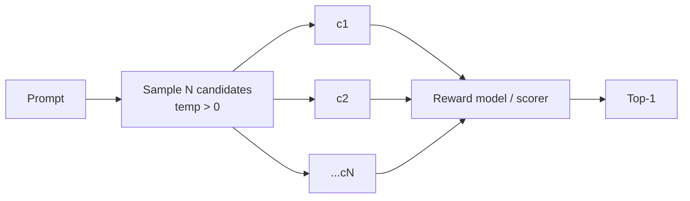

# Best-of-N Sampling

**Also known as:** BoN, Reranking, BoNBoN Alignment

**Category:** Verification & Reflection  
**Status in practice:** emerging

## Intent

Sample N candidate outputs and select the highest-ranked by a reward model or scorer.

## Context

Output quality matters and a reward model exists (or can be approximated) to score candidates.

## Problem

A single sample may be acceptable; the best of N is often markedly better at modest cost increase.

## Forces

- N candidates cost N inferences.
- Reward-model quality bounds achievable improvement.
- Diversity across candidates is needed; identical samples defeat the pattern.

## Solution

Generate N candidates with non-zero temperature. Score each with a reward model or rule-based scorer. Return the top-1 (or top-K). BoNBoN alignment fine-tunes a model to mimic the BoN distribution directly, eliminating per-inference sampling cost.

## Example scenario

A code-review assistant generates a one-paragraph summary for each pull request, and roughly one in five reads awkwardly. The team enables Best-of-N: for each PR, the model samples five candidate summaries with temperature 0.7, and a small reward model trained on past human-edited summaries picks the highest-rated one to display. Token cost goes up about five times for that step, but the rate of summaries that reviewers feel compelled to rewrite drops sharply.

## Diagram

## Consequences

**Benefits**

- Quality lift without retraining the base model.
- Trade-off knob: increase N for more quality, fewer for less cost.

**Liabilities**

- Cost scales with N.
- Reward hacking: candidates can game a flawed scorer.

## What this pattern constrains

The chosen output must be from the candidate set; no synthesis across candidates.

## Applicability

**Use when**

- A scorer or reward model exists that ranks candidates better than the generator picks them.
- Quality lift from selecting the best of N samples justifies the N-fold inference cost.
- Sampling temperature can be raised enough to produce meaningfully diverse candidates.

**Do not use when**

- No reliable scorer is available to pick among candidates.
- Inference cost or latency cannot absorb a multiplicative sampling factor.
- Candidates collapse to near-duplicates regardless of temperature, so the best-of-N gain is illusory.

## Known uses

- **RLHF training pipelines** — *Available*

## Related patterns

- *alternative-to* → [self-consistency](self-consistency.md)
- *alternative-to* → [evaluator-optimizer](evaluator-optimizer.md)
- *specialises* → [parallelization](parallelization.md)
- *specialises* → [test-time-compute-scaling](test-time-compute-scaling.md)
- *used-by* → [process-reward-model](process-reward-model.md)
- *used-by* → [rest-em](rest-em.md)
- *complements* → [automatic-workflow-search](automatic-workflow-search.md)

## References

- (paper) Gui, Gârbacea, Veitch, *BoNBoN Alignment for Large Language Models and the Sweetness of Best-of-n Sampling*, 2024, <https://arxiv.org/abs/2406.00832>

**Tags:** sampling, reward, alignment
