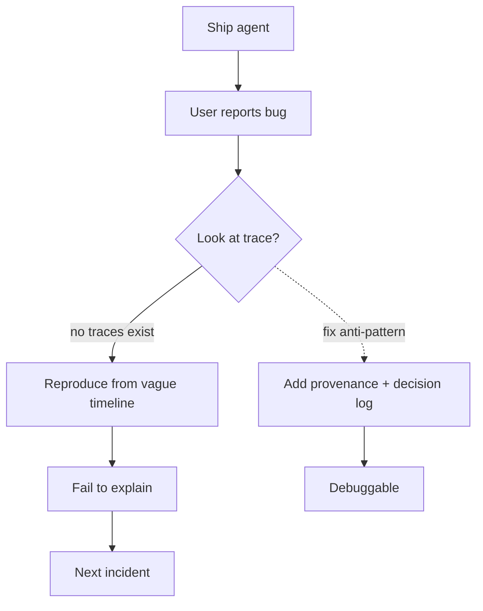

# Black-Box Opaqueness

**Also known as:** Opaque Agent, No-Trace Agent

**Category:** Anti-Patterns  
**Status in practice:** deprecated

## Intent

Anti-pattern: ship an agent without traces, decision logs, or provenance, then debug from user reports.

## Context

A team is shipping an LLM-based agent under schedule pressure, often using a framework that emits no traces by default. Observability — recording each model call, each tool invocation, and the decision that led to it — is treated as something to add later once the product proves itself. The agent goes to production with no run logs, no decision log, and no record of which inputs led to which outputs.

## Problem

When the agent eventually does something wrong, and it will, the team has no record of what the agent saw, what it decided, or which tool it called with which arguments. Debugging collapses into trying to reproduce a user's vague timeline from memory, and most incidents are never explained at all. The team ends up retrofitting traces during an outage, which is the most expensive moment to add them.

## Forces

- Observability has a cost (storage, dev time).
- Frameworks differ in trace quality.
- Privacy and trace coverage tension.

## Therefore

Therefore: instrument the agent with traces, decision logs, and provenance from the first deploy, so that every misbehaviour leaves an inspectable record instead of forcing reproduction from user reports.

## Solution

Don't. Add traces, decision logs, and provenance from day one. See provenance-ledger, decision-log, lineage-tracking.

## Example scenario

A startup ships a customer-facing agent in a hurry with no traces, no decision logs, and no tool-call provenance. A week later a user complains the agent issued a duplicate refund. The team has nothing to look at — they spend two days trying to reproduce the bug from the user's vague timeline and never definitively explain it. This is the Black-Box Opaqueness anti-pattern: the absence of observability is itself the failure, and recovery requires retrofitting traces to every step before the next incident.

## Diagram

## Consequences

**Liabilities**

- Debugging time stretches to weeks.
- Compliance posture is unanswerable.
- Stakeholder trust erodes.

## What this pattern constrains

Avoiding it means observability is not optional: an agent must not ship without traces, decision logs, and provenance attached to every action, and debugging must never depend on user reports alone.

## Applicability

**Use when**

- Cite this entry when a team proposes shipping an agent whose only failure signal is user reports.
- You are already here if production incidents cannot be replayed from traces or decision logs.
- Exit via provenance-ledger, decision-log, and lineage-tracking before launch, not after the first incident.

**Do not use when**

- Always do not use. There is no scenario where shipping a black-box agent is the right design.
- Even prototypes benefit from minimal traces — opacity is not the cheap option, it is the expensive option deferred.

## Known uses

- **Default state of un-instrumented LangChain projects circa 2023** — *Available*

## Related patterns

- *alternative-to* → [provenance-ledger](provenance-ledger.md)
- *alternative-to* → [decision-log](decision-log.md)
- *alternative-to* → [lineage-tracking](lineage-tracking.md)

## References

- (repo) *ai-standards/ai-design-patterns (Black-Box Opaqueness)*, <https://github.com/ai-standards/ai-design-patterns>

**Tags:** anti-pattern, observability
