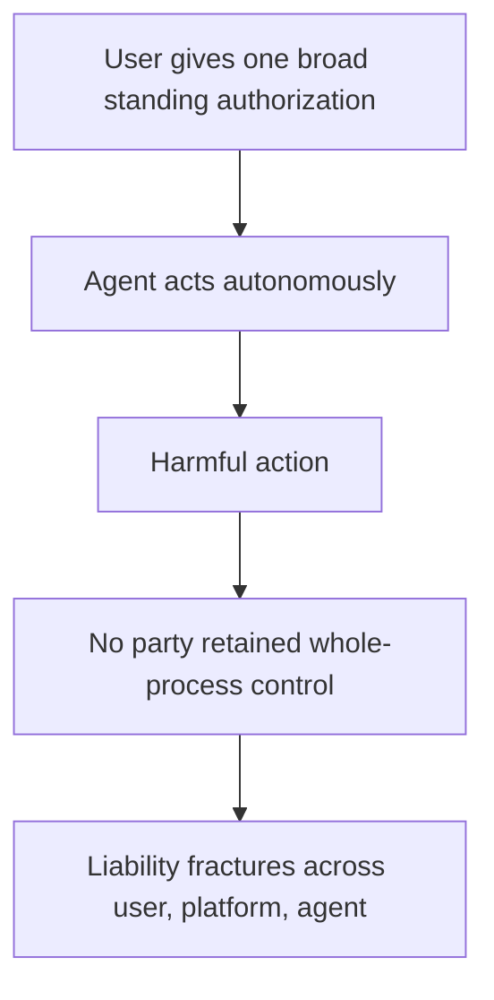

# Blanket-Authorization Accountability Rupture

**Also known as:** Responsibility Gap from Blanket Grant, Bundle-Authorization Rupture

**Category:** Anti-Patterns  
**Status in practice:** emerging

## Intent

Anti-pattern: a user grants an agent one broad standing authorization to act across apps, and when an autonomous action later causes harm no party retained whole-process control, so liability fractures across user, platform, and agent.

## Context

A user delegates broad authority to an agent so it can act on their behalf across applications — pay, order, message, book — with a single up-front grant rather than approving each action. The agent then operates autonomously inside that authorization for an extended period. The grant is convenient: one approval covers everything the agent might do.

## Problem

When an autonomous action under that blanket grant later causes harm, the chain of control that liability frameworks assume has dissolved. The user authorised broadly but did not direct or foresee the specific action; the platform supplied the agent but did not decide the action either; the agent acted but is not a legal subject that can hold responsibility. Neither user nor provider retained whole-process control, so accountability fractures — each can point to the others — and the harm has no clear owner. The broader and more standing the authorization, the wider this responsibility gap grows.

## Forces

- A single broad grant is convenient and reduces friction, but it severs the per-action link between a human decision and the action's effect.
- The user authorised the capability without directing or foreseeing the specific harmful action, so direct fault is hard to assign to them.
- The provider built the agent but did not choose the action, and the agent is not a legal subject that can bear responsibility.
- Traditional liability assumes a controllable, foreseeable actor, an assumption a broadly-authorised autonomous agent breaks.

## Therefore

Therefore: do not rely on one broad standing authorization for autonomous action with real-world effects; scope and time-bound delegation, keep each action attributable to a responsible party, and make accountability transfer with the work rather than dissolving into a gap.

## Solution

Replace the blanket grant with delegation that keeps responsibility attached. Issue scoped, short-lived, revocable authorization for specific classes of action rather than one standing grant covering everything, so each action is attributable to a decision a party is accountable for. Carry obligations and accountability along the delegation chain — not just the credentials to act — so duty transfers with the work and there is always an owner for an action's consequences. Keep material or irreversible actions under per-action confirmation rather than absorbed into the blanket authorization, and record who authorised what so the control chain can be reconstructed. The aim is that no autonomous action exists without a responsible party, closing the gap a blanket grant opens.

## Structure

```
User gives one broad standing authorization -> agent acts autonomously -> harmful action -> no party retained whole-process control -> liability fractures across user/platform/agent (BROKEN) ; Corrected: scoped + short-lived + revocable delegation, accountability transfers with the work
```

## Diagram



*A single broad grant severs the per-action link to a human decision, so a harmful autonomous action has no clear responsible owner.*

## Example scenario

A user signs up for a shopping agent and grants it blanket authority to buy, return, and message merchants on their behalf. Months later it places a large erroneous order with a third-party seller. The user never saw or directed that order, the platform says the agent acted within the user's grant, and the agent is not a legal person — so when the seller demands payment, there is no clear party who decided the purchase and owns the mistake.

## Consequences

**Liabilities**

- A harmful autonomous action has no clear responsible owner, so redress and correction stall.
- User, platform, and agent each point to the others, and the gap is exploited or simply left unresolved.
- Broad standing authority enlarges the set of actions for which no one is clearly accountable.
- Trust and adoption suffer once users learn an agent can act in their name with no one answerable for the result.

## Failure modes

- Blanket standing grant — one up-front authorization covers every future action with no per-action link.
- Attribution loss — the specific harmful action cannot be tied to a decision any party made.
- Responsibility gap — neither user, provider, nor agent can be held accountable for the outcome.
- Credentials-without-duty — authority to act transfers while the obligation for consequences does not.

## What this pattern constrains

An autonomous action with real-world effects must not rest on one broad standing authorization; delegation is scoped, time-bound, and revocable, each action stays attributable to a responsible party, and material actions cannot be absorbed into a blanket grant without per-action accountability.

## Applicability

**Use when**

- Recognising this failure when an autonomous action under a broad standing grant causes harm with no clear responsible party.
- Reviewing an agent that operates on one up-front blanket authorization across applications.
- Diagnosing disputes where user, platform, and agent each disclaim responsibility for an action's outcome.

**Do not use when**

- Delegation is already scoped, short-lived, and revocable, with each action attributable to a responsible party.
- Material actions require per-action confirmation rather than resting on a standing grant.
- The agent only drafts or advises and takes no autonomous real-world action.

## Components

- Blanket authorization — the single broad standing grant covering many future actions
- Autonomous agent — the actor operating inside the grant without per-action direction
- User principal — who authorised broadly but did not direct or foresee the specific action
- Provider — who supplied the agent but did not choose the action
- Responsibility gap — the missing owner for a harmful action's consequences

## Tools

- Scoped delegation credentials — the corrective short-lived, revocable, per-class authorization
- Deontic or accountability tokens — the corrective that transfers duty with the work along the chain
- Authorization audit log — the record of who authorised what, to reconstruct the control chain

## Evaluation metrics

- Action attributability — fraction of autonomous actions tied to a specific accountable decision
- Authorization scope breadth — how much standing authority a single grant confers
- Unowned-incident rate — share of harmful actions with no clear responsible party
- Per-action confirmation coverage — fraction of material actions kept out of the blanket grant

## Known uses

- **[Chinese legal analysis of blanket agent authorization](https://www.chinanews.com.cn/cj/2026/02-27/10577317.shtml)** _available_ — Names blanket authorization (yi-lan-zi shou-quan) producing responsibility rupture (ze-ren duan-lie): neither user nor service provider can maintain whole-process control, so accountability fractures under the existing framework.
- **[Responsibility gap for learning automata (Matthias)](https://commons.ln.edu.hk/sw_master/759/)** _available_ — Foundational account of the responsibility gap: when an autonomous system's behaviour is no longer predictable or controllable by its operator, traditional responsibility ascription breaks down and no party can be held responsible.

## Related patterns

- _alternative-to_ **Delegated Agent Authorization** — Scoped, short-lived, revocable delegated credentials are the corrective that keeps each action attributable; blanket authorization is the failure of one broad standing grant that dissolves attribution.
- _alternative-to_ **Deontic Token Delegation** — Deontic tokens transfer duty and accountability with the work along the chain; blanket authorization transfers only the credentials, leaving the responsibility rupture this names.
- _complements_ **Accountability Laundering via Algorithm** — Accountability laundering actively deflects blame onto the algorithm; blanket-authorization rupture is the structural gap where no party retained control to be blamed in the first place.
- _complements_ **Session-Scoped Payment Authorization** — Session-scoped authorization bounds a grant to a capped session; blanket authorization is the unbounded standing grant whose harm has no clear owner.

## References

- [After Blanket Authorization, Who Is Liable When the Agent Does Wrong?](https://www.chinanews.com.cn/cj/2026/02-27/10577317.shtml) — 2026
- [The responsibility gap: Ascribing responsibility for the actions of learning automata](https://commons.ln.edu.hk/sw_master/759/) — Andreas Matthias, 2004
