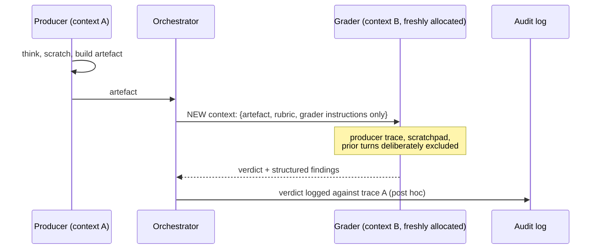

# Blind Grader with Isolated Context

**Also known as:** Fresh-Eyes Evaluator, Trace-Blind Judge, Outcomes-Style Verification, Context-Isolated Grader

**Category:** Verification & Reflection
**Status in practice:** emerging

## Intent

Run an evaluator or grader in a separately-allocated context window with access only to the artifact and the rubric — never the producing agent's reasoning chain — so the grader cannot be primed by the same assumptions that produced the work.

## Context

Agent workflows where an artefact (a plan, a piece of code, a written answer, a tool-call sequence) is produced by a long reasoning chain and a downstream evaluator is asked to judge it. Self-reflection and same-context critique have a known failure mode: the evaluator inherits the producer's framing and signs off on work that contains errors the producer also missed.

## Problem

Same-context self-critique echo-chambers. Even when the critic is a separate role or even a separate model, if it sees the full producing trace it tends to be primed by the same framing that produced the artefact, and it tends to rationalise rather than evaluate. The errors a fresh reader would catch are exactly the ones the trace-aware reader misses.

## Forces

- Reasoning traces carry useful context but also carry priming that biases evaluation.
- Some failures are only visible from outside the producer's framing.
- Fully retraining or routing to a different model is expensive and may not actually break the priming.
- Rubrics must be precise enough to apply without the producer's reasoning as context.
- Logs and trajectories must still be auditable, even if the grader does not see them.

## Therefore

Therefore: allocate a fresh context window for the grader and pass it only the artefact and the rubric — never the producing agent's reasoning trace, scratchpad, or tool-call history — so the grader evaluates the work from the outside and the same model can catch what its own reflection cannot.

## Solution

When the producer finishes, the orchestrator allocates a new context window (a new conversation, a new agent invocation, a new prompt instance) and constructs a grader call that contains only the artefact and the rubric. The producing agent's reasoning chain, scratchpad, and prior turns are deliberately excluded. The grader is instructed to judge against the rubric on its own terms and to flag what is missing or wrong. The grader's output is logged against the artefact and against the producer's trace for audit, but the grader itself was blind to the trace at decision time. The same model may be used as both producer and grader — context isolation is the load-bearing element, not a different model.

## Structure

```
Producer (full reasoning trace in context A) -> artefact + rubric -> NEW context window B containing only {artefact, rubric, grader instructions} -> grader verdict -> verdict logged against trace A (post hoc, not inside the grader's context).
```

## Diagram



*The grader runs in a freshly allocated context with only the artefact and rubric; the producer's framing cannot leak in.*

## Example scenario

A coding agent produces a fix for a flaky integration test. A naive critic reading the producer's reasoning agrees the fix is sound. The team instead routes the patch to a blind grader: a fresh context window containing only the patch diff and a rubric asking 'does this change the test's intent?' and 'does it suppress the underlying race?'. The blind grader flags that the patch widens a timeout and suppresses the race instead of fixing it — a verdict the trace-aware critic missed because the producer's reasoning made the widening sound deliberate.

## Consequences

**Benefits**

- Catches a class of failures that same-context critique systematically misses.
- Works with the same model — no second-vendor cost or routing complexity required.
- Rubric becomes a first-class artefact, since the grader has nothing else to lean on.
- Clean audit story: producer trace and grader verdict are independently attributable.

**Liabilities**

- Grader cannot use legitimate context from the producer's reasoning, so some judgements need information the rubric must explicitly carry.
- Rubric authoring becomes the bottleneck — a vague rubric in an isolated context is worse than a tight rubric with trace context.
- Extra context allocation costs tokens and latency per check.
- Discipline is required: leaking even a summary of the producer's trace into the grader's context defeats the pattern.

## What this pattern constrains

The grader's context window must contain only the artefact, the rubric, and grader instructions; the producing agent's reasoning trace, scratchpad, prior turns, and tool-call history must be excluded; summaries of the producer's reasoning must not be injected into the grader context.

## Applicability

**Use when**

- Producer self-critique has a known echo-chamber failure mode on the task.
- A precise rubric can be written that does not require the producer's reasoning.
- The artefact is self-contained enough to grade on its own.

**Do not use when**

- Grading legitimately requires the producer's intent or prior context that the artefact does not capture.
- Latency and token budgets cannot absorb a separate isolated context per check.
- No precise rubric is available — a vague rubric in an isolated context is worse than a trace-aware critic.

## Known uses

- **[Anthropic Claude Managed Agents — Outcomes feature](https://platform.claude.com/cookbook/managed-agents-cma-verify-with-outcome-grader)** — *Available* — Outcome grader runs in an isolated context with the artefact and rubric, not the producing trace.

## Related patterns

- *specialises* → [llm-as-judge](llm-as-judge.md) — Specialises LLM-as-judge with strict context isolation from the producer's trace.
- *alternative-to* → [agent-as-judge](agent-as-judge.md) — Agent-as-judge evaluates trajectories; blind grader deliberately excludes the trajectory.
- *alternative-to* → [same-model-self-critique](same-model-self-critique.md) — Same-model self-critique is the failure mode; blind grader is the structural fix using a fresh context.
- *complements* → [evaluator-optimizer](evaluator-optimizer.md) — Evaluator-optimizer loops refine and score; blind grader supplies the score from outside the producer's frame.
- *complements* → [frozen-rubric-reflection](frozen-rubric-reflection.md) — Frozen-rubric scopes self-reflection; blind grader adds context isolation as a structural element.

## References

- (doc) *Verify with outcome grader (Anthropic Cookbook, Claude Managed Agents)*, 2026, <https://platform.claude.com/cookbook/managed-agents-cma-verify-with-outcome-grader>
- (blog) *Anthropic updates Claude Managed Agents with three new features*, 2026, <https://9to5mac.com/2026/05/07/anthropic-updates-claude-managed-agents-with-three-new-features/>

**Tags:** evaluation, verification, context-isolation, grading, rubric
