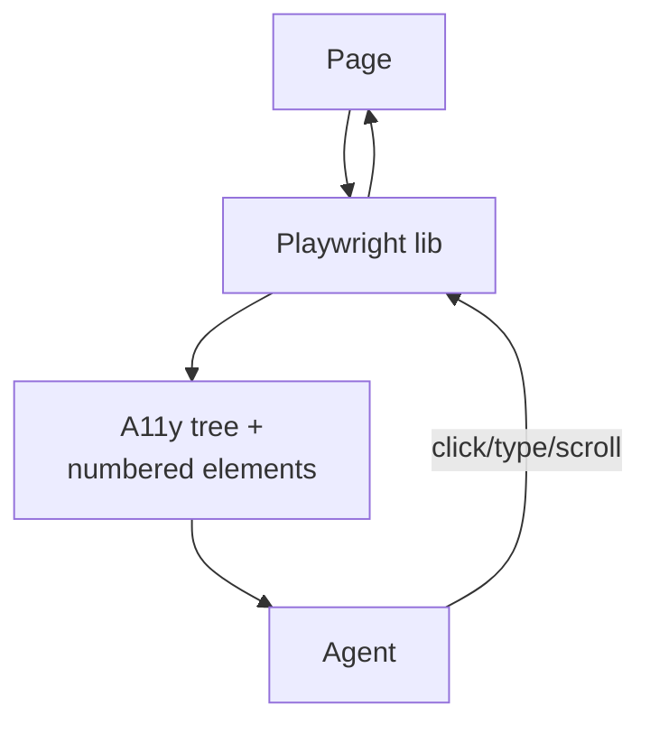

# Browser Agent

**Also known as:** Web Agent, Browser Automation Agent

**Category:** Tool Use & Environment  
**Status in practice:** emerging

## Intent

Expose websites to the agent through a structured DOM/accessibility tree plus a small action vocabulary, sitting between raw HTML and pixel-level Computer Use.

## Context

A team needs an agent that operates websites end-to-end: filling forms, pulling competitive data, navigating multi-page checkouts, or running research across many sites. The target sites have no clean API the team can integrate with, and pixel-level screen control (the Computer Use approach) is too slow and brittle for routine web work.

## Problem

Raw HTML is full of inline scripts, tracking pixels, and minified CSS that overwhelm the context window before the agent reaches the actual content. Treating the browser as pure pixels and driving the mouse to coordinates is slow, breaks the moment the layout shifts, and burns vision tokens on every click. Without a stable, structured representation of the page the agent ends up reasoning over noise instead of intent.

## Forces

- DOM extraction needs a stable representation across sites.
- Action vocabulary completeness vs simplicity.
- Anti-bot measures break agent flows.

## Therefore

Therefore: expose the page as a numbered DOM / accessibility tree and a small action vocabulary, so that the agent reasons over stable structure instead of raw HTML or pixels.

## Solution

A library (Playwright-backed) exposes structured page state (numbered interactive elements, accessibility tree) and a compact action set (click, type, scroll, navigate). The agent reasons over the structured state and emits actions; the library executes them.

## Example scenario

A growth team builds an agent that scrapes competitor pricing pages. Feeding raw HTML overflows context with tracking scripts and inline CSS; pixel-level Computer Use is overkill for clicking through five filters. They settle on a Browser Agent surface: the page is reduced to a structured DOM/accessibility tree of interactable elements, and the agent emits actions from a small vocabulary like click(id) and type(id, text). The model spends its tokens on intent, not on parsing minified script tags.

## Diagram

## Consequences

**Benefits**

- Faster and more reliable than pixel-driven Computer Use on the web.
- Web-specific abstractions like 'fill form' compose naturally.

**Liabilities**

- Still struggles with heavily-dynamic JS apps.
- Anti-bot blocks; CAPTCHAs.

## What this pattern constrains

Actions are limited to the typed vocabulary; arbitrary JavaScript execution is not part of this surface.

## Applicability

**Use when**

- The agent must operate websites and a structured DOM/accessibility tree is available.
- Raw HTML is too noisy and pixel-level Computer Use is too slow or brittle for the web target.
- A small action vocabulary (click, type, scroll, navigate) suffices for the task.

**Do not use when**

- The site requires pixel-level interaction (canvas, custom drawing) that no DOM tree exposes.
- There is a clean API and using it is cheaper and more reliable than driving the UI.
- Anti-bot measures make programmatic browser control infeasible at the required scale.

## Known uses

- **[browser-use (Python library)](https://github.com/browser-use/browser-use)** — *Available*
- **Playwright + LangChain** — *Available*
- **OpenAI Operator** — *Available*
- **Browserbase** — *Available*
- **Skyvern** — *Available*

## Related patterns

- *alternative-to* → [computer-use](computer-use.md)
- *specialises* → [tool-use](tool-use.md)
- *complements* → [tool-output-poisoning](tool-output-poisoning.md)
- *alternative-to* → [mobile-ui-agent](mobile-ui-agent.md)
- *generalises* → [dual-system-gui-agent](dual-system-gui-agent.md)

## References

- (repo) *browser-use/browser-use*, <https://github.com/browser-use/browser-use>

**Tags:** environment, web, browser
