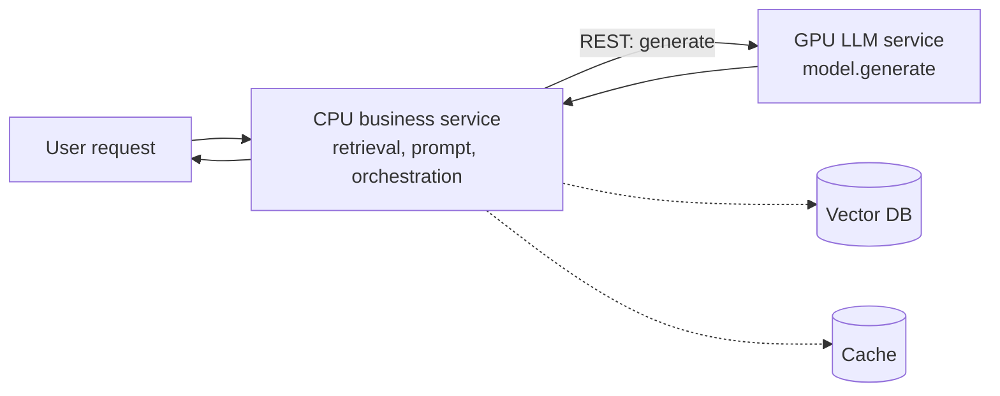

# Business + LLM Microservice Split

**Also known as:** CPU/GPU Tier Split, Inference-Service Decoupling

**Category:** Structure & Data  
**Status in practice:** mature

## Intent

Split an LLM application into a CPU-bound business microservice (retrieval, prompt assembly, orchestration) and a GPU-bound LLM microservice (only model.generate behind REST), so each tier scales on its own hardware budget.

## Context

A production LLM application bundles retrieval, prompt assembly, post-processing, business logic, and the LLM inference call into a single service. The service autoscales as a unit. The LLM call needs GPU; the rest does not. The unified deployment pays GPU prices to autoscale the CPU-only parts.

## Problem

Bundled deployments waste expensive hardware. As traffic grows, the autoscaler adds whole GPU pods to handle CPU-bound spikes in prompt assembly and retrieval, while genuine GPU-bound spikes drag the entire service. Maintenance is coupled: bumping the model means redeploying the business logic; bumping the retrieval code means restarting GPU pods. The single service is a strict generalisation that loses on cost, scaling, and deploy velocity.

## Forces

- LLM inference needs GPU; retrieval and prompt assembly do not.
- Independent scaling axes (RPS, token throughput) have different load shapes.
- Coupled deploys slow both teams; decoupled deploys let model and business iterate independently.
- REST boundary adds one network hop per request — a measurable latency cost.

## Applicability

**Use when**

- LLM inference and business logic have diverging scaling profiles.
- Model swaps should not force business-logic redeploys.
- Multiple LLM providers may sit behind one contract.

**Do not use when**

- Very low traffic — one service is simpler and within budget.
- Latency budget cannot absorb one network hop.
- Team has no capacity to operate two services and cross-service tracing.

## Therefore

Therefore: split the application into a CPU business service (retrieval, prompt assembly, orchestration) and a GPU LLM service exposing only model.generate over REST, so each tier scales on its own hardware budget and is deployed on its own cadence.

## Solution

Define the LLM microservice's contract as a single REST endpoint: generate(prompt, params) → completion. Run it on GPU autoscaling on token-throughput metrics. Run everything else — retrieval, prompt templating, business logic, orchestration, output post-processing — in the CPU business service that calls the LLM service over REST. Bound the LLM service's tail latency with batching, queueing, and admission control. The business service can use multiple LLM service instances (different models, different providers) behind the same contract.

## Example scenario

A RAG support platform deploys a CPU FastAPI business service handling retrieval (Qdrant), prompt assembly, and tenant routing, plus a separate GPU LLM service hosting a fine-tuned model behind TGI. Traffic spike: CPU pods scale 5x for retrieval load, GPU pods scale 2x for inference load. A model swap (Llama-3-8B to Llama-3-70B) is a deploy in the LLM service only; the business service is unchanged.

## Diagram

## Consequences

**Benefits**

- GPU pods size to GPU-bound load only; CPU pods to CPU-bound load only.
- Model swaps and business-logic changes deploy independently.
- Multiple LLM providers can sit behind one contract without business-service changes.

**Liabilities**

- One extra network hop per LLM call — latency cost.
- Two services to operate, deploy, monitor.
- Cross-service tracing required to make end-to-end latency visible.

## What this pattern constrains

An LLM application must not bundle GPU inference with CPU business logic in one service when scaling and deploy cadence diverge; the LLM call lives behind its own service contract.

## Known uses

- **LLM Engineer's Handbook (Iusztin, Labonne, Packt 2024) — Twin business/inference services** — *Available* — <https://www.packtpub.com/en-us/product/llm-engineers-handbook-9781836200079>
- **Hugging Face TGI / vLLM / SageMaker deployments as standalone LLM services** — *Available*
- **Most production LLM platforms (Anthropic, OpenAI) — model inference behind API** — *Available*

## Related patterns

- *composes-with* → [fti-llm-pipeline-split](fti-llm-pipeline-split.md)
- *complements* → [agent-adapter](agent-adapter.md)
- *complements* → [augmented-llm](augmented-llm.md)
- *complements* → [prompt-caching](prompt-caching.md)
- *uses* → [rate-limiting](rate-limiting.md)

## References

- (book) *LLM Engineer's Handbook*, Paul Iusztin, Maxime Labonne, 2024, <https://www.packtpub.com/en-us/product/llm-engineers-handbook-9781836200079>
- (blog) *Architect scalable and cost-effective LLM & RAG inference pipelines*, <https://www.decodingai.com/p/architect-scalable-and-cost-effective>

**Tags:** architecture, scaling, deployment
