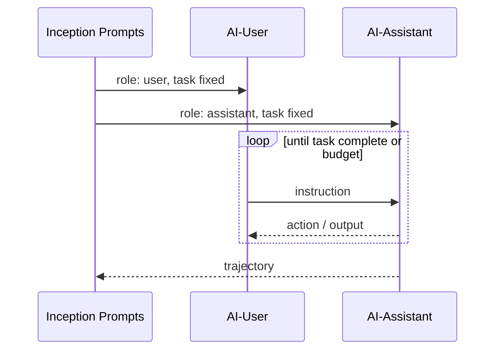

# CAMEL Role-Playing

**Also known as:** Inception Prompting, AI-User AI-Assistant

**Category:** Multi-Agent  
**Status in practice:** experimental

## Intent

Have two agents role-play a user-assistant interaction to autonomously complete a task neither could solve alone.

## Context

A team wants an autonomous system to carry out a task that, if done by humans, would unfold as a collaboration between someone stating goals and someone executing — a product owner working with a developer, an instructor working with a learner. There is no real user in the loop; both sides need to be played by agents, and the work has to converge through their interaction.

## Problem

A single-agent loop has no opposite voice to clarify or push back, and tends to mix goal-setting and execution in the same prompt until both blur. An adversarial debate setup is the wrong shape when what is actually wanted is collaborative role-play, not winning an argument. Without fixed roles and a bounded conversation, two free-form agents drift toward sameness, repeat themselves, and never converge on a working artefact.

## Forces

- Roles drift toward sameness without inception prompting.
- Conversation length must be bounded.
- Tasks need to be specified as something the role-play can converge on.

## Therefore

Therefore: instantiate two role-fixed agents — AI-User and AI-Assistant — with inception prompts and let them converse against a bounded budget, so that turn-taking collaboration runs to a task neither could solve alone.

## Solution

Use inception prompts to instantiate two agents (AI-User and AI-Assistant) with their roles fixed and the task specified. They converse until the task is completed or budget exhausted. The output is the final assistant message; the conversation log is debugging artefact.

## Example scenario

A research team wants an agent to design and prototype a small data-pipeline tool, but a single agent loop keeps drifting between requirements and implementation. They cast it as a CAMEL role-play: a 'product owner' agent and a 'developer' agent autonomously play out a user-assistant dialogue, with the product owner stating goals and constraints and the developer iterating. Neither alone could keep the conversation grounded; the role pairing produces working scaffolding without a human in the loop.

## Diagram

## Consequences

**Benefits**

- Synthetic task-solving without human-in-the-loop.
- Useful for generating training data.

**Liabilities**

- Cost: 2x inference per task.
- Role drift over long conversations.

## What this pattern constrains

The AI-User role may only ask, never answer; AI-Assistant may only answer, never ask user-style questions.

## Applicability

**Use when**

- The task benefits from explicit user-assistant turn-taking that a single agent loop misses.
- Inception prompts can fix the two roles and the task tightly enough to keep the conversation on-track.
- A budget caps the conversation length so unproductive loops terminate.

**Do not use when**

- A single agent already solves the task without turn-taking dynamics.
- Adversarial debate (not collaborative role-play) is what the task actually wants.
- Roles cannot be specified tightly enough and the conversation drifts off-task.

## Known uses

- **CAMEL framework** — *Available*

## Related patterns

- *alternative-to* → [autogen-conversational](autogen-conversational.md)
- *specialises* → [role-assignment](role-assignment.md)

## References

- (paper) Li, Hammoud, Itani, Khizbullin, Ghanem, *CAMEL: Communicative Agents for "Mind" Exploration of Large Language Model Society*, 2023, <https://arxiv.org/abs/2303.17760>

**Tags:** multi-agent, role-play
