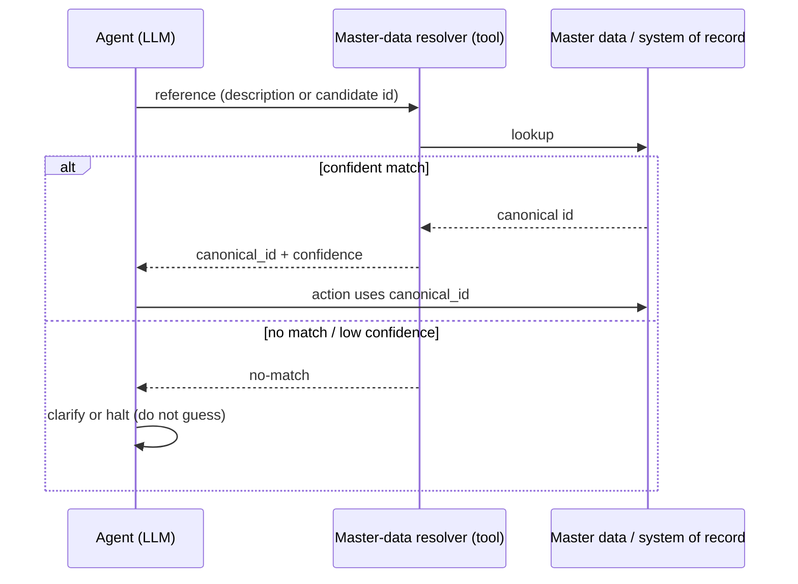

# Canonical-Entity Grounding

**Also known as:** Master-Data Lookup Grounding, Authoritative Identifier Resolution, Entity-Resolve-Before-Act

**Category:** Tool Use & Environment
**Status in practice:** emerging

## Intent

Require the agent to resolve every business identifier it uses — SKU, account, supplier, customer — through an authoritative lookup against the system of record, rather than emitting the identifier from the model's parametric memory.

## Context

An agent acts over enterprise systems whose entities are identified by exact codes — general-ledger accounts, stock-keeping units, supplier numbers, customer ids, project codes — that carry no meaning the model could infer and that must match a record exactly to be valid. The model is fluent enough to produce strings that look like these codes, and a code that is plausible but wrong points at the wrong account or the wrong part. The authoritative values live in master data the model was never trained on and that changes after training.

## Problem

Asked for an identifier it does not have, a model will supply one from parametric memory that is well-formed and confidently wrong — a close-enough part number, an account code from a similar company, a supplier id that no longer exists. In an enterprise system there is no credit for close: a transaction posted to a plausible-but-wrong GL account is a real error, not an approximation. Because the fabricated identifier is syntactically valid, downstream format validation often accepts it, and the mistake surfaces only later as a misposting or a failed integration.

## Forces

- The model is good at mapping a vague reference such as 'the Berlin office supplier' to intent, but bad at producing the exact code that intent corresponds to.
- Master data is authoritative and current; the model's parametric knowledge of identifiers is neither.
- A fabricated identifier is often well-formed, so format validation passes and the error escapes.
- Calling a lookup on every identifier costs latency and tool calls; skipping it risks silent corruption of a system of record.
- Identifiers change after the model is trained, so even a once-correct memorised code drifts out of date.

## Therefore

Therefore: treat any identifier the model produces as an unresolved reference until it is confirmed against the authoritative store, and require the agent to call a lookup tool that returns the canonical id — or no match — before that identifier is used in an action, so a write to the system of record can only ever name an entity that exists.

## Solution

Give the agent a resolver tool over master data that takes a description or a candidate identifier and returns the canonical id with a confidence, or an explicit no-match. Require every identifier that will enter an action — especially a write — to pass through this resolver first; the model proposes intent ('post to the marketing-travel account for the Munich entity') and the resolver returns the exact code, rather than the model emitting the code directly. Treat the resolver's output, not the model's text, as the identifier of record. On a no-match or a low-confidence result the agent asks for clarification or halts rather than guessing. Once an identifier is resolved, the rest of the operation runs against that canonical id deterministically. Where volume is high, the resolver can present a fetched candidate set the model selects among, so the model chooses among real entities rather than inventing one.

## Structure

```
Model --(reference: description or candidate id)--> resolver tool --(query)--> master data. Resolver --> {canonical_id + confidence | no-match}. On match: action uses canonical_id. On no-match / low confidence: clarify or halt. Model never supplies the identifier of record directly.
```

## Diagram



*Every identifier is resolved against authoritative master data before it enters an action; the model supplies intent, the resolver supplies the identifier of record.*

## Example scenario

An agent processes supplier invoices into an ERP. A scanned invoice reads 'Müller Bürobedarf, Munich', and the agent's first instinct is to fill in a supplier number that looks right from similar vendors. Instead it calls a master-data resolver with the name and address; the resolver returns the one canonical supplier id on file, or reports no confident match. When a new vendor has no record, the agent stops and flags it for onboarding rather than posting to a guessed account. Only resolved, real identifiers ever reach the posting step.

## Consequences

**Benefits**

- Writes to the system of record can only name entities that exist, removing a whole class of confident-but-wrong errors.
- The boundary between fuzzy intent (the model) and exact identity (master data) is explicit and testable.
- Resolution against current master data tolerates identifiers that changed after the model was trained.
- A no-match becomes a visible clarification or halt instead of a silent misposting found weeks later.

**Liabilities**

- A lookup on every identifier adds latency and tool calls, which matters in high-volume batch work.
- The resolver itself can return the wrong entity when the description is ambiguous or master data is dirty.
- Building and maintaining a resolver over messy master data is real integration work.
- Over-eager resolution can mask a genuine data-entry problem a human should have seen.

## What this pattern constrains

The agent must not use a self-generated identifier in an action against the system of record: every GL account, SKU, supplier, or customer id must be confirmed by the resolver tool first, and on a no-match or low-confidence result the agent must not guess but must clarify or halt.

## Guardrails

- Write-path resolver enforcement — no identifier reaches a system-of-record write without passing the resolver
- Low-confidence halt — results below threshold force clarification instead of action

## Applicability

**Use when**

- The agent writes to or acts on a system whose entities are identified by exact codes that must match a record.
- Wrong-but-well-formed identifiers would pass format validation and corrupt downstream data.
- Authoritative master data exists and can be queried at action time.
- Identifiers change after the model's training cut-off.

**Do not use when**

- The task is free-form generation with no identifiers that must match a record.
- There is no authoritative store to resolve against, so a lookup cannot confirm anything.
- The identifiers are already supplied verbatim by a trusted upstream system and never authored by the model.

## Components

- Master-data resolver — tool that maps a description or candidate id to the canonical id or a no-match
- Candidate set — the real entities the resolver returns for the model to select among when volume is high
- Confidence threshold — the line below which the agent clarifies or halts instead of using a result
- No-match handler — routes unresolved references to clarification, onboarding, or a halt

## Tools

- Master-data lookup API — authoritative query over GL accounts, SKUs, suppliers, and customers
- Fuzzy matcher / entity-resolution service — maps free-text references to candidate canonical records
- System-of-record write API — accepts only resolved canonical identifiers

## Evaluation metrics

- Fabricated-identifier rate — action identifiers not produced by the resolver; the target is zero
- No-match handling rate — share of no-match results that led to a clarify/halt rather than a guess
- Misposting rate — entries posted to a wrong-but-valid identifier, caught in reconciliation
- Resolution latency — added time per identifier, watched in high-volume batch runs

## Known uses

- **[Salesforce Agentforce — Grounding](https://trailhead.salesforce.com/content/learn/modules/grounding-an-agent-with-data/learn-the-basics-of-grounding)** — *Available* — Agents are grounded in CRM records so entity references resolve against data rather than model memory.
- **[Starburst](https://www.starburst.io/blog/agent-grounding-the-missing-discipline-in-enterprise-ai/)** — *Available* — Frames entity resolution and verified identifier grounding as a prerequisite discipline for enterprise agents.
- **[RudderStack](https://www.rudderstack.com/blog/why-ai-agent-hallucinates-on-your-data)** — *Available* — Describes grounding agents on governed enterprise data so they resolve identifiers instead of hallucinating them.

## Related patterns

- *complements* → [agentic-rag](agentic-rag.md) — RAG retrieves relevant documents; canonical-entity grounding resolves exact identifiers. Retrieval finds context, resolution pins identity.
- *complements* → [crag](crag.md) — Corrective RAG checks retrieved evidence quality; this checks that an identifier corresponds to a real master-data record.
- *complements* → [chain-of-verification](chain-of-verification.md) — Chain-of-verification re-checks claims; here the identifier is verified against the authoritative store before use.
- *complements* → [json-only-action-schema](json-only-action-schema.md) — A strict action schema validates an identifier's shape; resolution validates that the entity actually exists.
- *complements* → [citation-attribution](citation-attribution.md) — Citation attribution grounds prose in sources; this grounds identifiers in master data — the same discipline applied to exact codes.

## References

- (blog) Starburst, *Agent Grounding: The Missing Discipline in Enterprise AI*, 2026, <https://www.starburst.io/blog/agent-grounding-the-missing-discipline-in-enterprise-ai/>
- (paper) *Deterministic Legal Agents: A Canonical Primitive API for Auditable Reasoning over Temporal Knowledge Graphs*, 2025, <https://arxiv.org/abs/2510.06002>
- (doc) Salesforce, *Ground an Agent with Data — Salesforce Trailhead*, 2026, <https://trailhead.salesforce.com/content/learn/modules/grounding-an-agent-with-data/learn-the-basics-of-grounding>
- (blog) RudderStack, *Why Your AI Agent Hallucinates on Your Data*, 2026, <https://www.rudderstack.com/blog/why-ai-agent-hallucinates-on-your-data>

**Tags:** grounding, master-data, entity-resolution, tool-use-environment, hallucination, erp, system-of-record
