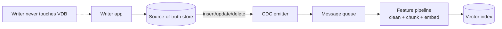

# CDC-Driven Vector Sync

**Also known as:** Change-Data-Capture RAG Sync, Event-Driven Vector Index Update

**Category:** Retrieval & RAG  
**Status in practice:** mature

## Intent

Treat the source-of-truth document store as the only writer; keep the vector index in sync by emitting change-data-capture events onto a queue that the feature pipeline consumes.

## Context

A RAG system reads from a vector index built over a corpus that lives in a source-of-truth store (database, document system, content platform). The corpus changes continuously — inserts, updates, deletes. The vector index must stay in sync or retrieval returns stale or missing material.

## Problem

Periodic batch rebuilds of the vector index are expensive, lag the source, and waste compute re-embedding unchanged documents. Dual-writing (the writer updates both the source and the vector index) is brittle: a crash between writes leaves the two stores inconsistent, and the writer code must understand the embedding pipeline. Without an event-driven path from source-of-truth changes to vector-index updates, embeddings drift silently from the corpus and retrieval quality degrades.

## Forces

- The source-of-truth store should be the only writer (single writer principle).
- Dual-writes from the application leak embedding-pipeline knowledge into the writer.
- Batch rebuilds waste compute and lag the source.
- CDC events provide ordered insert/update/delete signal.

## Applicability

**Use when**

- Vector index must reflect a corpus that changes continuously.
- Source-of-truth store supports CDC (change streams, logical replication, Debezium).
- Eventual consistency on retrieval (seconds-to-minutes lag) is acceptable.

**Do not use when**

- Corpus is static or changes in big batches that justify periodic rebuilds.
- Source store has no CDC mechanism and adding one is infeasible.
- Retrieval must be strongly consistent with writes (rare for RAG).

## Therefore

Therefore: have the source-of-truth store emit CDC events for every insert/update/delete onto a message queue, and have the feature pipeline consume those events to keep the vector index in sync.

## Solution

Enable change-data-capture on the source-of-truth store (MongoDB change streams, PostgreSQL logical replication, Kafka Connect, Debezium). Publish each change as an event to a queue (Kafka, RabbitMQ, SNS). The feature pipeline subscribes: on insert, embed and upsert; on update, re-embed and overwrite; on delete, remove from the vector index. The writer code knows nothing about embeddings. The pipeline can be paused, redeployed, or backfilled from queue history.

## Example scenario

A knowledge-base platform stores articles in MongoDB. The vector index over the article corpus must stay current as the editorial team adds, edits, and retires articles. The team enables MongoDB change streams; each change publishes to RabbitMQ. A Bytewax feature pipeline consumes, cleans, chunks, embeds, and upserts into Qdrant. Editors see new articles in RAG within seconds; the editorial system writes only to MongoDB.

## Diagram

## Consequences

**Benefits**

- Single writer to the source; embeddings follow as an asynchronous derived view.
- Vector index drift bounded by queue lag, not by rebuild cadence.
- Feature pipeline is independently scalable, debuggable, and replayable.

**Liabilities**

- CDC infrastructure to operate (Debezium, Kafka Connect, change streams).
- Eventually-consistent retrieval — the gap between source write and vector update is non-zero.
- Schema changes on the source need coordinated migrations in the embedding pipeline.

## What this pattern constrains

Vector indices over a changing corpus must not be kept in sync by dual-writes from application code; CDC events from the source-of-truth store drive embedding updates.

## Known uses

- **LLM Engineer's Handbook (Iusztin, Labonne) — LLM Twin CDC pipeline (lesson 3)** — *Available* — <https://www.comet.com/site/blog/llm-twin-3-change-data-capture/>
- **Debezium + Kafka Connect on Postgres/MySQL for RAG sync** — *Available*
- **MongoDB change streams + RabbitMQ for embedding sync** — *Available*

## Related patterns

- *composes-with* → [streaming-feature-pipeline](streaming-feature-pipeline.md)
- *composes-with* → [fti-llm-pipeline-split](fti-llm-pipeline-split.md)
- *complements* → [event-driven-agent](event-driven-agent.md)
- *uses* → [vector-memory](vector-memory.md)
- *complements* → [agentic-rag](agentic-rag.md)

## References

- (book) *LLM Engineer's Handbook*, Paul Iusztin, Maxime Labonne, 2024, <https://www.packtpub.com/en-us/product/llm-engineers-handbook-9781836200079>
- (blog) *Change Data Capture for LLM-Powered Applications (LLM Twin lesson 3)*, <https://www.comet.com/site/blog/llm-twin-3-change-data-capture/>

**Tags:** retrieval, rag, data-pipeline
