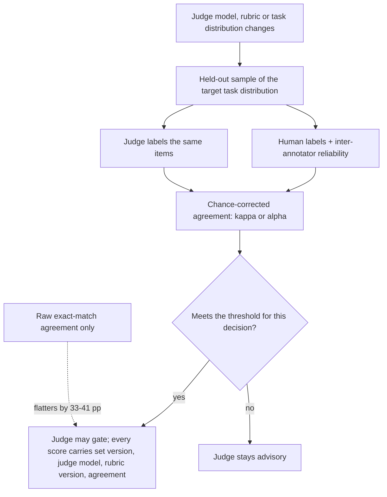

# Chance-Corrected Judge Validation

**Also known as:** Judge Meta-Evaluation, Kappa-Gated Judge, Judge Agreement Licence

**Category:** Governance & Observability  
**Status in practice:** emerging

## Intent

Measure an automated judge against human labels on a held-out meta-evaluation set with a chance-corrected agreement statistic, and publish that number beside every score the judge is allowed to gate.

## Context

Open-ended outputs and agent trajectories have no exact-match answer key, so a model-based judge scores them instead of a human reviewer. Those scores then start deciding things: which release ships, which rollout continues, which model sits where on a leaderboard, which outputs skip review. The judge's own quality is usually asserted from a single figure, the share of cases where the judge and a human reviewer chose the same label on a sample.

## Problem

That share counts every case where judge and human happened to land on the same label, including the ones a rater guessing the majority label would also have got. On a skewed label distribution it stays high while the judge discriminates almost nothing. A systematic study of 21 judges across roughly 541,000 judgements found the gap between exact-match agreement and Cohen's kappa runs 33 to 41 percentage points on MT-Bench, and that judge rankings move by up to 14 positions once the correction is applied. A number that flattering is not a licence to gate anything, yet it is routinely used as one.

## Forces

- Automated judging scales to volumes human annotation cannot reach; one study covered roughly 541,000 judgements, a scale no annotation panel would sustain.
- Exact-match agreement is the cheapest number to compute and the one that overstates the judge most, by 33 to 41 percentage points on MT-Bench.
- A human-labelled meta-evaluation set costs annotator time and has to establish its own reliability first; the Counsel agentic-task dataset reports a Krippendorff's alpha of 0.78 across annotators before any judge is scored against it.
- Agreement measured on one task distribution does not carry to another: the same judges that look adequate on final answers reach only about 0.65 AUROC on tau2-bench trajectories and 0.54 on AppWorld API-call traces.
- Every judge-model upgrade or rubric edit changes the thing that was measured, so a validated number decays quietly while the scores it licensed keep flowing.

## Therefore

Therefore: keep the human-labelled meta-evaluation set as a versioned artifact, score the judge on it with a chance-corrected agreement statistic before the judge gates anything, publish that statistic beside every score, and re-measure whenever the judge model, the rubric or the task distribution changes.

## Solution

Build a held-out sample of the task distribution the judge will actually score and have people label it, reporting inter-annotator reliability so the labels themselves are known to be stable. Run the judge over the same items and compare its labels to the human ones with a statistic that discounts agreement reachable by chance: Cohen's kappa for two raters over the same items, Krippendorff's alpha where there are more raters or missing labels. Set a threshold per decision, so a judge licensed to flag outputs for review is not automatically licensed to block a release. Record the measured agreement together with the meta-evaluation set version, the judge model and the rubric version, and attach that record to every score the judge emits, so a reader can tell an audited number from an unaudited one. Re-run the measurement whenever any of those three inputs changes, and treat a judge below threshold as advisory rather than as a gate. Raw exact-match agreement may still be reported, but only next to the corrected statistic, never in place of it.

## Structure

```
Held-out meta-eval set (human labels + inter-annotator reliability) -> judge run over same items -> chance-corrected statistic (kappa / alpha) -> compare against per-decision threshold -> licensed: judge gates, score carries {set version, judge model, rubric version, agreement}; below threshold: judge stays advisory. Any change to judge model, rubric or task distribution re-triggers the measurement.
```

## Diagram



*The judge earns a gating licence from its chance-corrected agreement with human labels on a versioned meta-evaluation set, and loses it whenever the judge model, rubric or task distribution changes.*

## Example scenario

A team ships a support assistant and lets a model judge decide which replies are good enough to send without review. The judge and a human reviewer agree on 88 percent of a sampled week, which sounds convincing until someone notices that 85 percent of replies are fine anyway, so the judge barely beats a rater who says fine every time. Recomputed as Cohen's kappa the judge scores close to zero, and the gate it had been running goes back to advisory until a properly labelled set exists.

## Consequences

**Benefits**

- A judge that looks accurate only because the label distribution is skewed is caught before it gates a release.
- Scores carry provenance: meta-evaluation set version, judge model, rubric version and measured agreement travel with the number.
- Comparisons between judges become stable, rather than reordering by up to 14 positions the moment the correction is applied.
- The decay of a judge's licence becomes visible, because a model upgrade or rubric edit invalidates a dated measurement instead of silently outliving it.

**Liabilities**

- The meta-evaluation set is a standing annotation cost and must establish its own reliability, which the Counsel dataset reports as a Krippendorff's alpha of 0.78 rather than assuming.
- Chance-corrected statistics are unstable on very skewed label distributions, so a high kappa computed over few disagreements can be as misleading as the raw agreement it replaced.
- A single headline agreement number hides slices where the judge cannot discriminate at all, and a judge validated on final answers stays unvalidated on trajectories.
- The threshold is a judgement call; no measured agreement level makes a judge safe for every decision it might be pointed at.

## Failure modes

- Raw exact-match agreement is reported as the validation number, so a judge with near-chance discrimination passes as accurate and keeps its gate.
- The meta-evaluation set is drawn from the prompts the judge's rubric was tuned on, so the measurement rewards fit to the set rather than judgement.
- Agreement is measured once at adoption and never again, while the judge model is upgraded and the rubric edited underneath it.
- The set is labelled by a single annotator, so there is no inter-annotator reliability and no ceiling against which the judge's agreement can be read.
- A judge validated on final answers is reused to score trajectories, where measured discrimination falls to roughly 0.54 to 0.65 AUROC.
- The agreement number exists but is not attached to the scores, so downstream consumers cannot tell which scores were licensed and which were not.

## What this pattern constrains

A judge may not gate a release, a rollout, a leaderboard position or an escape from human review before its chance-corrected agreement with human labels on a held-out meta-evaluation set has been measured and published; raw exact-match agreement is never sufficient on its own, and the licence lapses when the judge model, the rubric or the task distribution changes.

## Applicability

**Use when**

- A judge's scores decide something: a release gate, a rollout, a leaderboard position, or which outputs skip human review.
- Human labels can be collected for a held-out sample drawn from the same task distribution the judge will score.
- The label distribution is skewed enough that raw agreement can look high while discrimination is close to chance.
- Judge models, rubrics or task distributions change often enough that a one-off calibration goes stale unnoticed.

**Do not use when**

- The criterion has an exact-match or executable ground truth, in which case the check replaces the judge rather than validating it.
- The scores are exploratory and gate nothing, so an annotated meta-evaluation set is not repaid.
- Human labels on the task are not yet reliable enough to measure against; inter-annotator reliability has to be established first.
- The label distribution is so extreme that a chance-corrected statistic rests on a handful of disagreements and reports noise.

## Components

- Human-labelled meta-evaluation set — a versioned, held-out sample of the target task distribution carrying one label per item
- Inter-annotator reliability report — shows the human labels are stable enough to measure a judge against, and sets the ceiling for any agreement the judge can be credited with
- Judge replay — runs the judge under a pinned model and rubric over exactly the items the annotators labelled
- Chance-corrected agreement statistic — Cohen's kappa or Krippendorff's alpha, computed instead of raw exact match
- Per-decision licence threshold — the agreement level required before the judge may gate that particular decision
- Score provenance record — attaches set version, judge model, rubric version and measured agreement to every score the judge emits
- Re-measurement trigger — re-runs the meta-evaluation when the judge model, the rubric or the task distribution changes

## Tools

- scikit-learn cohen_kappa_score — computes two-rater chance-corrected agreement over the labelled items
- Krippendorff's alpha implementations — handle more than two annotators, ordinal labels and missing judgements
- Annotation platform with adjudication — collects the human labels and reports inter-annotator reliability before any judge is scored
- Evaluation platform datasets and experiments — version the meta-evaluation set and replay judge versions against it
- Judge version registry — pins the judge model and rubric version so a measured agreement can be attributed to something specific

## Evaluation metrics

- Cohen's kappa or Krippendorff's alpha between judge and human labels — the licence number itself
- Deflation gap between raw exact-match agreement and the corrected statistic — how much the headline figure was flattering the judge
- Inter-annotator reliability on the meta-evaluation set — the ceiling any judge agreement should be read against
- Rank stability of judges under the corrected statistic — how far a leaderboard moves once chance is discounted
- Per-slice agreement — where a single headline number hides a slice on which the judge cannot discriminate
- Age of the last measurement against the current judge model and rubric version — whether the licence is still valid

## Known uses

- **[Reliability without Validity (21-judge meta-evaluation)](https://arxiv.org/abs/2606.19544)** _pure-future_ — Re-scores 21 judge models over roughly 541,000 judgements and finds the deflation from exact-match agreement to Cohen's kappa universal, 33 to 41 percentage points on MT-Bench, with judge rankings shifting by up to 14 positions across benchmarks.
- **[Counsel meta-evaluation dataset for agentic tasks](https://arxiv.org/abs/2606.21627)** _pure-future_ — Supplies the human-labelled artifact the pattern requires for trajectories: annotators mark each flagged error as spot on, correct location but poor reasoning, or should not have flagged, reaching a Krippendorff's alpha of 0.78, and the best judge reaches only about 65 percent on reasoning.
- **[False-success characterisation on tau2-bench and AppWorld](https://arxiv.org/abs/2606.09863)** _pure-future_ — Measures judges as detectors of silent failure and finds no configuration across 5 judges and 5 prompt strategies exceeding 0.65 AUROC on tau2-bench, with the same judges at 0.54 on AppWorld API-call traces, which is the discrimination a trajectory judge starts from.
- **[MT-Bench and Chatbot Arena judge agreement](https://arxiv.org/abs/2306.05685)** _available_ — Publishes judge-to-human agreement alongside the benchmark, which made the comparison possible; the reported figure is raw agreement, and the chance-corrected re-analysis is what moves it by tens of percentage points.
- **[LangSmith evaluation datasets and human review](https://docs.langchain.com/langsmith/evaluation)** _available_ — Stores versioned datasets, collects human review on the same runs a judge evaluator scores, and replays evaluators as experiments, which is the machinery a meta-evaluation set needs; the agreement statistic itself is computed by the team.

## Related patterns

- _complements_ **LLM-as-Judge** — That pattern introduces the judge and asks for periodic calibration against human grading; this one names the artifact, the statistic and the threshold that turn calibration into a licence the judge has to hold.
- _complements_ **Agent-as-a-Judge** — Trajectory judging is where measured discrimination is weakest, around 0.54 to 0.65 AUROC, so a trajectory judge needs its own meta-evaluation set rather than one built from final answers.
- _uses_ **Eval Harness** — The meta-evaluation set is a held-out dataset replayed against judge versions, so the same harness machinery scores the judge instead of the agent under test.
- _complements_ **Scorer Live Monitoring** — Production scorers emit numbers continuously; the measured agreement is what says whether those numbers carry information.
- _complements_ **Sampled Prompt Trace Eval** — Sampling bounds how much traffic the judge scores; this bounds what those scores are permitted to decide.
- _complements_ **Frozen Rubric Reflection** — A fixed rubric is what makes agreement re-measurable across runs, and editing the rubric is one of the changes that invalidates a measured number.
- _complements_ **Blind Grader with Isolated Context** — Isolation controls what the grader may see; this measures whether what the grader produces from that view matches human labels.
- _complements_ **Eval as Contract** — If the eval suite is the release contract, the judge behind it needs a published agreement number before it can hold that contract.
- _complements_ **False Confidence Syndrome** — Uniform confidence over near-chance discrimination is the same failure moved from the generator to the evaluator.
- _complements_ **Judge-Channel Injection** — Injection corrupts the judge's inputs; validation measures its baseline discrimination, and a judge can fail either way independently.

## References

- [Reliability without Validity: A Systematic, Large-Scale Evaluation of LLM-as-a-Judge Models Across Agreement, Consistency, and Bias](https://arxiv.org/abs/2606.19544) — 2026
- [Counsel: A Meta-Evaluation Dataset for Agentic Tasks](https://arxiv.org/abs/2606.21627) — 2026
- [From Confident Closing to Silent Failure: Characterizing False Success in LLM Agents](https://arxiv.org/abs/2606.09863) — 2026
- [Judging LLM-as-a-Judge with MT-Bench and Chatbot Arena](https://arxiv.org/abs/2306.05685) — Lianmin Zheng, Wei-Lin Chiang, Ying Sheng, et al., 2023
- [Computing Krippendorff's Alpha-Reliability](https://repository.upenn.edu/asc_papers/43) — Klaus Krippendorff, 2011
- [scikit-learn: cohen_kappa_score](https://scikit-learn.org/stable/modules/generated/sklearn.metrics.cohen_kappa_score.html)
- [LangSmith Evaluation](https://docs.langchain.com/langsmith/evaluation)
