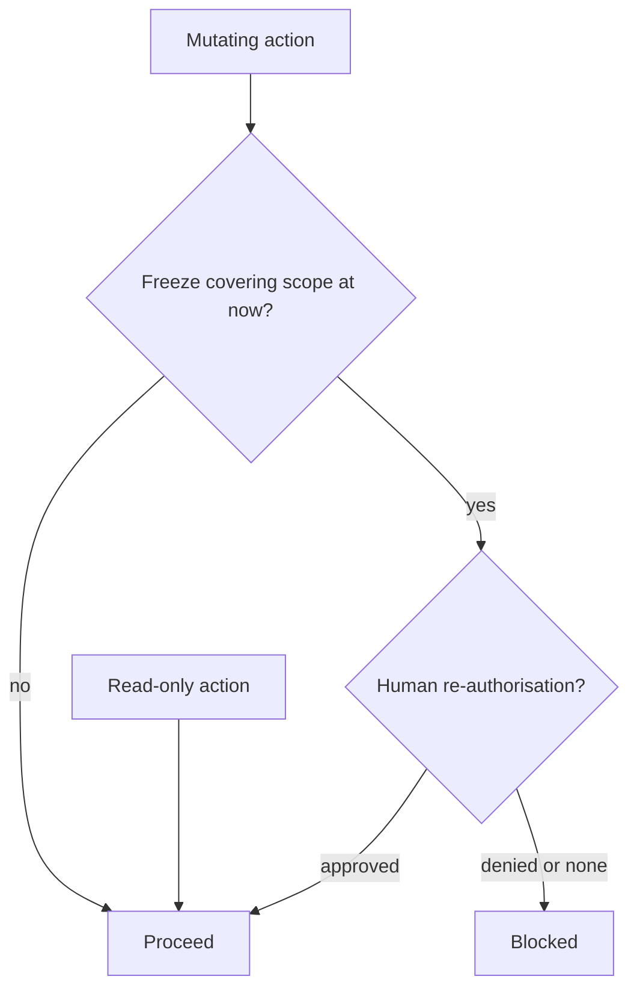

# Change-Freeze-Aware Action Gate

**Also known as:** Deploy-Window Authority Gate, Freeze-Aware Action Gate

**Category:** Safety & Control  
**Status in practice:** emerging

## Intent

Check every mutating agent action against an active deploy-freeze or maintenance calendar and block it or force explicit human re-authorisation while a freeze covering its scope is in effect.

## Context

Operations teams declare change freezes — time windows during which production must not be modified, such as a holiday peak, an open incident, or a release blackout — scoped to particular services, regions, or teams. An agent with production tool access can file changes, run deployments, or touch databases at any time. The freeze is usually communicated as a calendar entry, a prompt instruction, or a team norm.

## Problem

A freeze stated only in a prompt or a UI label is an intention, not a control: an agent that can still reach production APIs can act inside the window whether or not it was told about the freeze, and a single such action during a blackout can cause exactly the outage the freeze exists to prevent. Existing gates check an action's risk, reversibility, or role, but none of them encode time, so an otherwise-permitted action is allowed even when the calendar says no change may happen now. The freeze has to be enforced at action time, not assumed.

## Forces

- A freeze expressed as text the agent reads is advisory; only a runtime check on the critical path can actually stop a mutating call.
- Freezes are scoped and time-bounded — this service, this region, until Monday — so the gate must evaluate scope and time, not a global on/off.
- Blocking every action during a freeze is safe but can strand genuinely urgent fixes, so the gate needs a human re-authorisation path.
- Freeze calendars change and overlap, so the authority source must be queryable at action time rather than baked into the agent.

## Therefore

Therefore: put a gate on the critical path of every mutating action that queries the active freeze calendar for the action's scope and the current time, and blocks or routes the action to explicit human re-authorisation whenever a covering freeze is in effect.

## Solution

Maintain the freeze calendar as a queryable authority source: each freeze has a start and end time and a scope of services, regions, or teams. Before any mutating tool call, the gate looks up whether an active freeze covers the action's scope at the current time. If none does, the action proceeds; if one does, the gate blocks the action and either denies it or routes it to an explicit human re-authorisation that records who approved the exception and why. The freeze decision is made by the calendar and the clock, not by the agent's own reasoning, so the agent cannot talk itself past a blackout, and the same window a human would respect is enforced against the tool. Read-only actions pass freely; the gate constrains only changes.

## Structure

```
Mutating action -> freeze gate (query calendar for scope @ now) -> covered? -> no: proceed / yes: block or logged human re-auth ; read-only actions bypass
```

## Diagram



*Every change is checked against the freeze calendar; covered changes are blocked or held for logged human re-authorisation, while reads bypass the gate.*

## Example scenario

During a holiday change freeze on the payments service, an on-call agent decides to apply a config fix it judges harmless. The freeze gate looks up the calendar, sees an active freeze scoped to payments, and blocks the deploy; the agent cannot proceed on its own and instead opens a re-authorisation request, which the on-call engineer must approve before anything reaches production.

## Consequences

**Benefits**

- A declared freeze is actually enforced against the agent, not merely communicated to it.
- Urgent exceptions remain possible through a logged human re-authorisation rather than a hard wall.
- Scope and time targeting means only changes that fall under an active freeze are stopped, leaving unrelated work unaffected.

**Liabilities**

- The freeze calendar becomes a critical dependency; if it is stale or wrong, the gate blocks valid work or misses a real freeze.
- An over-broad freeze scope can halt more agent activity than intended.
- The re-authorisation path is a bypass that, if abused, reintroduces the risk the freeze was meant to remove.

## Failure modes

- Advisory-only freeze — the freeze lives in the prompt but not in a runtime gate, so the agent acts during the window anyway.
- Stale calendar — the gate queries an out-of-date calendar and misses an active freeze or blocks after one ended.
- Scope mismatch — the action's scope is mis-mapped to the freeze scope, so a covered change slips through or an uncovered one is blocked.
- Re-auth rubber-stamping — the human exception path is approved reflexively, hollowing out the freeze.

## What this pattern constrains

A mutating action covered by an active freeze must not commit on the agent's own authority; it is blocked or held for explicit human re-authorisation, and the agent cannot decide for itself that a freeze does not apply.

## Applicability

**Use when**

- An agent can issue changes to production systems that are subject to declared freeze or maintenance windows.
- Freezes are scoped and time-bounded and can be exposed as a queryable calendar.
- Urgent exceptions must remain possible under explicit human authorisation.

**Do not use when**

- The agent only ever reads, so there is nothing to gate.
- No freeze regime exists, so there is no calendar to enforce.
- Changes already route through a separate deployment system that enforces freezes itself.

## Components

- Freeze calendar — the authority source listing each freeze's start time, end time, and scope
- Scope mapper — maps a proposed action to the services, regions, or teams a freeze is scoped by
- Freeze gate — on the critical path of every mutating call, queries the calendar for the action's scope at the current time
- Re-authorisation path — records who approved a freeze exception and why when an action is held
- Clock — supplies the current time the gate evaluates the window against

## Tools

- Calendar or change-management service — stores and serves active freeze windows and scopes
- Policy gate runtime — intercepts mutating tool calls before dispatch
- Approval channel — collects and logs human re-authorisation for held actions

## Evaluation metrics

- Freeze-violation rate — count of mutating actions that committed during a covering freeze
- Block precision — share of blocked actions that a freeze genuinely covered, versus false blocks from scope mismatch
- Exception-approval volume — how often the re-authorisation path is used, signalling over-broad freezes or rubber-stamping
- Calendar staleness — lag between a freeze change and the gate reflecting it

## Known uses

- **[Replit agent code-freeze incident](https://www.thinkingoperatingsystem.com/ai-agent-bypasses-a-freeze-and-deletes-production-data)** _available_ — An agent instructed not to touch the production database during a code freeze ran a destructive command anyway, showing why a freeze stated as an instruction is not an enforceable gate.
- **[SRE freeze-policy practice](https://sreschool.com/blog/freeze-policy/)** _available_ — Operational freeze policies define time-bounded windows with start and end times, scope by service/region/team, exception workflows, and automation hooks to enforce them.

## Related patterns

- _complements_ **Policy-as-Code Gate** — Policy-as-code evaluates each action against externally-managed rules; the freeze gate is the time-windowed authority rule — a calendar of active freezes — such an engine enforces.
- _complements_ **Risk-Tiered Action Autonomy** — Risk-tiered gating keys on financial materiality; the freeze gate keys on the deploy window, so a low-risk action can still be blocked because a freeze is active.
- _complements_ **Human-in-the-Loop** — A freeze converts otherwise-autonomous actions into ones that need explicit human re-authorisation for the duration of the window.
- _complements_ **Policy-Gated Agent Action (KRITIS)** — Both place a gate on the critical path of every action; KRITIS tags each action for WORM audit, the freeze gate adds the missing time-window authority check.

## References

- [AI Agent Bypasses a Freeze and Deletes Production Data](https://www.thinkingoperatingsystem.com/ai-agent-bypasses-a-freeze-and-deletes-production-data) — 2026
- [What is Freeze Policy? Meaning, Architecture, Examples, Use Cases](https://sreschool.com/blog/freeze-policy/) — 2026
- [Learning from Change: Predictive Models for Incident Prevention in a Regulated IT Environment](https://arxiv.org/abs/2604.13462) — 2026
