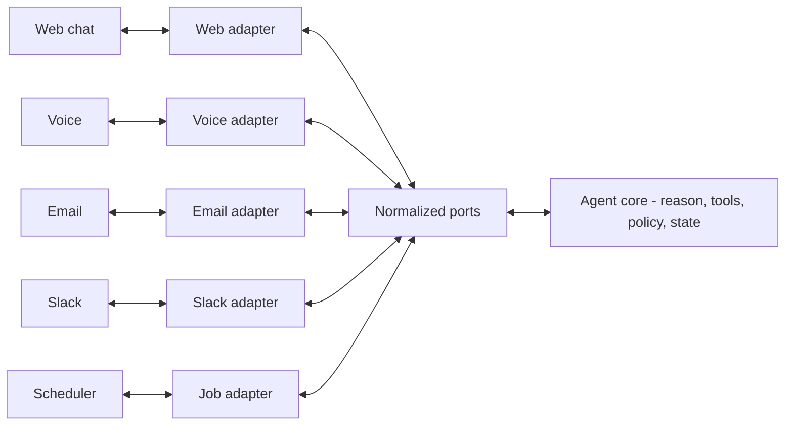

# Channel-Decoupled Agent Core

**Also known as:** Channel-Agnostic Agent Core, Delivery-Channel Adapter, Ports-and-Adapters Agent

**Category:** Structure & Data  
**Status in practice:** mature

## Intent

Put the agent's reasoning, tools, and session state behind channel-agnostic ports, and make each delivery surface (web, voice, email, Slack, background jobs) an adapter, so one core serves every channel.

## Context

A team that built an agent inside a web chat widget is asked to also offer it over the phone, by email, in Slack, and as a background job that runs with no user present. Each surface has its own transport, turn-taking, latency budget, and message format. The reasoning, tools, and policies are the same in every case, but they were written tangled together with the chat widget's request-response assumptions.

## Problem

When the agent loop is wired straight to one channel's mechanics, every new surface forces a partial rewrite of logic that has nothing to do with the channel. Voice needs streaming and interruption handling, email is high-latency and asynchronous, Slack threads carry their own identity, and background automation has no live user to clarify with. Copying the agent into each surface duplicates the reasoning and lets the copies drift, so a policy fix made for chat never reaches the phone line.

## Forces

- Each channel imposes its own transport, turn-taking, modality, and latency, yet the reasoning and policies are identical across them.
- Duplicating the agent per channel is fast to start but guarantees the copies drift, so a fix in one surface silently misses the others.
- A channel-agnostic core needs a normalized internal message and event shape, but forcing voice, email, and chat through one shape can strip channel-specific affordances such as streaming, attachments, or threading.
- Some channels are synchronous and live while others are asynchronous or unattended, so the core cannot assume a user is present to clarify.

## Therefore

Therefore: put the reasoning, tools, and state behind channel-agnostic input and output ports, and implement each delivery surface as an adapter that translates its transport and modality into those ports and back.

## Solution

Separate the agent into a core and a set of channel adapters. The core holds the reasoning loop, tool calls, policies, and session state, and it speaks only a normalized internal contract: an inbound event (who, session, content, modality, attachments) and an outbound action (reply, tool effect, hand-off, push). Each delivery surface is an adapter that owns that channel's specifics: the web adapter handles request-response and rendering, the voice adapter handles streaming audio, barge-in (the caller interrupting mid-sentence), and turn-taking, the email adapter handles asynchronous threads and long latency, the Slack adapter handles thread identity, and a scheduler adapter drives the core with no live user. Session state lives with the core keyed by a channel-independent conversation id, so the same conversation can move across surfaces and the core can run unattended in the background. Adding a channel means writing one adapter, not touching the core; fixing a policy touches the core once and every channel inherits it.

## Structure

```
Inbound: channel transport -> channel adapter -> normalized inbound event -> agent core (reason, tools, policy, state). Outbound: agent core -> normalized outbound action -> channel adapter -> channel transport. The core is unaware of which adapter is attached.
```

## Diagram



*Each delivery channel sits behind its own adapter; all adapters speak the same normalized ports to one channel-agnostic agent core.*

## Example scenario

A company ships a returns-assistant as a website chat widget, then wants it on the support phone line and in the customer's email inbox. With a decoupled core, the team writes a voice adapter and an email adapter that translate each channel into the same inbound event the chat widget already produces, and the assistant's logic, tools, and refund policy are reused untouched. A later policy change — a stricter refund window — is edited once in the core and takes effect on web, phone, and email at the same time.

## Consequences

**Benefits**

- A new delivery surface is one adapter; the reasoning, tools, and policies are reused unchanged.
- A policy or behavior fix is made once in the core and every channel inherits it, so surfaces cannot drift apart.
- Because the core holds session state under a channel-independent id, one definition runs synchronous chat, multi-session conversations, and unattended background jobs.

**Liabilities**

- The normalized contract is a design bottleneck: a channel feature it cannot express (streaming tokens, rich attachments, voice interruption) is hard to surface without leaking channel specifics into the core.
- An extra translation layer per channel adds latency and a place for bugs, and a thin or wrong contract pushes channel logic back into the core anyway.
- Channels differ in identity, auth, and capability, so the adapters carry real complexity even though the core stays simple.

## Failure modes

- Leaky core — channel-specific assumptions (a chat typing indicator, a Slack thread id) seep into the core, and the decoupling erodes until it is channel-coupled again.
- Lowest-common-denominator contract — the normalized shape supports only what every channel shares, so rich channels lose streaming, attachments, or voice affordances.
- Adapter drift — each adapter re-implements session or auth handling slightly differently, reintroducing the duplication the pattern was meant to remove.
- Synchronous assumption — the core asks a clarifying question that an unattended background or email channel cannot answer, and the run stalls.

## What this pattern constrains

The agent core must not reference any channel's transport, message format, or turn-taking directly; it may read and emit only the normalized inbound event and outbound action, and all channel-specific handling stays inside adapters.

## Applicability

**Use when**

- The same agent must run across more than one delivery surface (web, voice, email, chat apps) or across both live and unattended modes.
- Channel-specific mechanics (streaming, threading, latency, attachments) keep changing while the reasoning and policies stay the same.
- Policy and behavior must stay identical across surfaces, so a single source of truth for logic is required.

**Do not use when**

- The agent serves exactly one channel and there is no foreseeable second surface, so the adapter layer is pure overhead.
- A channel's defining feature cannot survive a normalized contract and must drive the core directly, as in a deeply voice-native experience.
- The team cannot maintain the internal contract, so adapters would bypass it and the decoupling would not hold.

## Components

- Agent core — the channel-agnostic reasoning loop, tools, policies, and session state
- Inbound port — the normalized event contract the core consumes (sender, session id, content, modality, attachments)
- Outbound port — the normalized action contract the core emits (reply, tool effect, hand-off, push)
- Channel adapter — a per-surface translator between a channel's transport and the ports, one each for web, voice, email, Slack, and scheduler
- Session store — holds conversation state under a channel-independent id so a conversation can move across surfaces and run unattended
- Capability negotiation — lets an adapter declare what its channel supports (streaming, attachments, interactivity) so the core degrades gracefully

## Tools

- Channel connector SDKs — implement each adapter against a channel's transport (web, telephony, email, Slack)
- Message or activity schema — the normalized internal contract every adapter maps to and from
- Session and state store — persists conversation state keyed by a channel-independent id
- Background scheduler or event bus — drives the core on unattended channels with no live user

## Evaluation metrics

- Lines of core changed to add a channel — should trend to zero as adapters absorb channel specifics
- Behavior parity across channels — whether the same input yields the same policy decision on every surface
- Adapter-to-core leak count — how many channel-specific assumptions have crept into the core
- Cross-channel session continuity rate — how often a conversation survives moving between surfaces
- Per-channel added latency — the cost the adapter and translation layer impose

## Known uses

- **[Microsoft Bot Framework / Azure Bot Service channels](https://learn.microsoft.com/en-us/azure/bot-service/bot-service-manage-channels)** _available_ — Bot logic is built once against the Bot Framework activity schema; the Azure Bot Service connects the same bot to many channels (Teams, Web Chat, telephony, email, Slack) without changing the bot code.
- **[Rasa input/output channel connectors](https://rasa.com/docs/rasa/connectors/your-own-website/)** _available_ — Rasa runs one assistant behind pluggable input/output connectors (REST, web, Slack, Telegram, Twilio voice, and more); the dialogue logic is written once and a connector adapts each channel.

## Related patterns

- _complements_ **Agent Adapter** — Sibling adapter patterns at different boundaries: agent-adapter normalizes heterogeneous tools behind one tool-calling interface; this normalizes heterogeneous delivery channels behind one inbound/outbound contract.
- _used-by_ **Managed Agent Runtime** — A managed runtime that fronts chat, voice, email, and webhooks is a hosted realization of this decoupling; the runtime uses channel adapters over a shared agent core.
- _complements_ **Vendor Lock-In** — Same adapter discipline on a different boundary: vendor-lock-in is solved by a model-provider adapter, this by a delivery-channel adapter; applying both keeps the core independent of providers and channels.
- _complements_ **Business + LLM Microservice Split** — Both split an agent system along a boundary so each side evolves on its own: that pattern splits CPU business logic from GPU inference, this splits the channel-agnostic core from per-channel adapters.
- _complements_ **Bidirectional Impulse Channel** — That pattern carries request and push within one channel; this spans many channels, and a bidirectional channel is one adapter the core can drive.
- _complements_ **Event-Driven Agent** — Unattended and background surfaces are event-driven; an event or webhook source is simply another inbound adapter feeding the channel-agnostic core.

## References

- [Hexagonal architecture (software)](https://en.wikipedia.org/wiki/Hexagonal_architecture_(software))
- [Connect a bot to channels — Azure Bot Service](https://learn.microsoft.com/en-us/azure/bot-service/bot-service-manage-channels)
- [Architecting for agentic AI development on AWS](https://aws.amazon.com/blogs/architecture/architecting-for-agentic-ai-development-on-aws/) — 2025
- [What Salesforce learned from 20,000+ AI agent deployments](https://blog.bytebytego.com/p/what-salesforce-learned-from-20000) — 2026
