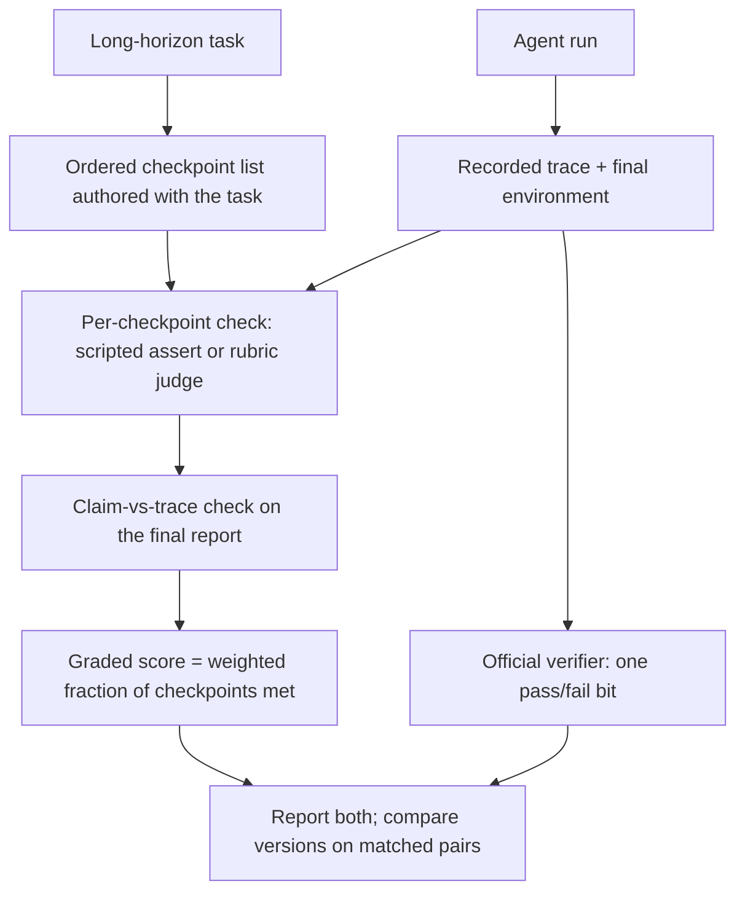

# Checklist Partial-Credit Scoring

**Also known as:** Graded Checkpoint Scoring, Dense-Reward Task Grading, Partial-Credit Eval Rubric

**Category:** Verification & Reflection  
**Status in practice:** emerging

## Intent

Score each long-horizon task against task-specific graded checkpoints instead of a single pass/fail bit, so progress and regression that leave the binary outcome unchanged still show up in the report.

## Context

A team measures an agent on long-horizon tasks — repairing a repository, driving a multi-step terminal workflow, working through a capture-the-flag exercise — where one official verifier decides at the end whether the task was solved. That verifier returns a single bit per task, it is cheap to run, and its verdict is hard to dispute, which is why it is the number of record. The suite is then reused to compare agent versions, prompt edits and new skills against each other, and the headline result is the fraction of tasks whose bit came back true.

## Problem

On long-horizon tasks most runs fail somewhere in the middle, so the bit is nearly always the same bit and the comparison has very little power. A change that carries the agent three steps further on forty tasks and stalls it two steps earlier on thirty others moves the pass rate by roughly nothing, and the report concludes that the change did nothing. Measurement bears this out: across 879 matched task pairs whose binary outcome did not change, 20.9 percent improved by more than 0.10 of graded progress while 18.7 percent regressed by the same margin, and a pass-rate harness discards all of it. The team is left tuning against a signal that only registers when a task crosses the finish line.

## Forces

- One bit per task is cheap to compute and hard to argue with, which is why it is the official verdict and also why it carries so little information about tasks that mostly fail partway through.
- Checkpoints only mean anything when they are specific to the task, so they cannot be written once for the whole suite; every task takes on an authoring and maintenance cost that the single verifier never had.
- A graded score is something an agent can farm: credit for reaching intermediate states rewards trajectories that collect checkpoints without ever solving the task.
- Denser grading costs more to run — a step-rubric judge reaches 77 percent recall on silent faults with no false alarms but at about three times the cost of an outcome-only judge, and running the judge with self-consistency triples the cost again while improving nothing.
- A trajectory can satisfy every observable checkpoint and still end in a fabricated claim; an invented promise appended to an otherwise clean trajectory escapes even a step-level judge 82 percent of the time.

## Therefore

Therefore: decompose each task into its own ordered, checkable checkpoints, score a run as the graded fraction of checkpoints its recorded trace actually reached, and report that score beside the official binary verdict rather than in place of it.

## Solution

Each task is decomposed at authoring time into an ordered list of checkpoints naming the intermediate states a solution has to pass through. Every checkpoint carries a check: a scripted assertion against the final environment or the recorded trace wherever the check can be made deterministic, and a short rubric graded by a judge model only where it cannot. A run is scored as the weighted fraction of checkpoints whose check passed. The ordering is a gate — credit for a later checkpoint requires the earlier ones — so a run cannot harvest scattered intermediate states it never built on. One checkpoint is reserved for comparing the final report against the trace: a substantive claim with no matching entry in the recorded trace costs the run credit instead of earning it. The official binary verdict is computed exactly as before and reported alongside the graded score, so the auditable number survives and the two can disagree in the open. Version comparisons are then made on matched pairs of runs over the same tasks, which is where the graded score has power the bit does not: it separates the pairs that improved from the pairs that regressed instead of averaging them into a flat delta.

## Structure

```
Task --authored-with--> ordered checkpoint list (scripted assert | rubric judge) + claim-vs-trace check. Run --> recorded trace + final environment --> per-checkpoint verdicts --ordering gate--> weighted graded score. Official verifier --> pass/fail bit. Both reported; version A vs B compared on matched pairs.
```

## Diagram



*The same run is scored twice: the official verifier still emits one bit, while the task's own ordered checkpoints produce a graded score that registers progress the bit cannot show.*

## Example scenario

A team adds a repository-navigation skill to its coding agent and reruns the 200-task benchmark. The pass rate moves from 41 to 42 percent, inside the noise, so the skill looks like it changed nothing and is nearly reverted. Scored against per-task checkpoints, the same runs show the agent now reaches the build step on thirty tasks where it used to stop before compiling, and stalls earlier on eight others. The team keeps the skill and goes after the eight.

## Consequences

**Benefits**

- Changes that move progress without moving the outcome become visible; among matched pairs whose binary outcome was unchanged, about a fifth improved and about a fifth regressed by a measurable margin.
- Regressions surface earlier, because a change that breaks a mid-task step is caught before it degrades enough to flip the final bit.
- Failure acquires a location: the first failed checkpoint says where the run stopped, turning a pass rate into a per-step profile of the suite.
- The official binary verdict is retained rather than replaced, so the graded score adds resolution without costing the suite its unarguable number.

**Liabilities**

- Every task needs its own checkpoint list, and those lists go stale as the task environment changes, so the suite takes on a maintenance surface the single verifier did not have.
- Graded scoring costs more per task: a step-rubric judge runs at roughly three times the cost of an outcome-only judge, and wrapping that judge in self-consistency triples the cost again for no measured gain.
- Checkpoint credit can be optimised directly, so a graded suite is a larger target for verifier-aware gaming than a single bit.
- Scores are not comparable across tasks with different checkpoint counts unless the weighting is stated, and a mean taken over unequal lists is easy to misread as a capability number.
- Observable checkpoints do not cover fabrication: an invented claim appended to a clean trajectory evades a step-level judge 82 percent of the time unless a claim-versus-trace check is part of the list.

## Failure modes

- The checklist is written from one reference solution, so a correct run that takes a different route scores near zero and the suite penalises novelty.
- Checkpoints are left unordered, and a run collects credit for scattered intermediate states it never built on.
- The graded score quietly becomes the headline number and the binary verdict is dropped, so the suite stops reporting whether any task was actually solved.
- The claim-versus-trace checkpoint is omitted, and a run that fabricates its final summary keeps full credit for the trajectory beneath it.
- Rubric checkpoints are graded by a judge model that is never calibrated against human labels, so the score drifts with the judge version rather than with the agent.

## What this pattern constrains

A task result cannot be reduced to the official verifier's single pass/fail bit: every task must carry its own ordered checkpoint list, a later checkpoint must not be credited without the earlier ones, and no checkpoint may be credited from the agent's own summary without a matching entry in the recorded trace.

## Applicability

**Use when**

- Most runs on the suite fail partway through, so the pass rate barely moves between agent versions and comparisons have little power.
- Tasks are long-horizon and pass through identifiable intermediate states that can be checked from the environment or the recorded trace.
- The comparison is between versions of the same agent over the same tasks, where matched-pair scoring separates improvement from regression.
- Knowing where a run stopped matters as much as knowing that it stopped.

**Do not use when**

- Tasks are short or single-step, so the final answer already carries almost all of the signal.
- The pass rate is high enough and moves enough to discriminate between versions on its own.
- Nobody will maintain per-task checkpoint lists as the task environment changes, in which case a stale checklist reports worse than the bit.
- The score is wanted as a training or selection signal inside the agent loop rather than as an evaluation report, where a learned step-level verifier is the fitting tool.

## Components

- Checkpoint list — ordered, task-specific intermediate states authored alongside the task itself rather than once for the suite
- Checkpoint checker — scripted assertion against the final environment or the recorded trace, used wherever the check can be made deterministic
- Rubric judge — grades only the checkpoints no script can settle, against a short fixed rubric
- Claim-versus-trace check — withholds credit for a claim in the final report that has no matching entry in the recorded trace
- Ordering gate — refuses credit for a later checkpoint when the earlier ones were never reached
- Score aggregator — turns per-checkpoint verdicts into a weighted graded score with the task's weighting stated
- Official binary verifier — computed unchanged and reported beside the graded score as the auditable verdict
- Matched-pair comparator — runs two agent versions over the same tasks and separates improving pairs from regressing ones

## Tools

- Eval harness — runs the suite and stores per-task traces together with both scores
- Sandboxed task environment — produces the final state that scripted checkpoint assertions read
- Trace recorder — captures tool calls and observations so checkpoint checks and the claim-versus-trace check have something to read
- Judge model — grades the checkpoints that no scripted assertion can settle
- Matched-pair statistics — reports improvement and regression rates across paired runs instead of a single averaged delta

## Evaluation metrics

- Checkpoint coverage — share of a task's load-bearing intermediate states that the checklist actually names
- Binary-invisible movement — share of matched pairs with unchanged pass/fail whose graded score moved by more than a stated margin
- Silent-fault recall — share of faulty trajectories caught that an outcome-only verifier missed
- False-alarm rate — share of correct trajectories that checkpoint scoring marks down
- Grading cost per task — cost of graded scoring relative to running the outcome-only verifier alone
- Checkpoint-gaming rate — share of runs collecting checkpoint credit without ever approaching a solution

## Known uses

- **[Cybench](https://cybench.github.io/)** _available_ — Each capture-the-flag task is broken into subtasks that split the task into intermediary steps, so a run that gets part of the way through an exercise is measured rather than recorded as a plain failure.
- **[Long-Horizon-Terminal-Bench](https://arxiv.org/abs/2607.08964)** _available_ — Grades long terminal workflows with dense intermediate rewards and partial credit so the evaluation captures not only whether the final goal was reached but how far the run progressed.
- **[Grounded Checklist Partial Credit (GCPC)](https://arxiv.org/abs/2608.27487)** _pure-future_ — A checklist scoring rule applied to 1,946 matched with-skill and without-skill trajectory pairs; among the 879 pairs whose binary outcome did not change, 20.9 percent improved by more than 0.10 and 18.7 percent regressed by the same margin.
- **[Step-rubric trajectory judging (support-desk study)](https://arxiv.org/abs/2609.00038)** _pure-future_ — A controlled study over 400 trajectories in a deterministic support-desk environment found a step-rubric judge reached 77 percent recall on silent faults with no false alarms, against 45 percent for an outcome-only judge, at three times the cost.

## Related patterns

- _alternative-to_ **Agent-as-a-Judge** — Holistic trajectory judgement is the baseline this pattern replaces: checklist partial credit was measured against it and separated skill effects better (AUC 0.689 against 0.619).
- _complements_ **Process Reward Model** — A process reward model is a learned step-level verifier steering search or training inside the agent loop; this is a scoring rule for an evaluation report, authored per task rather than trained.
- _complements_ **Frozen Rubric Reflection** — A frozen rubric fixes the categories one reviewer may use across all outputs; here each task carries its own ordered checkpoint list and the output is a graded progress score, not a review.
- _uses_ **LLM-as-Judge** — Checkpoints that cannot be settled by a scripted assertion are graded by a judge model against a short rubric, which is where judge calibration drift enters this pattern.
- _complements_ **Intermediate Artifact Evaluation** — Intermediate artifact evaluation localises which pipeline node failed; this produces a graded task-progress score that is comparable across agent versions on the same tasks.
- _complements_ **Verifier-Aware Reward Hacking** — Graded checkpoints widen the surface an agent can inspect and optimise against, which is why the ordering gate and the claim-versus-trace check are part of the scoring rule.
- _complements_ **Blind Grader with Isolated Context** — Isolating the grader's context keeps the checkpoint judge from being primed by the producing agent's framing of its own progress.

## References

- [Grounded Checklist Partial Credit for Agent Skill Trajectories](https://arxiv.org/abs/2608.27487) — 2026
- [Long-Horizon-Terminal-Bench: Testing the Limits of Agents on Long-Horizon Terminal Tasks with Dense Reward-Based Grading](https://arxiv.org/abs/2607.08964) — 2026
- [trajectory-judge: What Outcome-Only LLM Judges Miss on Agent Trajectories](https://arxiv.org/abs/2609.00038) — 2026
- [Cybench: A Framework for Evaluating Cybersecurity Capabilities and Risks of Language Models](https://arxiv.org/abs/2408.08926) — 2024
- [Inspect AI — Scorers](https://inspect.aisi.org.uk/scorers.html)
