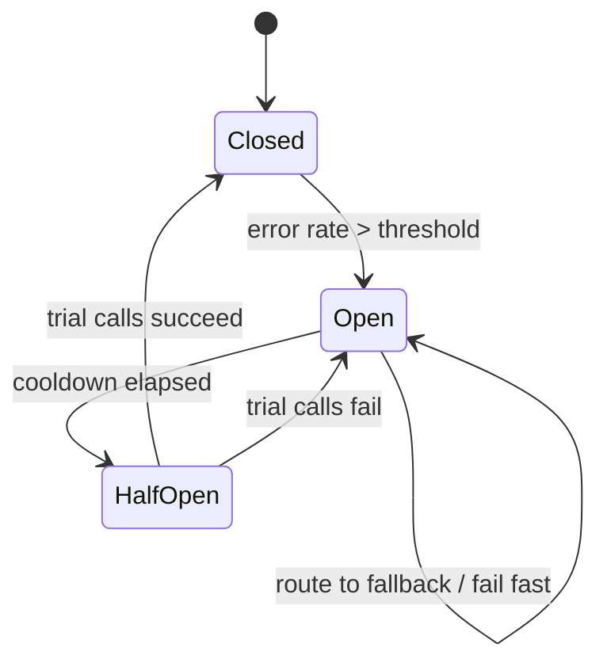

# Circuit Breaker

**Also known as:** Failure Trip, Rate-Limit Trip

**Category:** Routing & Composition  
**Status in practice:** mature

## Intent

Stop calling a failing dependency for a cooldown period after error rates exceed a threshold.

## Context

An agent calls external services as part of every request — third-party APIs, vector databases, model providers, internal microservices — and those dependencies fail from time to time through rate limiting, vendor outages, regional incidents, or transient bugs. The agent itself does not control when these failures happen, but it does control how it reacts when one of them starts returning errors. Retries are the natural first instinct because most transient errors clear on their own.

## Problem

When a dependency is genuinely down or rate-limited, naive retry logic hammers it with the same failing call over and over, burning token budget and wall-clock latency on responses that will never succeed. Worse, the retry storm can push a partially-degraded vendor past its rate limits and block legitimate traffic from other tenants, turning a small incident into a larger one. The team has no way to give the upstream a chance to recover without a coordinated decision to back off.

## Forces

- Threshold tuning trades fast detection for false trips.
- Cooldown duration trades availability for stability.
- Per-endpoint vs global breakers differ on blast radius.

## Therefore

Therefore: trip an open state when per-dependency error rate crosses a threshold and refuse calls until a cooldown probes recovery, so that a failing dependency is not hammered into a worse failure.

## Solution

Track per-dependency error rate over a window. When error rate exceeds a threshold, 'open' the breaker: route calls to fallback (or fail fast) for a cooldown. After cooldown, allow trial calls; close the breaker on success.

## Example scenario

A tool-using agent calls a third-party enrichment API that suddenly starts returning 500s. Without protection it retries every call, burning token budget on failed responses and tripping the vendor's per-key rate limit. The team puts a Circuit Breaker in front of the tool: once the error rate over the last minute exceeds 30%, the breaker opens and short-circuits subsequent calls with a structured 'dependency unavailable' result for sixty seconds before probing again. Cost stops climbing and the agent can pivot to a fallback strategy.

## Diagram

## Consequences

**Benefits**

- Cost and latency under partial outages drop.
- Upstream dependencies recover without retry storms.

**Liabilities**

- False trips degrade availability when the error was transient.
- Tuning is empirical.

## What this pattern constrains

When the breaker is open, the dependency must not be called; only fallback paths may run.

## Applicability

**Use when**

- A dependency fails often enough that hammering it wastes cost or blocks legitimate traffic.
- Per-dependency error rates can be tracked over a meaningful window.
- A fallback or fail-fast path exists for use during the cooldown.

**Do not use when**

- Failures are correlated across all dependencies and there is no useful fallback to route to.
- The dependency is so cheap that wasted calls cost less than the breaker machinery.
- Cooldown semantics conflict with strict per-request SLAs (every request must be tried).

## Known uses

- **Standard pattern in microservice frameworks; transferred to agent stacks** — *Available*
- **[Sparrot](https://marco-nissen.com/sparrot/)** — *Available* — Sliding-window failure tracking on each LLM provider with cooldown on rate-limits; a separate breaker also closes tool loops that hit repeat / unknown / poll / ping-pong patterns.

## Related patterns

- *composes-with* → [fallback-chain](fallback-chain.md)
- *complements* → [rate-limiting](rate-limiting.md)
- *complements* → [exception-recovery](exception-recovery.md)
- *complements* → [provider-fallback](provider-fallback.md)
- *composes-with* → [kill-switch](kill-switch.md)
- *used-by* → [graceful-degradation](graceful-degradation.md)

## References

- (book) *Release It! (Michael Nygard)*, 2007

**Tags:** routing, reliability, breaker
