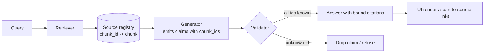

# Citation Attribution

**Also known as:** Source Attribution, Answer-to-Source Binding, Span-Level Citations

**Category:** Retrieval  
**Status in practice:** mature

## Intent

Track and surface, alongside a RAG-grounded answer, which retrieved chunks supported which claims, so the binding between answer span and source survives all the way to the user.

## Context

RAG systems where the user must be able to trace any claim back to the retrieved evidence that supports it; compliance, research, and customer-support settings where unsupported claims are not acceptable.

## Problem

Generating citations is not enough — they must be bound to the spans of the answer they support. Free-text citations the model writes are ungrounded (see hallucinated-citations); the binding has to be created by the retrieval pipeline and preserved through generation and delivery.

## Forces

- The chunk-to-claim binding can be at document, chunk, or span level; finer granularity is more useful but harder.
- Models given retrieved context may still fabricate citations to documents that were not retrieved.
- Span-level alignment requires the model to emit either citation markers or structured outputs that the runtime resolves.
- Aggregating citations from multiple chunks behind one claim is common — single-source attribution is too narrow.
- Distinct from citation-streaming, which is the delivery shape; this is the binding itself.

## Applicability

**Use when**

- Users must be able to trace each claim to a retrieved source.
- Compliance, research, or audit settings make unsupported claims unacceptable.
- The delivery UI can render per-claim or per-span source links.
- The retrieval pipeline already assigns stable source ids to chunks.

**Do not use when**

- Answers do not depend on retrieved evidence (no retrieval, no binding).
- The binding granularity required is finer than what the model and validator can deliver reliably.
- Citation markers in prose would degrade the UX more than they help.

## Therefore

Therefore: bind every claim in the answer to one or more retrieved-source ids during generation and validate the binding against the retrieval result before delivery, so that what reaches the user is span-anchored to evidence that was actually retrieved.

## Solution

During retrieval, assign each chunk a stable source-id and keep a registry of which ids were retrieved for this turn. During generation, either (a) prompt the model to emit citation markers (`[src-id]`) at the granularity you want, then resolve and validate them against the registry, refusing any id that was not retrieved; or (b) use a structured-output schema that has a `claims` array with `text` and `supporting_chunk_ids` fields. At delivery, attach the resolved source records to the answer so the UI can render the binding. Pair with citation-streaming (delivery), naive-rag / contextual-retrieval (the upstream retrieval), and hallucinated-citations (the anti-pattern that ignores binding).

## Structure

Retriever → {chunk_id, content, source} registry → Generator (emits claims tagged with chunk_ids) → Validator (drops or refuses unknown ids) → Answer with bound citations.

## Example scenario

A legal-research assistant retrieves case excerpts and must produce an analysis where every claim cites the source case. The team assigns each retrieved chunk a stable `chunk_id` and prompts the model to emit a structured output: a list of claims, each with `text` and `supporting_chunk_ids`. A validator rejects any `chunk_id` not in this turn's retrieval registry. The UI renders each claim with footnote-style links to the cited cases. When the model is uncertain it returns fewer claims rather than fabricating citations; the citation-attribution binding is what the auditor checks.

## Diagram

## Consequences

**Benefits**

- Every claim is traceable to a retrieved chunk; unsupported claims are detectable.
- Auditors and users can verify provenance independently.
- The binding survives delivery, so UI components can render per-span source links.
- Hallucinated citations are blocked at validation time, not noticed at user-report time.

**Liabilities**

- Generation quality drops if the model is asked for tight span-level attribution and a coarser binding would suffice.
- Multi-chunk claims need aggregation logic — single-source binding is too narrow.
- Citation markers in prose can clutter UX; the delivery layer must render them well.
- Validation that rejects unknown ids must be paired with a fallback to avoid empty answers.

## What this pattern constrains

Every claim in the answer must be bound to at least one retrieved-source id from this turn's retrieval registry; citations to ids not in the registry must be rejected before delivery.

## Known uses

- **Anthropic Claude (Citations API)** — Claude's Citations feature returns per-claim citations bound to provided source documents. *Available* — [link](https://docs.anthropic.com/en/docs/build-with-claude/citations)
- **OpenAI Responses API (file_citation / url_citation annotations)** — OpenAI's Responses API emits citation annotations bound to retrieved files or URLs. *Available* — [link](https://cookbook.openai.com/examples/responses_api/responses_example)
- **Dify (automatic citations on knowledge retrieval)** — When an LLM node consumes context variables from knowledge retrieval, Dify automatically tracks citations. *Available* — [link](https://github.com/langgenius/dify-docs/blob/main/en/use-dify/nodes/llm.mdx)
- **Perplexity / You.com / Phind** — Answer engines that show source links bound to claim spans as the headline UX. *Available*

## Related patterns

- *complements* → [citation-streaming](citation-streaming.md)
- *uses* → [naive-rag](naive-rag.md)
- *uses* → [contextual-retrieval](contextual-retrieval.md)
- *alternative-to* → [hallucinated-citations](hallucinated-citations.md)
- *complements* → [structured-output](structured-output.md)

## References

- *doc*: [Anthropic Claude — Citations](https://docs.anthropic.com/en/docs/build-with-claude/citations) — Anthropic
- *doc*: [Dify — LLM node and citation tracking](https://github.com/langgenius/dify-docs/blob/main/en/use-dify/nodes/llm.mdx) — LangGenius

**Tags:** retrieval, citations, rag, anthropic, openai, dify
