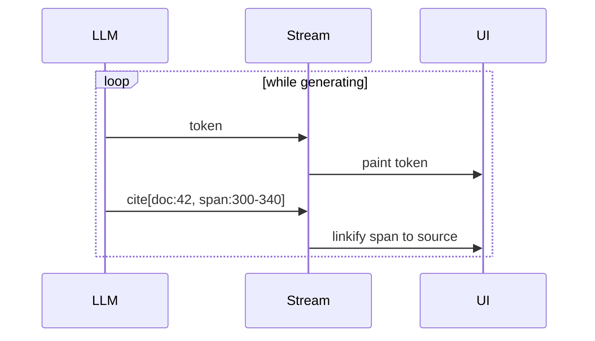

# Citation Streaming

**Also known as:** Inline Citations, Source-Anchored Output

**Category:** Streaming & UX  
**Status in practice:** mature

## Intent

Stream citations alongside generated text so the UI can render source links in place as content appears.

## Context

A team is building a retrieval-augmented agent — Retrieval-Augmented Generation, where the model answers from a set of documents pulled in at query time — and the user needs to see which source each claim came from. The answer streams to the user token by token so the interface feels responsive. The team has to decide when and how the citations should appear alongside the streaming text.

## Problem

Two obvious choices both fail. Generating the answer first and the citation list afterwards hides every source until the streaming finishes, which defeats the responsiveness the streaming was meant to deliver and trains users to wait for the end before they trust anything. Asking the model to weave citation markers into its prose and hoping it does so consistently is unreliable: marker formats drift, citations attach to the wrong span, and a free-form text channel cannot tell the user-interface code which characters are a citation and which are prose.

## Forces

- Citation events must align with generated tokens.
- Source spans need stable ids.
- UI needs to render mid-stream without flickering.

## Therefore

Therefore: emit citations as typed events on the same stream as the text, so that the UI can render verifiable source links in place as content appears.

## Solution

Define a streaming event vocabulary that includes citation events linked to source ids. The model is prompted to emit citation markers; the host extracts them into typed events alongside text deltas. The UI renders sources progressively. Final output includes a citation map.

## Applicability

**Use when**

- Outputs cite documents and users need to verify each claim.
- Regulatory or audit requirements demand source attribution at the span level.
- Trust depends on traceability from claim back to evidence.

**Do not use when**

- Outputs are creative and not grounded in retrievable documents.
- Latency-critical paths cannot afford citation rendering overhead.
- Citations would be noise — speed is more valuable than verifiability.

## Example scenario

A medical-information agent answers 'what are the side effects of metformin?' As the answer streams to the user, each clinical claim arrives with a citation pointing back to the exact paragraph in the prescribing-information PDF. The user can click any sentence to verify the source — they don't have to trust the model alone.

## Diagram

## Consequences

**Benefits**

- Trust UX: claims trace to sources visibly.
- Hallucinations become visible (no source = suspicious).

**Liabilities**

- Streaming protocol is more complex.
- Citation event quality depends on model compliance.

## What this pattern constrains

Source claims in the output must reference a citation event with a valid source id.

## Known uses

- **Perplexity** — *Available*
- **Anthropic Citations API** — *Available*
- **ChatGPT** — *Available*
- **Gemini Deep Research** — *Available*
- **Glean** — *Available*

## Related patterns

- *specialises* → [streaming-typed-events](streaming-typed-events.md)
- *complements* → [naive-rag](naive-rag.md)
- *alternative-to* → [hallucinated-citations](hallucinated-citations.md)
- *alternative-to* → [attention-manipulation-explainability](attention-manipulation-explainability.md)

## References

- (doc) *Anthropic: Citations*, <https://docs.anthropic.com/claude/docs/citations>

**Tags:** streaming, citation, ux
