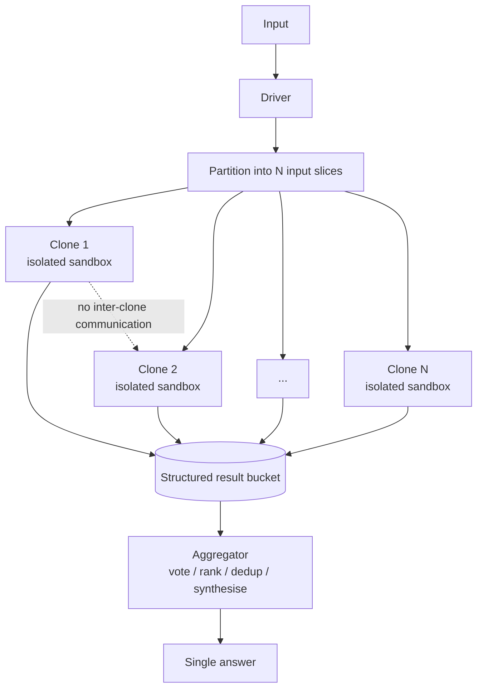

# Clone Fan-Out Research

**Also known as:** 通用副本扇出, Wide Research, Identical-Worker Fan-Out, Manus Wide Research

**Category:** Planning & Control Flow
**Status in practice:** emerging

## Intent

Spawn 100 or more identical, full-capability agent instances in parallel — each a complete general agent rather than a role-specialised worker — and aggregate their independent outputs into a single answer.

## Context

Wide-coverage tasks such as comparing many candidates, scanning many sources, or sampling many independent strategies. Each subtask is large enough that a role-specialised lightweight worker is too weak, but small enough that a full agent can handle it. Per-agent isolation is available (sandbox VMs or worktrees).

## Problem

Orchestrator-workers patterns assume specialisation — the orchestrator decomposes by role and dispatches to differently-skilled workers. Many real wide-coverage jobs are not role-decomposable: each unit of work needs the *same* full capability. Spawning hundreds of role-specialised workers wastes the orchestrator's effort and produces inconsistent worker quality. Spawning hundreds without isolation or aggregation produces the Unbounded Subagent Spawn anti-pattern.

## Forces

- Wide coverage demands high parallelism, but parallel agents collide if they share state.
- Each unit of work needs full agent capability, not a stripped-down worker.
- Aggregation must reconcile many independent outputs without an O(N²) comparison.
- Spawn cost and per-agent isolation cost grow linearly with N.

## Therefore

Therefore: spawn N identical full-capability agent clones into isolated sandboxes, give each the same prompt template parametrised by a different input slice, and pipe their structured outputs into a single aggregation pass so wide-coverage jobs scale by replication rather than by role decomposition.

## Solution

A driver computes the input partition (one slice per clone), allocates N isolated sandboxes (e.g. VMs or worktrees) so the clones cannot interfere with one another, and launches N instances of the same agent with the same system prompt and tools — only the input slice differs. Each clone runs to completion independently and writes a structured result to a shared collection bucket. A separate aggregator pass (LLM or deterministic) consolidates results — voting, ranking, deduplication, or synthesis. The clones never communicate; aggregation is one-shot at the end. N is bounded by a declared budget and the available sandbox pool, not by the agent's own discretion.

## Structure

```
Driver -> partition -> {Clone_1 ... Clone_N in isolated sandboxes} -> structured outputs -> Aggregator -> single answer.
```

## Diagram



*N identical full-capability agents run in isolation; aggregation is a single one-shot pass at the end.*

## Example scenario

A user asks an agent to compare 200 candidate libraries against five evaluation criteria. The driver partitions the list into 200 slices and spawns 200 identical agents, each in its own sandbox VM, each tasked with evaluating one library and emitting a structured row. After all clones finish, an aggregator pass ranks the rows and synthesises a shortlist. None of the clones talked to each other; the fan-out is bounded by the declared N=200.

## Consequences

**Benefits**

- Wide-coverage jobs scale linearly with sandbox count.
- Identical clones simplify reasoning about per-agent quality.
- No inter-clone coordination means no message-passing failure modes.
- Isolation prevents one clone's failure from poisoning others.

**Liabilities**

- Cost scales linearly with N; budgets must be explicit.
- Aggregation quality caps overall quality; a weak aggregator wastes the fan-out.
- Identical clones cannot specialise to harder slices.
- Without strict spawn bounds this collapses into Unbounded Subagent Spawn.

## What this pattern constrains

The driver must declare N up front; the agent itself cannot decide to spawn more clones recursively; clones must run in isolated sandboxes with no shared mutable state; results must be aggregated in a single declared pass, not by inter-clone chatter.

## Applicability

**Use when**

- The job naturally partitions into many independent units that each need full agent capability.
- Isolated sandboxes are available so clones cannot interfere.
- An aggregator (vote, rank, dedup, or synthesis) can produce one answer from N structured outputs.

**Do not use when**

- The subtasks are role-differentiated; use orchestrator-workers instead.
- No aggregation strategy exists; raw N outputs are not a deliverable.
- Per-clone cost makes N infeasible at the needed coverage.

## Known uses

- **[Manus Wide Research (Monica / Manus AI)](https://zhuanlan.zhihu.com/p/1934558071381812623)** — *Available* — Wide Research mode spawns 100+ identical full-capability agent instances in parallel VMs.
- **[Manus Wide Research technical writeup (SegmentFault)](https://segmentfault.com/a/1190000047111276)** — *Available* — Coverage of the architecture and parallelism model.
- **[Manus Wide Research announcement (OSCHINA)](https://www.oschina.net/news/363554/manus-wide-research)** — *Available* — Product-level introduction of the Wide Research feature.

## Related patterns

- *alternative-to* → [orchestrator-workers](orchestrator-workers.md) — Orchestrator-workers decomposes by role; clone fan-out replicates the same role.
- *specialises* → [parallelization](parallelization.md) — A specific shape of sectioning where every section gets the same full agent.
- *uses* → [subagent-isolation](subagent-isolation.md) — Each clone runs in its own isolated sandbox.
- *conflicts-with* → [unbounded-subagent-spawn](unbounded-subagent-spawn.md) — This pattern is the bounded, aggregated counterpart of that anti-pattern.
- *alternative-to* → [lead-researcher](lead-researcher.md) — Lead-researcher uses a small number of specialised subagents; clone fan-out uses many identical ones.

## References

- (blog) *Manus大升级，100多个智能体并发给你做任务*, 2025, <https://zhuanlan.zhihu.com/p/1934558071381812623>
- (blog) *Manus Wide Research：重新定义AI多智能体并发处理的技术革命*, 2025, <https://segmentfault.com/a/1190000047111276>
- (blog) *Manus推出Wide Research功能*, 2025, <https://www.oschina.net/news/363554/manus-wide-research>

**Tags:** fan-out, parallel, multi-agent, wide-research, isolation
