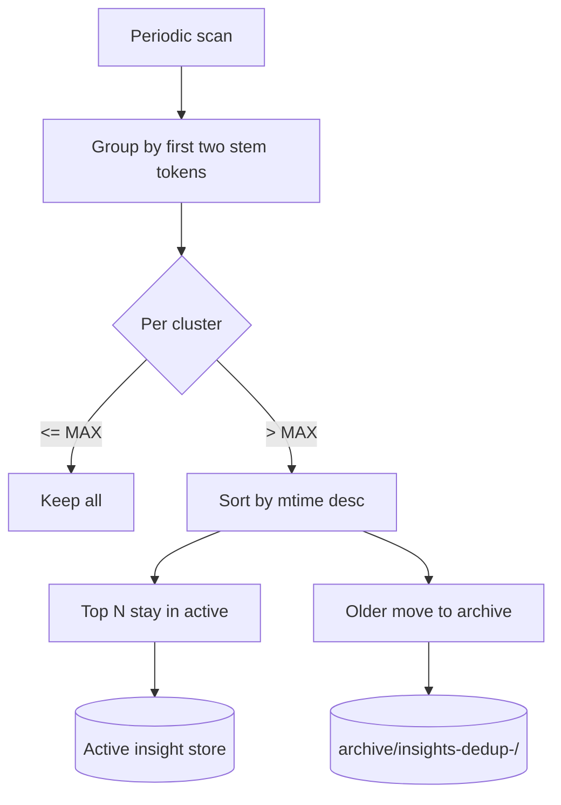

# Cluster-Capped Insight Store

**Also known as:** Insight Dedup, Cluster Ceiling, Mtime-Selected Insight Pruning

**Category:** Cognition & Introspection
**Status in practice:** experimental

## Intent

Cap the number of insights per stem-token cluster and archive the oldest variants by mtime so the long-term store keeps the active research edge instead of accumulating near-duplicates.

## Context

A team is running a long-lived agent that writes small insight notes to disk over weeks and months as it reflects on its work. The store is append-only by default and grows continuously. Whenever the agent thinks about a recurring topic, it tends to produce slightly different versions of the same insight rather than locating and updating the old one, so a topic the agent revisits often ends up with a cluster of near-duplicate files.

## Problem

With no structural ceiling on per-topic clusters, the insight store accumulates twelve or fifteen variations on the same theme, and retrieval increasingly surfaces older drafts of the agent's own thinking instead of the current view. Asking a language model to merge each cluster into a single canonical insight is expensive to run on every consolidation pass and risks quietly losing the nuance that distinguishes the variants. The team is forced to choose between unbounded growth and a slow, opaque, model-driven cleanup.

## Forces

- Pure age-based eviction loses durable insights.
- Pure popularity loses fresh edges.
- LLM-driven merge is expensive and unauditable.
- Archived versions must remain available for forensics.

## Therefore

Therefore: cluster insight files mechanically by the first two stem tokens of their id, cap each cluster at a small N (default three) keeping the most-recently-touched by mtime, and move overflow to a timestamped archive directory, so that the active edge stays visible without losing the older variants.

## Solution

A periodic job (runs each consolidation pass) scans the insight directory, groups files by the first two stem tokens of the id (for example `affect-substrate-*`, `completion-narration-*`), and for any cluster above MAX_PER_CLUSTER keeps the N newest by mtime. Older files move to `archive/insights-dedup-<timestamp>/` with original names preserved. No model call, no merge. The archive is read-only after the move; provenance is preserved.

## Example scenario

A long-running personal agent has been writing insights for six months. An audit shows twelve files starting with `affect-`, ten with `completion-narration-`, three with `concept-rotation-`. The agent reads stale variants instead of the current one. The team adds a Cluster-Capped Insight Store: the consolidation pass groups files by first two stem tokens, caps each cluster at three keeping the most-recently-touched by mtime, and moves overflow to a timestamped archive. The active store shrinks from over two hundred files to under eighty and retrieval improves immediately.

## Diagram

*Cluster by stem tokens, cap by count, keep most-recent by mtime, archive the rest with timestamp.*

## Consequences

**Benefits**

- Active store keeps the current research edge, not a graveyard of variants.
- Mechanical clustering has no model cost and is fully auditable.
- Archive preserves older variants for forensics.

**Liabilities**

- Stem-token clustering will sometimes split related insights or merge unrelated ones.
- The cap is opinionated and bad clusters lose useful older work.
- Storage continues to grow because archive is preserved.

## What this pattern constrains

Insight files in the active store are capped per stem-token cluster; an insight cannot survive in the active store if it falls outside the most-recent N of its cluster — archive promotion is mechanical, not model-judged.

## Applicability

**Use when**

- Insights are written to disk continuously and near-duplicates accumulate.
- An LLM-merge approach is too expensive or too opaque for the use case.
- Stem-token clustering is a reasonable proxy for topical similarity.

**Do not use when**

- Insights are small in number or grow slowly enough that dedup is unnecessary.
- Stem-token clustering would lose critical distinctions (highly polysemous topics).
- Archive preservation is not feasible because of storage constraints.

## Known uses

- **Author's long-running personal agent (single private deployment)** — *Available* — Single-source evidence: one private deployment by the catalog author; no independently documented use yet.

## Related patterns

- *complements* → [dream-consolidation-cycle](dream-consolidation-cycle.md)
- *alternative-to* → [episodic-summaries](episodic-summaries.md)

## References

- (book) Tiago Forte, *Building a Second Brain (chapter on knowledge fragment hygiene)*, 2022, <https://www.buildingasecondbrain.com/book>
- (paper) Piotr A. Wozniak, Edward J. Gorzelanczyk, *Optimization of Repetition Spacing in the Practice of Learning*, 1994, <https://www.supermemo.com/en/archives1990-2015/english/ol/sm2>

**Tags:** cognition, insight-store, dedup, hygiene
