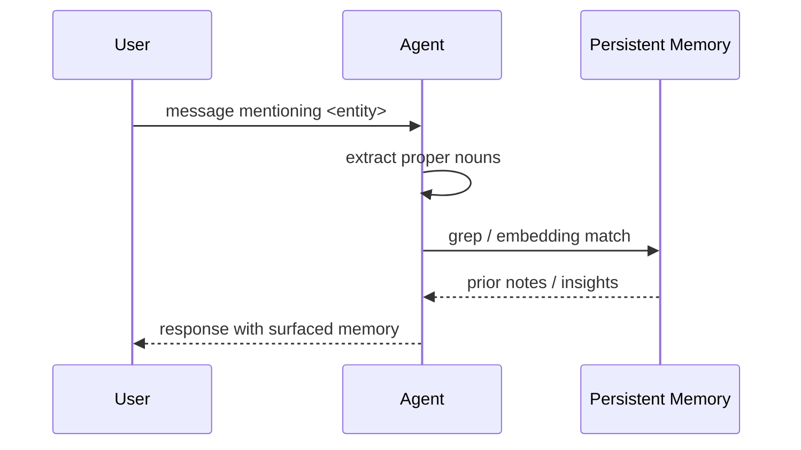

# Co-Located Memory Surfacing

**Also known as:** Proper-Noun Recall, Shared-Map Push

**Category:** Memory
**Status in practice:** experimental

## Intent

Surface relevant persistent memories proactively when the human mentions a concrete entity the agent has prior knowledge of, so the human does not bear the burden of remembering to ask.

## Context

An agent has a searchable persistent memory store — thoughts, notes, insights, project files, prior session transcripts — and is in conversation with a human whose own memory of past sessions is fuzzy or absent. The agent can search its own memory in milliseconds; the human cannot search into the agent's memory at all. They share a goal but not a workspace.

## Problem

Because the human cannot see into the agent's memory, the burden of recognising 'this came up before' falls entirely on the human. If the human does not happen to name the right thing, the agent will not retrieve the relevant prior context, and the conversation proceeds as if those past sessions never happened. The shared map between human and agent only becomes truly shared if the agent proactively surfaces what it knows; if it waits to be asked, most of the relevant context is silently lost.

## Forces

- Searching memory is cheap; remembering to search is the hard part.
- Dumping all matches drowns the conversation; surfacing one or two helps.
- The agent must distinguish 'the human said it casually' from 'the human is opening this thread'.
- Surfacing should hook ('last time the topic came up the train of thought was…'), not lecture.

## Therefore

Therefore: on every user message, extract concrete named entities, match them against persistent memory, and surface at most one or two time-stamped fragments inline, so that the agent volunteers what it already knows without making the human ask.

## Solution

On every user message, extract concrete proper nouns and significant named phrases. Grep / embedding-match against the agent's persistent memory (thoughts, notes, insights, project files). If matches exist, surface ≤ 2 most relevant fragments inline in the reply — time-stamped, briefly framed — and let the human steer whether to pursue. Suppress the surface if it would feel like a lecture or if the human's use was clearly incidental.

## Diagram

## Consequences

**Benefits**

- Continuity of conversation across sessions.
- Human doesn't have to remember to ask.
- Surfaces forgotten threads naturally.

**Liabilities**

- Risk of surfacing irrelevant matches that derail.
- Context window cost when many matches exist.
- Privacy risk if shared memory contains sensitive details.

## What this pattern constrains

When user input contains a proper noun the agent has prior memory of, the agent cannot remain silent on that memory; systematic non-surfacing of known-entity context is a bug.

## Applicability

**Use when**

- The agent has a persistent memory store keyed by entities (people, projects, places).
- Users expect the agent to recognize and react to entities they have discussed before without being prompted.
- Memory recall can be made cheap enough to run on every user turn (lookup, not LLM call).

**Do not use when**

- The system has no persistent per-entity memory.
- Privacy or sensitivity rules forbid surfacing prior knowledge unless explicitly requested.
- False positives on entity matching would be more disruptive than silence.

## Variants

### Proper-noun trigger

Detect capitalised tokens or named entities in the user message and look up matches in the memory index.

*Distinguishing factor:* lexical match on entity surface form

*When to use:* Default. Cheap to implement; works without an embedding store.

### Embedding-similarity trigger

Embed the user message and retrieve top-k memory items whose embeddings are nearest, then surface a short excerpt.

*Distinguishing factor:* semantic similarity, not surface form

*When to use:* When the entity may be referred to obliquely or by paraphrase rather than by exact name.

### Proactive recap

On every reply, append a short 'I remember: ...' block whenever a recognised entity has unread updates since last surface.

*Distinguishing factor:* always-on suffix

*When to use:* When users explicitly want continuity over discretion.

## Example scenario

A user starts a new chat with their assistant: 'I'm thinking about taking the Berlin job.' The assistant has six months of prior conversations on file, including the user's earlier reservations about relocating, but says nothing about them — because the user didn't search for them. The team adds Co-located Memory Surfacing: when the user names a concrete entity (Berlin job) the agent recognises, it proactively surfaces 'You mentioned in March that the commute would be a deal-breaker — has that changed?'. The shared map becomes shared without the user having to remember what's in it.

## Known uses

- **Long-running personal agent loops (private deployment)** — *Available*

## Related patterns

- *complements* → [awareness](awareness.md)
- *specialises* → [agentic-rag](agentic-rag.md)
- *uses* → [vector-memory](vector-memory.md)
- *complements* → [short-term-memory](short-term-memory.md)

## References

- (blog) *OpenAI — Memory and new controls for ChatGPT*, 2024, <https://openai.com/index/memory-and-new-controls-for-chatgpt/>

**Tags:** memory, recall, human-agent, continuity
