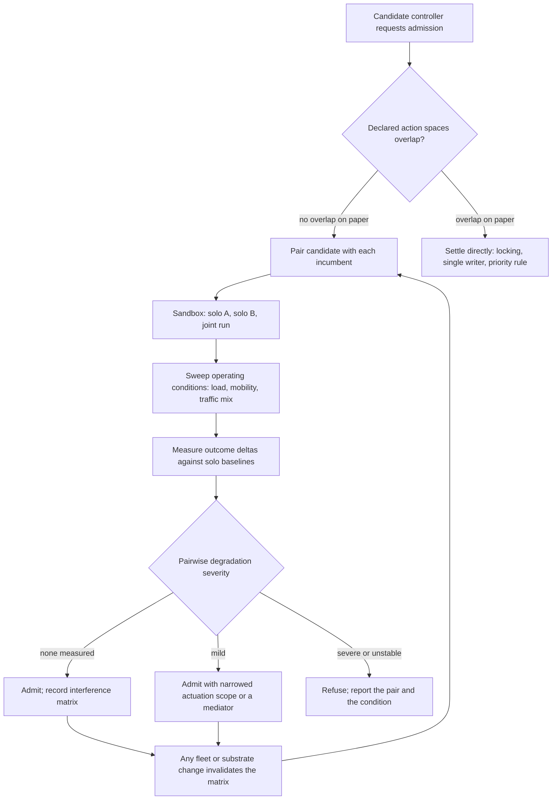

# Co-Tenant Interference Profiling

**Also known as:** Pre-Admission Interference Matrix, Sandbox Coexistence Profiling, Indirect Conflict Profiling

**Category:** Multi-Agent  
**Status in practice:** emerging

## Intent

Before admitting a new autonomous controller to a fleet acting on one shared physical substrate, profile it in a sandbox against every incumbent, measure pairwise outcome degradation, and gate admission on the measured severity.

## Context

A fleet of independently developed closed-loop controllers acts on one shared physical medium. The Near-RT RAN Intelligent Controller in an Open RAN deployment is the clearest instance: it hosts many xApps, each written by a different vendor, each an autonomous control loop over radio access network parameters, each admitted to the platform on its own merits. The same shape appears wherever separately authored agents actuate one substrate — warehouse robots on one floor, bidding agents in one auction, heating and shading controllers in one building. Each controller is reviewed alone, declares which parameters it writes, and is judged safe on that declaration.

## Problem

Controllers that share a substrate rarely collide on a parameter; they collide through the medium that couples the parameters they each own separately. One xApp owns transmit power, another owns resource-block allocation or handover offset. They never write the same field, so a static reading of their action spaces shows no overlap and the design review finds nothing. Radio physics couples them anyway: both move cell coverage, and the damage shows up only as degraded outcomes. PACIFISTA measures it — a 16% throughput loss between xApps with similar goals, and up to 30% performance degradation plus instability between xApps with opposing goals. Worse, the coupling is conditional rather than constant: two xApps may conflict under certain conditions and coexist under others, so a single review, or a single test run, cannot settle whether the pair is safe.

## Forces

- A declared action space is cheap to check and easy to reason about, but it describes which fields a controller writes, not which outcomes it moves, and indirect coupling lives entirely in the gap between the two.
- Each controller is individually correct and individually approved, so there is no faulty component to find; the harm exists only in the pair, and no single-agent review can see it.
- Conflicts are context-dependent — a pair that coexists under light load can oscillate under mobility or congestion — so evidence gathered under one operating condition does not transfer to another.
- Profiling every candidate against every incumbent across a sweep of conditions grows with the square of the fleet, and sandbox time is the scarce resource that decides how thorough the gate can be.
- The actuation changes physical conditions for thousands of subscribers at once, so discovering the interaction from production telemetry means the degradation has already been served to users, which is why the measurement has to happen before admission rather than as a live rollback.

## Therefore

Therefore: treat the pair, not the controller, as the unit of admission — run the candidate in a sandbox alongside each incumbent across a sweep of operating conditions, measure how far joint operation degrades the outcomes each achieves alone, and let the measured severity decide whether the candidate joins, joins with a restricted scope, or is refused.

## Solution

Stand up a sandbox that reproduces the substrate faithfully enough for outcomes to be comparable — an emulated radio environment, a plant digital twin, a physics simulation of the floor. Keep a registry of the incumbent controllers currently admitted to the fleet. When a candidate arrives, run three configurations for every incumbent and every declared operating condition: the candidate alone, the incumbent alone, and the two together. Collect end outcomes rather than actions — throughput, tail latency, handover failures, oscillation amplitude — and compare the joint run against each solo baseline with a statistical model, so that run-to-run noise is separated from real degradation. The result is an interference matrix over the fleet: one severity score per pair per condition, plus the conditions under which the pair is safe. The admission gate reads that matrix. A candidate with no measurable degradation joins. A candidate with mild degradation joins with its actuation scope narrowed, or with a mediator placed between it and the substrate for the parameters implicated. A candidate that drives an incumbent into instability is refused, and the refusal names the pair and the condition rather than a general objection. Because the matrix is a property of the fleet, admitting anyone invalidates it: re-profile when a controller is added, updated, or when the substrate itself changes.

## Structure

```
Candidate controller + incumbent registry --> pairwise profiling scheduler --> sandbox substrate emulator (solo A / solo B / joint runs across a condition sweep) --> outcome metric collector --> severity model (joint vs solo baselines) --> interference matrix keyed by pair and condition --> admission gate: admit / admit-with-restricted-scope / refuse. Any fleet change invalidates the matrix and re-triggers profiling.
```

## Diagram



*Admission is decided by measured outcome degradation across profiled pairs and conditions, not by a static comparison of action spaces; any change to the fleet invalidates the matrix and sends the pairs back through the sandbox.*

## Example scenario

An office building runs two separate automation controllers: one raises and lowers the window blinds to manage glare, the other sets the air conditioning. Neither can write the other's setting, so a review of what each is allowed to change finds no overlap and both are switched on. On a sunny afternoon the blind controller opens for daylight, the cooling controller fights the heat that comes in with it, and the two cycle against each other all day. A week of paired sandbox runs across different weather conditions would have shown the swing before either went near the real building.

## Consequences

**Benefits**

- Conflicts that no static comparison of action spaces can reveal become measurable, because the measurement is taken in outcome space where the coupling actually shows.
- The gate produces a specific artefact — this pair, under this condition, costs this much throughput — so a refusal can be argued with and a restriction can be scoped to the parameter implicated.
- Degradation is discovered before subscribers or occupants experience it, which matters when one admission changes physical conditions for thousands of users at once.
- The interference matrix accumulates into a map of which controllers can share the substrate, useful long after the admission decision that produced each entry.

**Liabilities**

- Cost grows with the square of the fleet multiplied by the condition sweep, so late admissions get either a long queue for sandbox time or thinner coverage than early ones.
- Pairwise profiling misses three-way interactions; a candidate can be clean against every incumbent individually and still destabilise the fleet once all of them run together.
- The sandbox is only as good as its fidelity to the substrate — an emulator that smooths over the physical coupling reports a clean pair and admits the conflict it was built to catch.
- The matrix goes stale the moment any co-tenant is updated, and a fleet under continuous delivery can spend more time re-profiling than operating.
- Severity thresholds are a policy choice with no natural value; set them tight and useful controllers are refused, set them loose and measured degradation is admitted on purpose.

## Failure modes

- The gate compares declared action spaces, finds no shared field, and admits a pair that couples through the medium — the conflict then surfaces in production as unexplained throughput loss with no controller to blame.
- Profiling runs under one nominal condition, the pair coexists, and the interference appears months later under congestion or high mobility that the sweep never covered.
- Only the candidate is measured against a static picture of the incumbents, so a later update to an incumbent silently invalidates every admission decision that depended on it.
- The severity score is computed from a single run per configuration, so ordinary run-to-run variance is read as degradation, or real degradation is dismissed as noise.
- A pair is flagged, the candidate is admitted anyway under schedule pressure, and the recorded severity becomes documentation of a known defect rather than a gate.
- Sandbox fidelity is degraded to fit the profiling budget until the emulator no longer reproduces the coupling mechanism, at which point every pair profiles clean.

## What this pattern constrains

A controller cannot be admitted to a fleet sharing one substrate on the strength of a declared non-overlapping action space; it must first be profiled in the sandbox against every incumbent across the declared operating conditions, and admission is refused, or its actuation scope narrowed, when measured pairwise degradation exceeds the fleet's threshold. The resulting interference matrix is only valid for the fleet composition that produced it, so no controller may be added or updated without re-profiling.

## Applicability

**Use when**

- Several independently developed controllers actuate one shared physical or economic medium and are admitted to the fleet one at a time.
- Controllers write disjoint parameters, so a comparison of their action spaces cannot show a conflict that the medium nonetheless creates.
- The damage from a conflicting pair is emergent over sustained joint operation rather than visible in any single action.
- A sandbox exists that reproduces the substrate faithfully enough for outcome measurements to transfer to production.
- Actuation reaches many users at once, so discovering the conflict from production telemetry means the degradation has already been served.

**Do not use when**

- Controllers contend directly on the same field or resource, where locking, a single-writer path or a priority rule settles it without profiling.
- No sandbox reproduces the coupling mechanism, in which case a clean profile is misleading and a runtime mediator or staged rollout is the honest remedy.
- The fleet is small, stable and authored by one team that can reason about the coupling from the design directly.
- Actions are cheap to reverse and low-blast-radius, where observing a live canary costs less than a full pairwise sweep.
- Controllers change faster than the profiling sweep can complete, so every matrix is stale before it is used.

## Components

- Sandbox substrate emulator — reproduces the shared medium, including the physical coupling, faithfully enough that outcome measurements transfer to production
- Incumbent registry — the current fleet composition each candidate must be profiled against, and the record whose change invalidates the matrix
- Pairwise profiling scheduler — enumerates candidate-by-incumbent-by-condition runs and allocates the scarce sandbox time between them
- Operating-condition sweep — the load, mobility and traffic-mix settings under which a pair is exercised, because coexistence is conditional rather than constant
- Outcome metric collector — records end results such as throughput, tail latency, handover failures and oscillation amplitude rather than the actions taken
- Severity model — compares joint runs against both solo baselines and separates run-to-run variance from real degradation
- Interference matrix — one severity score per pair per condition, plus the conditions under which the pair is safe
- Admission gate — reads the matrix and returns admit, admit with narrowed actuation scope, or refuse with the offending pair named

## Tools

- Radio frequency emulation testbeds such as Colosseum via OpenRAN Gym — run network controllers against reproducible channel conditions before they reach a live network
- Plant digital twins and discrete-event simulators — provide the same sandbox substrate for industrial, building and warehouse fleets
- Statistical comparison libraries — distribution tests and effect sizes that separate measured degradation from run-to-run noise
- Conflict graph stores — hold the interference matrix keyed by pair and condition so the admission gate and later audits can query it
- Controller registries and package managers — the admission point where the gate is enforced and where a fleet change triggers re-profiling

## Evaluation metrics

- Pairwise outcome degradation — how far each metric falls in joint operation relative to each controller running alone
- Instability measure — oscillation amplitude or variance of the controlled outcome under joint operation, which catches pairs that fight rather than merely compete
- Pair coverage — share of candidate-incumbent pairs actually profiled before admission
- Condition coverage — share of the declared operating envelope exercised, since a pair that coexists under light load may conflict under congestion
- Escaped conflict rate — production incidents traced to a controller pair the gate admitted as clean
- Sandbox fidelity gap — difference between degradation measured in the sandbox and degradation observed in production for the same pair
- Time and cost to admission — profiling hours per candidate, which decides whether coverage survives fleet growth

## Known uses

- **[PACIFISTA (Open RAN conflict profiling framework)](https://arxiv.org/abs/2405.04395)** _pure-future_ — Profiles O-RAN applications in a sandbox before production and combines hierarchical graphs with statistical models to detect conflicts and score their severity; reports 16% throughput loss between xApps with similar goals and up to 30% degradation with instability between xApps with opposing goals.
- **[O-RAN Near-RT RIC Conflict Mitigation component](https://www.o-ran.org/specifications)** _planned_ — The O-RAN architecture reserves a component inside the Near-RT RIC for detecting and resolving conflicts between xApp decisions, but the detection method is left to implementers and indirect conflicts remain an open item, so pre-deployment profiling is proposed to fill it.
- **[O-RAN Software Community Near-RT RIC platform](https://docs.o-ran-sc.org/en/latest/)** _available_ — Open-source RIC that hosts independently developed xApps side by side on one radio access network; it provides the multi-tenant hosting surface this pattern gates, without shipping interference profiling of its own.
- **[OpenRAN Gym / Colosseum](https://openrangym.com/)** _available_ — Large-scale radio frequency emulation testbed used to run RAN applications against reproducible channel conditions, which is the sandbox substrate a profiling pipeline needs before an application is allowed near a live network.

## Related patterns

- _complements_ **Simulate Before Actuate** — That gates one irreversible action at issue time on a per-action simulation; this gates fleet membership before any action is issued, and the harm it catches is emergent over sustained joint operation rather than present in any single call.
- _complements_ **Shadow Canary** — There the unit under test is one challenger version of the same agent against its own champion; here every controller is already trusted individually and the unit under test is the pair, so the output is an interference matrix rather than a promote-or-hold decision.
- _complements_ **Race Conditions on Shared Tool Resources** — That anti-pattern is direct read-modify-write contention on the same resource; the difficulty here is that no shared field is written at all and the coupling runs through the physical medium.
- _complements_ **Priority Matrix (Conflict Resolution)** — That resolves a conflict already surfaced to a decision-maker; this pattern's contribution is discovering, in outcome space, that a conflict exists between controllers that have no knowledge of each other.
- _complements_ **Control-Loop-Mapped Agent Chain** — That derives the agent team from the plant's own loop diagram and settles direct contention over a shared manipulated variable with the chain's selectors; this measures indirect coupling between controllers that were authored independently and share no diagram.
- _complements_ **Stigmergic Coordination** — Coordination through the environment used deliberately; the same channel here is unintended, which is why it has to be measured rather than designed.
- _complements_ **Agent Capability Manifest** — A manifest declares what a controller can touch; profiling measures what it actually moves, and the gap between the two is exactly where indirect conflicts live.
- _complements_ **Red-Team Sandbox Reproduction** — Both reproduce a hazard in a sandbox per release, but that one replays known misalignment cases against a single agent while this one searches for degradation that exists only between co-tenants.

## References

- [PACIFISTA: Conflict Evaluation and Management in Open RAN](https://arxiv.org/abs/2405.04395) — Pietro Brach del Prever, Salvatore D'Oro, Leonardo Bonati, Michele Polese, Maria Tsampazi, Heiko Lehmann, Tommaso Melodia, 2025
- [Detection and mitigation of indirect conflicts between xApps in Open Radio Access Networks](https://arxiv.org/abs/2305.13464) — Cezary Adamczyk, Adrian Kliks, 2023
- [xApp Conflict Mitigation with Scheduler](https://arxiv.org/abs/2504.06867) — Idris Cinemre, Toktam Mahmoodi, Amirmohammad Farzaneh, 2025
- [Challenges for Conflict Mitigation in O-RAN's RAN Intelligent Controllers](https://arxiv.org/abs/2311.17482) — Cezary Adamczyk, 2023
- [O-RAN Alliance Specifications](https://www.o-ran.org/specifications)
