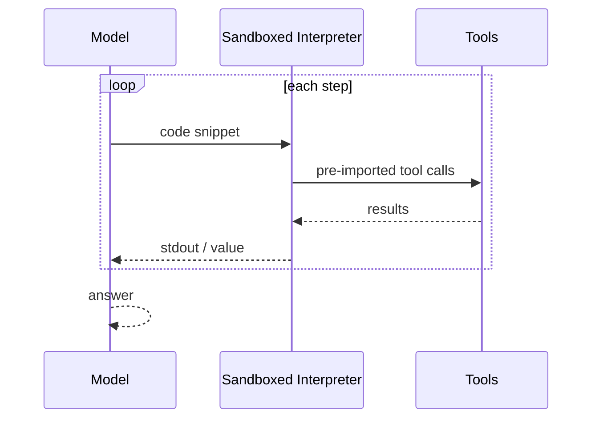

# Code-as-Action Agent

**Also known as:** CodeAct Agent, Code-Writing Agent, Python-Action ReAct, Executable Code Actions

**Category:** Tool Use & Environment  
**Status in practice:** emerging

## Intent

Have the agent emit a Python (or similar) code snippet as its action at each step, executed in a constrained interpreter, instead of emitting a JSON tool call; tool composition becomes function nesting and control flow inside the snippet.

## Context

Agent loops where each step often needs to compose several tool results, branch on intermediate values, or compute over them — actions that a single JSON tool call cannot express without inventing meta-tools.

## Problem

JSON tool calls flatten composition; expressing "call A, filter results by predicate B, then call C on each" requires multiple turns or bespoke meta-tools, both of which inflate token cost and lose the natural composability of a programming language.

## Forces

- Programming languages express composition (loops, conditionals, function nesting) natively.
- JSON tool-call format flattens that composition into a sequence of turns.
- Executing model-generated code is a real security surface.
- Models trained on code emit composed actions more compactly than JSON ones.

## Solution

Replace the JSON tool-call channel with a code-snippet channel. The agent emits a Python (or DSL) snippet; the host executes it in a sandboxed interpreter that pre-imports the available tools as functions and an allow-list of safe builtins/modules. Tool results are returned as Python values usable by subsequent code. The agent can compose tools inside one snippet (loops, conditionals, intermediate variables) and observe the printed output. Bracket every snippet with a sandbox that whitelists imports and prevents arbitrary IO.

## Example scenario

A data-analysis agent needs to fetch a list of orders, filter to those over a threshold, and call a second tool for each one. With JSON tool calls, it takes a turn per order plus glue. The team switches to Code-as-Action: each step the agent emits a small Python snippet that runs in a constrained interpreter, so the whole composition is one snippet — fetch, filter, loop, call. Tool composition becomes ordinary control flow, and the conversation collapses from twenty turns to one.

## Structure

```
Agent -> code snippet -> Sandbox(allowlisted imports + tool functions) -> stdout/return -> Agent.
```

## Diagram



## Consequences

**Benefits**

- Empirically ~30% fewer steps and tokens than JSON tool calls.
- Natural composability: function nesting, loops, conditionals in one action.
- Models trained on code (most modern frontier models) emit better code than JSON.

**Liabilities**

- Sandbox correctness is load-bearing; weak sandbox means arbitrary code execution.
- Debugging silent failures inside snippets is harder than per-call JSON tracing.
- Some hosted environments forbid model-generated code execution.

## What this pattern constrains

The agent may only execute Python operations against the explicitly allowlisted imports and tool functions; arbitrary import or system calls fail at the sandbox boundary.

## Applicability

**Use when**

- Tool composition is natural in code (filter, map, conditional chains) and clumsy as JSON tool calls.
- A sandboxed interpreter with pre-imported tools and an allow-list of safe builtins is feasible.
- Saving turns by composing multiple operations per step would meaningfully cut token cost.

**Do not use when**

- The deployment cannot host or trust a sandboxed interpreter.
- Tools are simple atomic calls with no useful composition.
- Auditors require explicit per-call structured arguments rather than free-form code.

## Known uses

- **[Hugging Face smolagents](https://github.com/huggingface/smolagents)** — *Available*. CodeAgent emits Python; pre-imported tool functions; allow-listed modules.
- **Hugging Face Transformers Agents** — *Available*. Original ReactCodeAgent / CodeAgent variants; beat the GAIA benchmark.
- **Manus** — *Available*. Sandbox VM with shell + file edit; agent action vocabulary includes code execution.

## Related patterns

- *alternative-to* → [tool-use](tool-use.md)
- *uses* → [code-execution](code-execution.md)
- *uses* → [sandbox-isolation](sandbox-isolation.md)
- *specialises* → [react](react.md)
- *alternative-to* → [parallel-tool-calls](parallel-tool-calls.md)
- *complements* → [structured-output](structured-output.md)

## References

- (paper) Wang et al., *Executable Code Actions Elicit Better LLM Agents*, 2024, <https://arxiv.org/abs/2402.01030>
- (blog) *Introducing smolagents: simple agents that write actions in code*, <https://huggingface.co/blog/smolagents>

**Tags:** tool-use, code, france-origin, smolagents, huggingface
