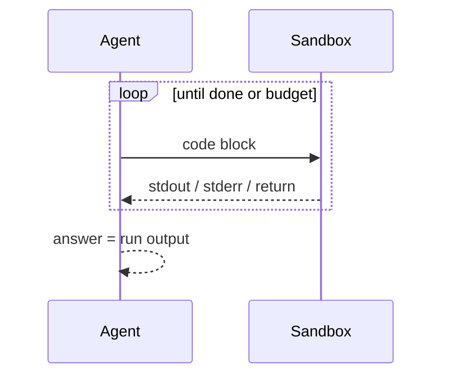

# Code Execution

**Also known as:** Code-Then-Execute, CodeAct, Program of Thoughts

**Category:** Tool Use & Environment  
**Status in practice:** mature

## Intent

Let the model emit code, run it in a sandbox, and treat the run as the answer instead of trusting the model to compute in its head.

## Context

The task involves arithmetic, data manipulation, parsing, or transformation where executing code is more reliable than text generation.

## Problem

LLMs hallucinate calculations and miscount; small numeric errors invalidate downstream steps.

## Forces

- Sandbox setup adds latency.
- Generated code may import unsafe modules or run forever.
- Execution results must round-trip back into the model's working context.

## Solution

The agent emits a code block; a controlled interpreter (Python sandbox, JS VM, container) runs it; stdout/stderr/return value flow back. Repeat under a step budget. CodeAct treats code as the action language directly.

## Example scenario

A finance agent answers 'what was the average gross margin across these 47 orders?' by reading the rows and trying to compute the answer in its head, getting it wrong by 1.4 percentage points. The team enables Code Execution: the agent emits a short Python snippet that loads the data and computes the average in a sandbox, and the run's stdout becomes the answer. The model's strength stays at constructing the right calculation; the arithmetic stops being something it has to hallucinate.

## Diagram

## Consequences

**Benefits**

- Deterministic computation on top of probabilistic intent.
- Code is auditable; the same script can be replayed for debugging.

**Liabilities**

- Sandbox security is its own engineering problem.
- Very flexible action space increases failure modes versus a curated tool palette.

## What this pattern constrains

Computation happens in the sandbox; the model's free-form numeric output is not trusted.

## Applicability

**Use when**

- The task involves calculation, parsing, or transformations that LLMs hallucinate.
- A controlled interpreter or sandbox is available and trusted enough to run model-emitted code.
- stdout, stderr, and return values can flow back to the agent under a step budget.

**Do not use when**

- The task is pure language with no computation that benefits from running code.
- No safe execution environment is available and the security risk is unacceptable.
- Latency or sandbox cost outweighs the accuracy gain over in-context computation.

## Known uses

- **OpenAI Code Interpreter / Advanced Data Analysis** — *Available*
- **Anthropic Claude with code execution tool** — *Available*
- **CodeAct paper implementations** — *Available*
- **Claude Code (Bash tool)** — *Available*
- **Replit Agent** — *Available*
- **v0** — *Available*
- **E2B Sandboxes** — *Available*

## Related patterns

- *specialises* → [tool-use](tool-use.md)
- *composes-with* → [react](react.md)
- *composes-with* → [deterministic-llm-sandwich](deterministic-llm-sandwich.md)
- *composes-with* → [skill-library](skill-library.md)
- *complements* → [sandbox-isolation](sandbox-isolation.md)
- *complements* → [wasm-skill-runtime](wasm-skill-runtime.md)
- *used-by* → [code-as-action](code-as-action.md)

## References

- (paper) Gao et al., *PAL: Program-aided Language Models*, 2022, <https://arxiv.org/abs/2211.10435>
- (paper) Wang et al., *Executable Code Actions Elicit Better LLM Agents (CodeAct)*, 2024, <https://arxiv.org/abs/2402.01030>
- (paper) Chen, Ma, Wang, Cohen, *Program of Thoughts Prompting*, 2022, <https://arxiv.org/abs/2211.12588>

**Tags:** code-execution, sandbox, tool-use
