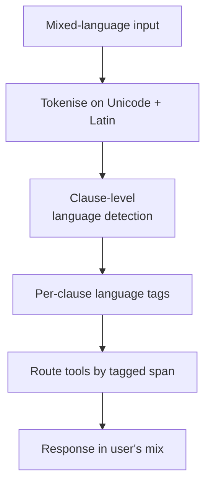

# Code-Switching-Aware Agent

**Also known as:** Mixed-Language Input Handling, Hinglish-Tolerant Agent, Romanised-Indic Agent

**Category:** Structure & Data  
**Status in practice:** emerging

## Intent

Treat mixed-language input (e.g. Hinglish — Hindi-English code-switching, often in Roman script) as the expected input shape, not an error, and design tokenisation, language tagging, and tool routing to handle it natively without forcing the user to commit to one language.

## Context

A team is building a conversational agent for a market where users routinely blend two or more languages inside a single sentence, and often type one of those languages in a script that does not belong to it. A common example is Hinglish in India, where a user might type "book me a cab from Saket to Connaught Place jaldi" — English verbs, Hindi place names, and one Hindi adverb, all in the Latin alphabet because that is what the phone keyboard offers by default. The agent has to make sense of this mix without asking the user to commit to one language.

## Problem

A pipeline that assumes one language per turn fails this input in several distinct ways. A tokenizer tuned for English may split a Hindi word written in Latin letters into nonsense pieces; a language detector that runs on the whole utterance flips between turns or picks the wrong language and routes the request to a Natural Language Understanding stack that does not speak it; some systems give up entirely and ask the user to please pick one language, which is both a worse experience and a tacit refusal of how bilingual users actually talk. The team is then forced to choose between rejecting natural input and building a parallel pipeline per language pair.

## Forces

- Most off-the-shelf LLMs handle code-switching unevenly.
- Romanised Indic (Latin script) breaks naïve language detection.
- Tools and intents may be in one language while content is in another.
- Strict monolingual pipelines reject natural input.

## Therefore

Therefore: treat code-switched input as the default shape — tokenise script-agnostically, tag language at the clause level, and route tools off the tagged spans — so that the user never has to commit to one language.

## Solution

Adopt a three-part discipline. (1) Tokenise on Unicode + Latin without assuming a single script per turn. (2) Run language detection at clause level, not utterance level, so mixed-language tagging is preserved. (3) Choose models trained explicitly on code-switched corpora for the relevant language pair; if not available, prompt-engineer with code-switched few-shot examples. Tool slot extraction (entities like place names, times) must accept either script; normalise *after* extraction, not before.

## Variants

- **Native code-switched model** — Use a foundation model explicitly trained on code-switched corpora (Sarvam, IndicLLM); no extra detection layer.
- **Per-clause language tagging** — Run a clause-level language detector and route each clause to the appropriate sub-pipeline before recombining.
- **Few-shot code-switched prompting** — When no code-switched-trained model is available, supply few-shot exemplars in the same code-switched register as expected input.

## Example scenario

A consumer-finance assistant in India keeps mishandling messages like 'mera EMI kab due hai bhai?' — Roman-script Hindi mixed with English. A mono-language tokeniser splits 'EMI' awkwardly and the language detector flips between turns, sending replies to the wrong NLU pipeline. The team rebuilds the front of the agent as Code-Switching Aware: tokenisation handles Latin and Devanagari indistinguishably, each token gets a language tag, and tool routing uses the mixed signal directly. Users stop being asked to 'please use one language'.

## Structure

```
Utterance -> per-clause language tagger -> mixed-script aware extractor -> normalised slots -> tool call.
```

## Diagram



## Consequences

**Benefits**

- Natural input is accepted as-is.
- Better recall for entities expressed in either language.
- Avoids the per-language refusal anti-pattern.

**Liabilities**

- Per-clause language detection is harder than utterance-level.
- Few foundation models are explicitly evaluated on code-switching.
- Eval sets need multilingual + code-switched coverage.

## What this pattern constrains

The agent may not refuse or downgrade a request because the user mixed languages or scripts in one utterance; mixed-language input is in-spec.

## Applicability

**Use when**

- Real users mix languages within a single utterance (e.g. Hinglish, Spanglish, Singlish).
- Mono-language pipelines mis-tokenise or mis-detect the input.
- Models trained on code-switched corpora exist for the language pair in question.

**Do not use when**

- The user base reliably writes in one language per turn.
- No code-switched-trained model exists for the language pair and quality would regress.
- Forcing one language is acceptable in the deployment context (e.g. internal English-only tooling).

## Known uses

- **[Sarvam (Indic LLMs and conversational agents)](https://www.sarvam.ai/)** — *Available*. Models and pipelines explicitly trained for Indic-English code-switching.
- **AI4Bharat IndicTrans / IndicLLM family** — *Available*. Indic-focused models with code-switching coverage.
- **Krutrim (Ola)** — *Available*. Indic-first foundation model targeting mixed-language input.

## Related patterns

- *complements* → [structured-output](structured-output.md)
- *alternative-to* → [translation-layer](translation-layer.md)
- *complements* → [input-output-guardrails](input-output-guardrails.md)
- *complements* → [multilingual-voice-agent](multilingual-voice-agent.md)
- *conflicts-with* → [refusal](refusal.md)

## References

- (doc) *Sarvam AI*, <https://www.sarvam.ai/>
- (doc) *AI4Bharat*, <https://github.com/AI4Bharat>

**Tags:** structure-data, multilingual, india-origin, code-switching
