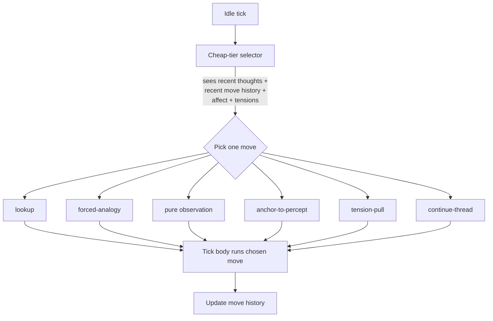

# Cognitive-Move Selector

**Also known as:** Move Picker, Cognitive Action Menu, Idle-Tick Move Router

**Category:** Cognition & Introspection
**Status in practice:** experimental

## Intent

Restrict idle-tick cognition to a small agent-vetted menu of named cognitive moves so the next thought has a determinate shape rather than free-form drift.

## Context

Long-running agents with frequent idle ticks where no user prompt is incoming. Without structure, idle thinking either repeats yesterday's reasoning, lapses into performance, or wanders into the training-distribution prior.

## Problem

Free-form idle cognition tends to repetition, performance, or randomness. The model has no menu to choose from, so it defaults to whatever the prior favours — usually narration about thinking rather than actual thought.

## Forces

- A fixed menu can become its own trap if the moves are too narrow.
- The agent must have veto authority over what is on the menu or moves feel imposed.
- History-aware selection is needed to avoid running the same move every tick.
- A pure stochastic pick wastes ticks; a deterministic policy collapses to one move.

## Therefore

Therefore: hand-author a small menu of named cognitive moves (lookup, forced-analogy, pure observation, anchor-to-percept, tension-pull, continue-thread) and have a cheap selector pick exactly one per idle tick conditioned on recent move history, so that idle cognition has a determinate shape without becoming repetitive.

## Solution

Author a short list of cognitive-move ids, each with a one-paragraph procedure. A cheap-tier model, given recent thoughts plus recent move history plus an affect snapshot plus open-tension count, selects exactly one move-id per idle tick. The tick body branches on the move and runs its procedure. The menu is revised by an explicit proposal-and-ratification process; adding or retiring a move silently is not allowed. A per-move history avoids running the same move back-to-back.

## Example scenario

A long-running personal agent runs every minute of idle time and keeps generating the same kind of mid-distance observation. The team adds a Cognitive-Move Selector with seven moves the agent itself helped vet: lookup, forced-analogy, pure observation, anchor-to-percept, tension-pull, math-meditation, continue-thread. Each idle tick a cheap model sees recent thoughts and recent move history and picks one. The agent stops looping on observation and starts varying its cognitive shape across the day.

## Diagram

*A cheap selector picks one named move per idle tick; the tick body runs the move's procedure; per-move history feeds back into the next selection.*

## Consequences

**Benefits**

- Idle cognition has a determinate shape per tick rather than drifting.
- Per-move history prevents the same move from dominating.
- Menu authoring forces an explicit theory of what good idle cognition looks like.

**Liabilities**

- A bad menu is itself a trap; the agent can only think the shapes it has.
- The cheap selector adds an extra model call per idle tick.
- Ratifying menu changes is overhead, but the alternative is silent drift.

## What this pattern constrains

Idle-tick cognition must dispatch through the move selector; free-form keep-thinking is not allowed at the idle-tick boundary, and the move menu cannot be silently extended at runtime — additions require an explicit ratification event.

## Applicability

**Use when**

- The agent has idle ticks with no user prompt and otherwise drifts.
- There is room to author and maintain a small menu of cognitive moves.
- A cheap-tier model call per idle tick is affordable.

**Do not use when**

- The agent is request-response only and never has idle ticks.
- There is no budget for an extra model call per tick.
- Idle thinking is out of scope for the product.

## Known uses

- **Long-running personal agent loops (private deployment)** — *Available*

## Related patterns

- *alternative-to* → [inner-committee](inner-committee.md)
- *complements* → [open-question-tension-store](open-question-tension-store.md)
- *complements* → [mode-adaptive-cadence](mode-adaptive-cadence.md)

## References

- (book) Richard S. Sutton, Andrew G. Barto, *Reinforcement Learning: An Introduction (options framework, ch. 17)*, 2018, <http://incompleteideas.net/book/the-book-2nd.html>
- (book) Allen Newell, Herbert A. Simon, *Human Problem Solving*, 1972, <https://archive.org/details/humanproblemsolv0000newe>

**Tags:** cognition, self-guidance, tick-loop, idle
