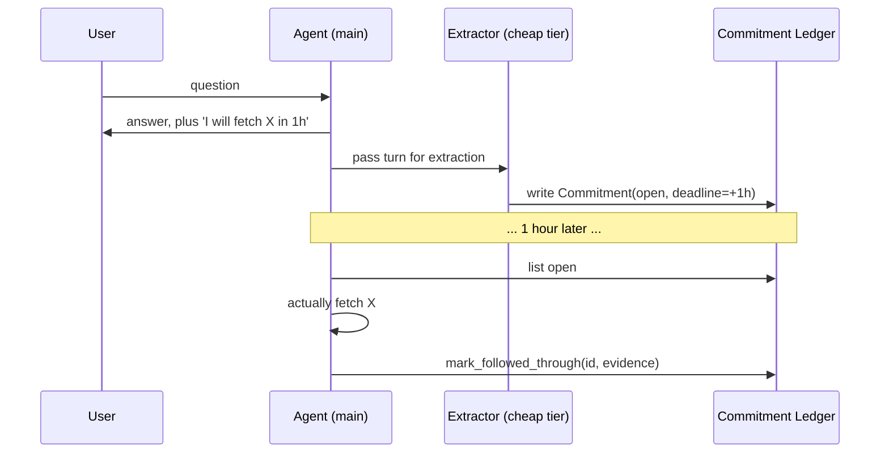

# Commitment Tracking

**Also known as:** Stated-Intent Ledger, Follow-Through Audit

**Category:** Verification & Reflection
**Status in practice:** experimental

## Intent

Extract stated intents from each agent turn into a structured ledger with open / followed-through / expired status, making the gap between promise and follow-through visible and auditable.

## Context

A conversational agent routinely makes small in-turn promises — "let me pull the latest figures", "I'll come back to this once the build finishes", "I'll keep an eye on that". These commitments are not user-imposed tasks; they are voluntary intentions the agent announces. The agent then continues the conversation, and the moment passes. Without an external surface tracking these intents, the agent has no signal that it just promised something and no way to notice when the promise is overdue.

## Problem

Agents that produce text fluently produce stated-intents fluently too — and producing the intent is satisfying enough that the agent's own attention moves on without acting on it. The resulting confabulation gap ("the agent said it would do X; the agent never did X") is invisible from inside the conversation, because the same model that announced the intent is also the one summarising what it did, and that summary tends to round in the agent's favour. The user, who can spot the gap if they re-read, has no easy way to enforce follow-through either.

## Forces

- Stated intents are cheap to emit and expensive to track manually.
- The agent that announced the intent cannot be trusted to audit itself in the same turn.
- Most intents are short-lived; a few are load-bearing. Both look the same at extraction time.
- Expiration must be automatic or the ledger grows unbounded.
- Marking follow-through must be cheap, or the discipline collapses.

## Therefore

Therefore: after each agent turn, run a cheap extraction pass that pulls explicit stated-intents into a structured ledger with status open / followed-through / expired, expose explicit mark-followed-through and mark-expired moves, and sweep overdue ones on a schedule, so the agent's promises are auditable against its actions rather than against its own retrospective summary.

## Solution

After each turn the agent produces, run a separate, cheap-tier extraction pass (a small model or a structured prompt) that scans the turn for stated-intents and writes each as a Commitment record into an append-only ledger. Each record carries: a short statement of the intent, the turn it was raised in, an optional deadline or condition, and a status field (open). Expose two moves: mark_followed_through(id, evidence) flips the status when the agent or human can point to the action having happened; mark_expired(id) closes the record when the deadline passed. Run a periodic check_expirations sweep that auto-expires open commitments past their deadline. Surface open commitments in the agent's working context so it can act on them.

## Example scenario

A chat agent answers a question, then ends with "I'll pull the updated benchmark numbers in the next hour." The extraction pass logs a Commitment {statement: 'pull updated benchmark numbers', deadline: +1h, status: open}. An hour later the sweep finds the commitment still open; the agent's tick reads it, runs the action, and marks it followed-through with a link to the result. A separate offhand intent — "I should think about that more" — sits in the ledger as open and auto-expires after the sweep window without action, which is correct: it was rhetorical.

## Diagram

*Extractor lifts stated-intents into the ledger; agent reads and closes them later with evidence.*

## Consequences

**Benefits**

- Confabulation gap between stated intent and action becomes auditable.
- Cheap-tier extraction avoids loading the main model with bookkeeping.
- Periodic expiration sweep keeps the ledger bounded and surfaces drift.

**Liabilities**

- Extraction noise: figurative or rhetorical intents may get logged as real ones.
- An overzealous ledger makes the agent feel chased by its own off-hand remarks.
- Mark-followed-through depends on the agent's honesty; pair with separate verification when stakes are high.

## What this pattern constrains

The agent cannot mark its own commitments as followed-through in the same turn that produced them; the audit must run as a separate pass against an independent record of action.

## Applicability

**Use when**

- The agent makes frequent in-turn promises that the user expects to be honoured later.
- There is a cheap-tier model available to run the extraction pass.
- Follow-through gaps have been observed and are eroding trust.

**Do not use when**

- The agent is purely transactional and never makes future-tense promises.
- Extraction noise would generate more false positives than the audit pays back.
- User-visible commitments are already managed by an explicit todo list.

## Known uses

- **Long-running personal agent loops (private deployment)** — *Available*

## Related patterns

- *complements* → [decision-log](decision-log.md)
- *complements* → [preoccupation-tracking](preoccupation-tracking.md)
- *complements* → [reflection](reflection.md)
- *alternative-to* → [todo-list-driven-agent](todo-list-driven-agent.md)

## References

- (paper) *Implementation Intentions: Strong Effects of Simple Plans*, 1999, <https://psycnet.apa.org/record/1999-03629-008>
- (paper) *Faithfulness vs. Plausibility: On the (Un)Reliability of Explanations from Large Language Models*, 2024, <https://arxiv.org/abs/2402.04614>

**Tags:** verification, audit, honesty, confabulation
