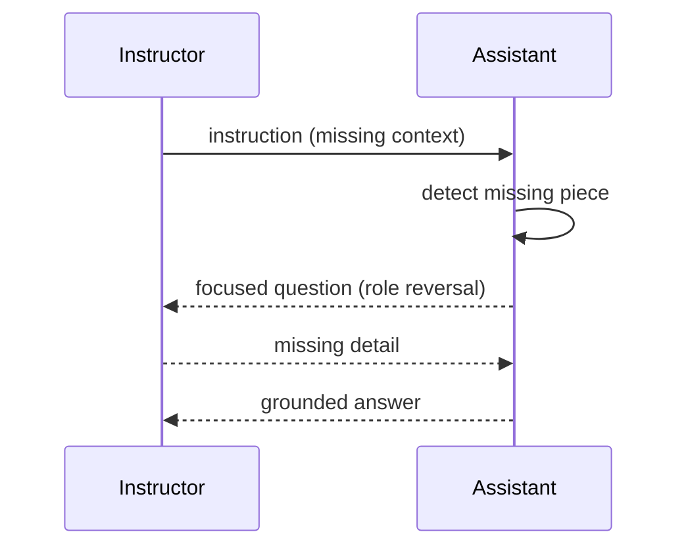

# Communicative Dehallucination

**Also known as:** Instructor-Reversal Clarification, Inter-Agent Clarifying Question

**Category:** Multi-Agent  
**Status in practice:** emerging

## Intent

When an instructed agent would have to invent missing context to comply, have it reverse roles and ask the instructor for the missing detail before answering.

## Context

Two agents are communicating in an instructor-and-assistant shape — an orchestrator telling a coding sub-agent what to do, a planner handing work to an executor — and the instruction arrives with a decisive detail missing. The missing piece might be a specific class name, an API version, an ambiguous unit of measure, or which of several plausible interpretations the instructor actually meant.

## Problem

Without a way for the assistant to ask back, it complies by inventing a plausible value for the missing detail and proceeds as if it had been told. The fabricated choice gets baked into the next artefact and is hard to spot at the hand-off boundary, where it looks like a confident answer rather than a guess. By the time the wrong assumption surfaces — in a downstream failure or a user complaint — the trail back to the original gap is buried.

## Forces

- Speed of completion vs. fidelity of context.
- Adding a clarification round costs latency and tokens.
- Asking too eagerly degrades into chatter; not asking at all produces hallucinated outputs.

## Therefore

Therefore: when an instructed agent would have to invent a missing decisive fact, force it to reverse roles and ask one bounded question of the instructor first, so that fabrication is replaced by a scoped clarification round at the boundary.

## Solution

Define an explicit role-reversal protocol: when the assistant detects that the instruction is missing a deciding piece of context, it pivots and emits a focused question back to the instructor ("the precise name of the dependency, please"). The instructor answers, and only then does the assistant produce its conclusion. Bound the depth (one or two reversals) to prevent infinite ping-pong.

## Example scenario

An orchestrator agent tells a coding sub-agent 'add the new field to the user model'. The sub-agent doesn't know whether 'field' means database column, API contract, or both, but it would normally just pick one and start editing. Under Communicative Dehallucination, the sub-agent reverses roles and asks back: 'do you mean the database schema, the GraphQL type, or both?' Only after the orchestrator answers does it act, so the wrong choice never propagates downstream where it would be expensive to detect.

## Structure

```
Instructor -> instruction -> Assistant; if context_gap_detected: Assistant -> question -> Instructor -> answer -> Assistant -> conclusion.
```

## Diagram



## Consequences

**Benefits**

- Targets the specific dehallucination point instead of after-the-fact verification.
- Cheaper than full multi-agent debate; the question is scoped.
- Produces a more faithful artefact at the next hand-off.

**Liabilities**

- Adds latency for every clarification round.
- Detecting the gap is itself a model judgement and can fail.
- Risk of infinite ping-pong without a depth bound.

## What this pattern constrains

The assistant may not produce a final answer when a designated context slot is unfilled; it must instead emit a clarifying question.

## Applicability

**Use when**

- Multi-agent setups where the assistant otherwise fabricates missing context to comply with instructions.
- A reverse-direction question channel between agents can be implemented cleanly.
- Fabrications would propagate downstream and be hard to detect at the artefact boundary.

**Do not use when**

- The instructor cannot answer clarification questions in time (e.g. fully autonomous pipelines).
- The cost of an extra round-trip exceeds the cost of detecting and fixing fabrications later.
- Instructions are always complete by construction and missing-context fabrication never arises.

## Known uses

- **[ChatDev](https://github.com/OpenBMB/ChatDev)** — *Available*. Original demonstration; assistant reverses to instructor role to request missing detail before delivering a conclusive response.

## Related patterns

- *specialises* → [disambiguation](disambiguation.md) — Same shape, but agent-to-agent rather than agent-to-user.
- *alternative-to* → [human-in-the-loop](human-in-the-loop.md)
- *alternative-to* → [debate](debate.md)
- *conflicts-with* → [infinite-debate](infinite-debate.md) — Requires a depth bound to avoid this anti-pattern.
- *uses* → [inter-agent-communication](inter-agent-communication.md)

## References

- (paper) Qian et al., *ChatDev: Communicative Agents for Software Development*, 2023, <https://arxiv.org/abs/2307.07924>

**Tags:** multi-agent, verification, china-origin, chatdev
