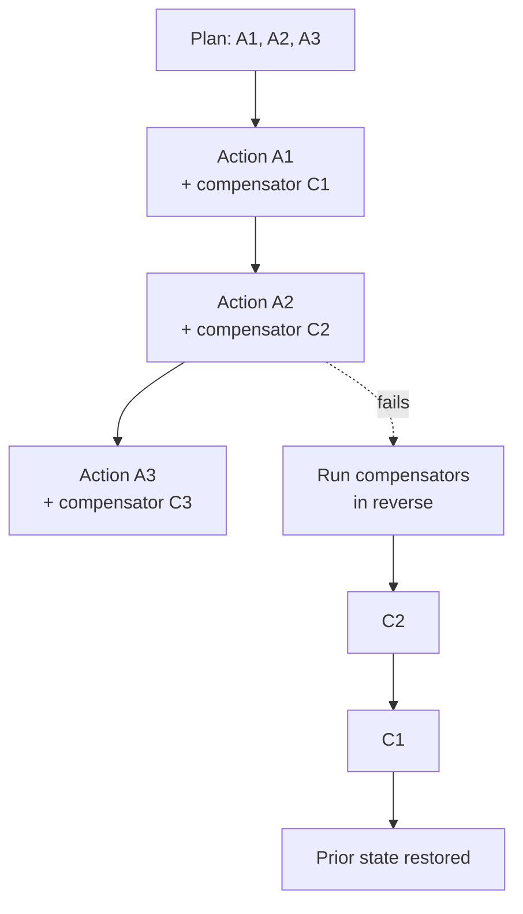

# Compensating Action

**Also known as:** Saga, Undo Step, Rollback Action

**Category:** Safety & Control  
**Status in practice:** mature

## Intent

Pair every irreversible-looking agent action with a compensating action that can undo or counteract it.

## Context

An agent is executing a multi-step plan that writes to several systems in sequence — book a flight, then a hotel, then a car, or charge a card, then provision an account, then send a welcome email. Each step succeeds or fails independently, and the agent is operating across services that have no shared transactional boundary. Some of the early steps will have already landed in the real world by the time a later step fails.

## Problem

Most agent tool palettes do not offer distributed transactions across the third-party systems the agent talks to, so there is no built-in mechanism to roll back a multi-step plan when one step fails. Without an explicit undo strategy, a failure halfway through the plan leaves the world in an inconsistent state: the flight is booked but the hotel is not, the card has been charged but the account does not exist. The agent then either retries blindly and double-books, or stops and leaves a human to clean up by hand.

## Forces

- Not every action has a clean compensator.
- Compensation logic is a separate code path.
- Idempotency matters: compensating an already-compensated action must be safe.

## Therefore

Therefore: register a paired, idempotent undo with every forward action and run the undos in reverse order on failure, so that partial-failure state can be walked back instead of leaking into the world.

## Solution

For each forward action, define a compensating action (delete-after-create, refund-after-charge, archive-after-publish). On failure mid-plan, run compensators in reverse order to restore the prior state. Idempotent compensators.

## Example scenario

A booking agent reserves a flight, then a hotel, then realises the dates conflict with the user's calendar. There's no two-phase commit across these vendors. The team requires every irreversible-looking action to be paired with a compensating action: book_flight registers cancel_flight(reservation_id) on a stack, book_hotel pairs with cancel_hotel. When the agent detects the conflict, it walks the stack and undoes the steps in reverse order, leaving the user where they started.

## Diagram

## Consequences

**Benefits**

- Partial-failure consistency.
- Confidence to attempt multi-step writes.

**Liabilities**

- Doubles the number of action implementations.
- Some actions cannot truly be compensated (sent emails, public posts).

## What this pattern constrains

Forward actions cannot be invoked without a registered compensator; uncompensable actions need explicit operator approval.

## Applicability

**Use when**

- Agent actions are irreversible-looking and distributed transactions are unavailable.
- For each forward action a meaningful undo (delete-after-create, refund-after-charge) can be defined.
- Compensators can be made idempotent so retrying them is safe.

**Do not use when**

- Actions are truly irreversible (sent emails, physical world effects) with no compensator possible.
- Native transactional semantics are available and simpler than building per-action compensators.
- The cost of authoring and testing compensators outweighs the rare failure cases they would handle.

## Known uses

- **Saga pattern in microservices, transferred to agents** — *Available*

## Related patterns

- *complements* → [human-in-the-loop](human-in-the-loop.md)
- *uses* → [provenance-ledger](provenance-ledger.md)
- *complements* → [approval-queue](approval-queue.md)
- *used-by* → [kill-switch](kill-switch.md)

## References

- (paper) *Sagas (Garcia-Molina, Salem)*, 1987

**Tags:** safety, saga, transaction
