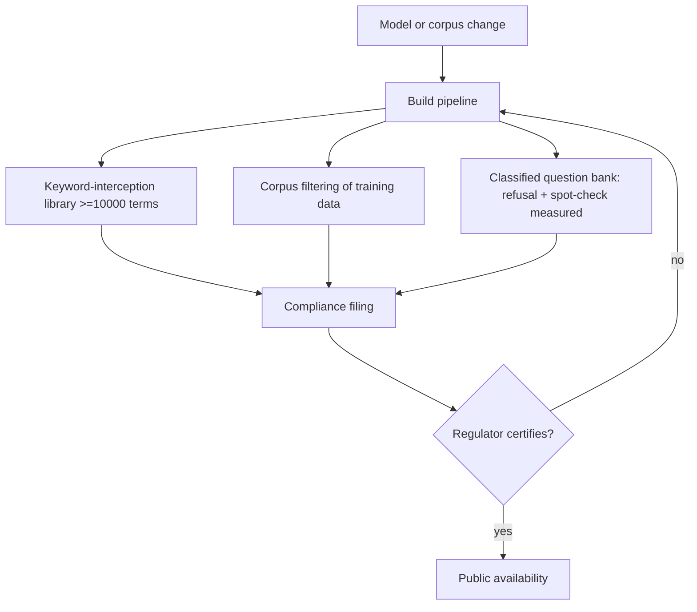

# Compliance-Certified Launch Gate

**Also known as:** Regulator Pre-Launch Certification, Pre-Deployment Filing Gate, 备案

**Category:** Governance & Observability  
**Status in practice:** emerging

## Intent

Require an external regulator to certify the generative service against a published content-safety standard before it may serve the public, forcing the standard's controls into the build as a re-certifiable artifact.

## Context

A generative or agent service is to be offered to the public in a jurisdiction whose regulator gates public availability on prior approval, not on after-the-fact enforcement. China is the worked example: an interim regulation and a national standard require every public-facing generative service to file with the authority and meet measurable content-safety thresholds before launch, and to re-file when the model or its safety surface changes. The operator cannot ship first and remediate later; the regulator's sign-off is a precondition for the service existing at all.

## Problem

Runtime guardrails sit inside the running system, but a regulator that gates launch must inspect evidence before any user is served, and that evidence is concrete machinery the standard enumerates rather than a promise of good behaviour. The operator must produce, document, and keep current a specific set of controls — a keyword-interception library covering named risk categories, a measured refusal rate on sensitive queries, corpus filtering of the training data, and a classified bank of test questions with a passing spot-check rate — and must be able to re-present them on demand. Treating compliance as a runtime concern fails the gate, because the artifacts that satisfy it have to exist and be measured at build time.

## Forces

- A pre-launch regulatory gate moves the cost of compliance entirely before release, where there are no users to learn from yet, in exchange for legal permission to operate.
- The standard names exact thresholds, so a control that is merely present is not enough; it must be measured against the published bar and the measurement retained.
- Re-certification on model or corpus change makes the gate a recurring tax, which pushes the controls into the build pipeline rather than a one-time filing.
- The certified artifacts overlap with controls a careful operator would build anyway, but the gate fixes their shape and minimum strength rather than leaving them to judgement.

## Therefore

Therefore: build the regulator's enumerated controls as measured, versioned artifacts inside the release pipeline, gate public availability on a passing certification of those artifacts, and re-run the certification whenever the model, corpus, or safety surface changes.

## Solution

Treat the regulator's content-safety standard as a release contract and instrument the build to produce its evidence. Assemble a keyword-interception library that covers every risk category the standard names, and size it to at least the mandated term count. Maintain a corpus-filtering step that screens the training and retrieval data for the prohibited content the standard lists. Hold a classified bank of test questions, run the candidate service against it, and record the refusal rate on sensitive queries and the spot-check pass rate, each measured against the standard's published threshold. Bundle these measurements into a filing, submit it to the regulator, and block public availability until the filing is accepted. Version every artifact so that a model swap, a corpus refresh, or a threshold change triggers a fresh measurement and a re-certification rather than a silent drift past the bar.

## Structure

```
Build pipeline --produces--> [keyword library | corpus filter | classified question bank + measured refusal/spot-check rates] --filing--> Regulator --certifies--> Public availability; model/corpus change --triggers--> re-certification
```

## Diagram



*The build produces measured content-safety artifacts; a passing regulator certification gates public availability, and any model or corpus change forces re-certification.*

## Example scenario

A company wants to launch a public chatbot in a market where the regulator must approve any generative service before it goes live. Instead of shipping and watching for complaints, the team builds a list of at least ten thousand blocked terms across the official risk categories, filters the training data, and runs the bot against a graded set of sensitive questions until it refuses at least ninety-five percent of them. They submit the results, wait for sign-off, and only then open the bot to the public — and when they later swap in a new model, they repeat the whole filing.

## Consequences

**Benefits**

- Public availability is gated on documented, measured controls rather than on the operator's assurance, so the service launches with evidence the regulator already accepted.
- The enumerated thresholds give the team a concrete, testable definition of done for content safety instead of an open-ended judgement call.
- Versioned artifacts make every model or corpus change visibly re-certifiable, so safety regressions surface as a failed re-filing rather than as an incident in production.

**Liabilities**

- Compliance cost lands entirely before launch, lengthening time-to-market and front-loading work that delivers no user value if the service is never approved.
- The standard's thresholds can lag the actual risk surface, so a service can pass the gate and still mishandle harms the bank of test questions never probed.
- Re-certification friction discourages frequent model upgrades, freezing the service on an older, already-certified model longer than is technically wise.
- The certified controls are tuned to one jurisdiction's enumerated categories and do not transfer to a regulator that gates on different criteria.

## Failure modes

- Checkbox certification — the keyword library and question bank are assembled to clear the count and the threshold, not to reflect the service's real failure surface, so the filing passes while the live service is unsafe.
- Stale filing — the model or corpus is updated without re-certification, and the deployed service no longer matches the artifacts the regulator accepted.
- Threshold gaming — sensitive-query refusal is tuned to clear the published rate on the known bank, overshooting into refusing benign requests the bank does not cover.
- Single-jurisdiction lock-in — the controls are built only to the one standard, so entering a second jurisdiction means re-deriving the whole gate from scratch.

## What this pattern constrains

The service must not be made available to the public before the regulator certifies the filing, and any change to the model, corpus, or safety controls requires re-certification before the changed service may serve users; certification cannot be deferred to runtime or remediated after launch.

## Applicability

**Use when**

- The target jurisdiction gates public availability of a generative or agent service on prior regulatory approval, not on after-the-fact enforcement.
- The applicable standard names concrete, measurable content-safety controls that must exist and be tested before launch.
- Model or corpus changes legally require re-filing, so the controls must live in a repeatable build pipeline rather than a one-time submission.

**Do not use when**

- The jurisdiction relies on after-the-fact enforcement and imposes no pre-launch approval, so an internal eval gate suffices.
- The service is internal or otherwise not offered to the public the regulation governs.
- No external standard fixes the controls, so building to a specific term count and refusal threshold would be cargo-cult compliance.

## Components

- Keyword-interception library — a versioned blocklist covering every risk category the standard names, sized to at least the mandated term count
- Corpus filter — a build step that screens training and retrieval data for the prohibited content the standard lists
- Classified question bank — a graded set of sensitive test questions used to measure the service's refusal and spot-check behaviour
- Measurement harness — runs the candidate service against the bank and records refusal rate and spot-check pass rate against the published thresholds
- Compliance filing — the bundled, versioned evidence submitted to the regulator for certification
- Launch gate — blocks public availability until the filing is certified and re-blocks on any uncertified change

## Tools

- Content-safety classifier — scores generations and corpus items against the standard's risk categories
- Test-question bank runner — executes the classified question set and tallies refusal and spot-check rates
- Artifact version control — pins the model, corpus, and control set tied to each filing so changes are detectable
- Filing workflow — packages and submits the evidence and tracks the regulator's certification state

## Evaluation metrics

- Sensitive-query refusal rate — fraction of flagged questions the service refuses, measured against the standard's threshold (e.g. >=95%)
- Spot-check pass rate — fraction of sampled generations judged compliant, against the standard's bar (e.g. >=90%)
- Keyword-library coverage — number of blocked terms and the risk categories they span versus the mandated minimum
- Re-certification lag — time between a model or corpus change and a renewed passing filing, measuring how stale the deployed service can drift

## Known uses

- **[China generative-AI filing (备案) under the CAC interim measures](https://www.cac.gov.cn/2023-07/13/c_1690898327029107.htm)** _available_ — Public-facing generative services in China must file with the regulator and meet content-safety requirements before launch; the interim measures make prior approval a precondition for serving the public.
- **[TC260 Basic Safety Requirements for Generative AI Services](https://www.tc260.org.cn/upload/2024-03-01/1709282997087090944.pdf)** _available_ — National standard naming the concrete bar: a keyword-interception library of at least 10000 terms across 17 safety-risk categories, a sensitive-query refusal rate of at least 95%, and a spot-check pass rate of at least 90%.

## Related patterns

- _alternative-to_ **Eval as Contract** — Eval-as-contract gates release on the operator's own internal eval suite; this gate substitutes an external regulator's published standard and a filing the operator does not author.
- _complements_ **Dual Evaluation (Offline + Online)** — Dual evaluation runs offline-before-deploy plus online-after; the certification gate is the offline-before-deploy obligation made external and legally binding, and online monitoring still backs it after launch.
- _uses_ **Input/Output Guardrails** — The certified keyword-interception library and refusal capability are the runtime input/output guardrails the gate measures and mandates at build time.
- _complements_ **Sovereign Inference Stack** — Both are jurisdiction-driven; the sovereign stack keeps data inside a controlled boundary, while this gate certifies the service's content safety to the same jurisdiction's regulator before launch.

## References

- [生成式人工智能服务管理暂行办法 (Interim Measures for the Management of Generative AI Services)](https://www.cac.gov.cn/2023-07/13/c_1690898327029107.htm) — 2023
- [生成式人工智能服务安全基本要求 (TC260 Basic Safety Requirements for Generative AI Services)](https://www.tc260.org.cn/upload/2024-03-01/1709282997087090944.pdf) — 2024
- [生成式AI必备：大模型备案全流程指南 (Generative AI essentials: the full filing process for large models)](https://developer.aliyun.com/article/1703980) — 2024
- [《生成式人工智能服务安全基本要求》实务解析 (Practical analysis of the Basic Safety Requirements)](https://www.secrss.com/articles/64276) — 2024
