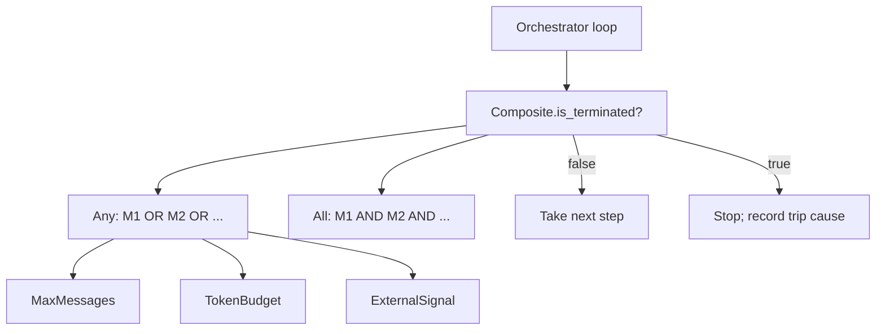

# Composable Termination Conditions

**Also known as:** Termination DSL, Stop-Condition Composition

**Category:** Safety & Control  
**Status in practice:** emerging

## Intent

Express agent stop criteria as small single-purpose conditions composed with AND/OR into one explicit termination contract instead of ad-hoc loop guards.

## Context

An agent or orchestrator loops over model calls, tool invocations, and message exchanges until something tells it to stop. The realistic stop criteria are heterogeneous: a max number of messages, a token budget, a phrase the model emitted, a particular tool call (e.g. submit_final), a handoff to another agent, a timeout, an external operator signal, or a user cancellation.

## Problem

Inlining these stop conditions as ad-hoc `if` statements in the orchestrator loop scatters the termination logic, makes its precedence implicit, and prevents reuse across loops. Adding a new condition requires editing the loop. Combining conditions (stop on max_messages OR external signal AND a specific tool call) becomes an unreadable nest. Operators reading a trace cannot tell why a run ended without re-reading the loop code.

## Forces

- Different agents need different combinations of the same primitive conditions.
- Conditions must compose with AND/OR while preserving short-circuit semantics.
- The trace must record which condition tripped, for postmortem.
- External signals (operator cancellation, kill-switch) must be expressible as a condition like any other.

## Applicability

**Use when**

- An agent loop must combine multiple heterogeneous stop criteria.
- Operators need structured trip-cause for postmortem.
- External signals (cancellation, kill-switch) need to share termination semantics with intrinsic stops.

**Do not use when**

- Only a fixed max-steps budget is needed — a single primitive is fine.
- The orchestrator is a one-shot non-looping call.

## Therefore

Therefore: model each stop criterion as a typed termination condition and compose them with AND/OR into a single decision the loop consults each iteration, so termination is one explicit contract whose trip cause is recorded.

## Solution

Define a small set of primitive termination conditions: MaxMessages, TokenBudget, TextMention, FunctionCall, Handoff, Timeout, ExternalSignal, Cancellation. Each implements a single method `is_terminated(state) -> bool, reason`. Define a Composite that combines conditions with `any` (OR) or `all` (AND) semantics. The orchestrator loop consults the composite once per step. The trip cause (which leaf condition fired) is logged with the termination event.

## Example scenario

A research-agent loop is configured with `MaxMessages(50) | TokenBudget(200_000) | TextMention('final_answer') | ExternalSignal(cancel_token)`. Each step the orchestrator asks the composite whether to stop. When the cancel token flips, the loop ends and the trace records `terminated_by=ExternalSignal`; when the model emits 'final_answer' first, the trace records that instead.

## Diagram

## Consequences

**Benefits**

- Stop criteria are testable in isolation.
- AND/OR composition reads as a single contract per loop.
- External operator signals are expressible as conditions, unifying termination paths.
- Trip cause is structured for postmortem.

**Liabilities**

- An expressive DSL invites complex compositions that surprise on edge cases.
- Polling-based conditions (timeout, external signal) need a clock the loop trusts.

## What this pattern constrains

Termination criteria must not be inlined as ad-hoc loop guards; they must be expressed as named conditions and composed with AND/OR into a single termination contract per loop.

## Known uses

- **AutoGen TerminationCondition + handoff/text/maxmessages set** — *Available* — <https://microsoft.github.io/autogen/>
- **picoagents (Dibia, Designing Multi-Agent Systems) — full termination package** — *Available* — <https://github.com/victordibia/designing-multiagent-systems>

## Related patterns

- *complements* → [kill-switch](kill-switch.md) — ExternalSignal condition is the in-loop side of the kill-switch.
- *specialises* → [step-budget](step-budget.md) — MaxMessages / TokenBudget are conditions of the budget family.
- *uses* → [cost-gating](cost-gating.md)
- *complements* → [degenerate-output-detection](degenerate-output-detection.md)
- *composes-with* → [interruptible-agent-execution](interruptible-agent-execution.md)
- *alternative-to* → [unbounded-loop](unbounded-loop.md)

## References

- (book) *Designing Multi-Agent Systems*, Victor Dibia, 2025, <https://www.oreilly.com/library/view/designing-multi-agent-systems/9781098150495/>
- (doc) *AutoGen TerminationCondition*, <https://microsoft.github.io/autogen/stable/user-guide/agentchat-user-guide/quickstart.html>

**Tags:** safety, termination, control
