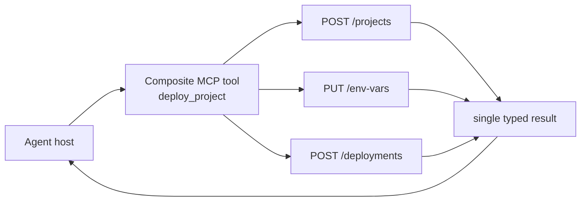

# Composite Service

**Also known as:** Capability Aggregation, Workflow Tool, Consolidated MCP Tool, Higher-Level MCP Tool

**Category:** Tool Use & Environment  
**Status in practice:** emerging

## Intent

Expose one MCP tool that orchestrates several underlying API calls into a single higher-level operation, so the agent invokes a task-level capability instead of chaining many low-level endpoints.

## Context

A team is building an MCP server over a set of fine-grained APIs, or over several different services. Agents need to accomplish a multi-step task — create a project, set its variables, then deploy it — that maps to several endpoint calls in a fixed order.

## Problem

A one-to-one endpoint-to-tool mapping pushes orchestration onto the model: it must know the right call order, thread each output into the next input, and handle partial failures across calls. This bloats the tool list, spends tokens on intermediate reasoning, and makes brittle multi-call sequences that fail in hard-to-debug ways. The team needs the agent to express intent at the level of the task, not the level of individual HTTP calls.

## Forces

- Fewer, higher-level tools are easier for the model to choose among, but each hides more logic that must be maintained on the server.
- Orchestration in the server is written once and testable; orchestration in the model is re-derived on every call.
- Aggregating endpoints couples them — a change in one underlying API can ripple into the composite tool.
- A composite tool must define its own error semantics for partial failure across the calls it bundles.
- Too much aggregation produces opaque mega-tools that are hard to debug and hard to reuse.

## Applicability

**Use when**

- Common tasks span several endpoints in a fixed order.
- A one-to-one tool surface is too large or too chatty for reliable tool selection.
- Orchestration logic is stable enough to own on the server and reuse across tasks.
- Partial-failure handling across calls should be consistent rather than re-derived by the model.

**Do not use when**

- The underlying API is small and stable enough that one tool per operation suffices — see direct-api-wrapper.
- The workflow varies so much per task that any fixed composite would be wrong — let the model orchestrate, or see mcp-as-code-api.
- Aggregation would couple endpoints whose lifecycles are independent and likely to diverge.

## Therefore

Therefore: bundle a coherent sequence of underlying calls behind one MCP tool that owns the orchestration and error handling, so the agent calls a single task-level capability.

## Solution

Identify recurring multi-call workflows and expose each as one MCP tool whose handler performs the calls, threads the intermediate results, and returns a single typed result. Keep each composite cohesive — one business capability per tool, such as a deploy_project that internally creates the project, sets environment variables, and triggers the deployment — and keep the underlying integrations modular so one API's change does not cascade. Define explicit partial-failure semantics so the tool reports which underlying call failed. This is the capability-aggregation step beyond direct-api-wrapper; when the orchestration is itself better expressed as code the agent writes, see mcp-as-code-api, and when many composites need organising under one server, hierarchical-tool-selection helps the model navigate them.

## Structure

agent host -> [composite MCP tool] -> orchestrates call A + call B + call C -> single typed result.

## Example scenario

A platform exposes fine-grained endpoints for creating a project, setting environment variables, and starting a deployment. Instead of giving the agent three separate tools to sequence, the team ships one MCP tool, deploy_project, whose handler runs the three calls in order and returns a single result. The agent asks to deploy a project in one call, and if the environment-variable step fails the tool returns a typed error naming that step rather than leaving a half-created project behind.

## Diagram

## Consequences

**Benefits**

- Smaller tool surface: the model chooses among task-level capabilities, not raw endpoints.
- Fewer model-tool round-trips and lower token cost per task.
- Orchestration lives on the server where it is reusable and testable.
- Cleaner error handling: partial failure is resolved inside the tool.
- Intent is expressed at the level of the task rather than the HTTP call.

**Liabilities**

- The server holds more logic that must be maintained and versioned.
- Aggregated endpoints are coupled; a change in one underlying API can break the composite.
- Over-aggregation produces opaque mega-tools that are hard to debug.
- Bundled pieces are harder to reuse individually than separate tools.
- Partial-failure semantics across the bundled calls must be designed deliberately.

## What this pattern constrains

Orchestration of the bundled calls must live in the server tool, not in the model; the agent may invoke the composite capability but must not be required to sequence the underlying calls itself.

## Known uses

- **Klavis AI (workflow-based design)** — Consolidates granular API calls such as create_project, add_environment_variables, and create_deployment into a single atomic deploy_project tool that handles the full process internally. *Available* — [link](https://www.klavis.ai/blog/less-is-more-mcp-design-patterns-for-ai-agents)
- **Stripe Agent Toolkit (MCP)** — Exposes task-level tools such as create_payment_link and create_product that bundle the underlying Stripe API operations rather than mirroring every endpoint. *Available* — [link](https://github.com/stripe/ai)

## Related patterns

- *specialises* → [mcp](mcp.md)
- *alternative-to* → [direct-api-wrapper](direct-api-wrapper.md)
- *complements* → [mcp-as-code-api](mcp-as-code-api.md)
- *complements* → [hierarchical-tool-selection](hierarchical-tool-selection.md)

## References

- *blog*: [Less is More: design patterns for building better MCP servers (workflow-based design)](https://www.klavis.ai/blog/less-is-more-mcp-design-patterns-for-ai-agents) — Klavis AI
- *blog*: [Should you wrap MCP around your existing API? (capability aggregation pattern)](https://www.scalekit.com/blog/wrap-mcp-around-existing-api) — Scalekit
- *doc*: [Generating MCP tools from OpenAPI: benefits, limits and best practices](https://www.speakeasy.com/mcp/tool-design/generate-mcp-tools-from-openapi) — Speakeasy

**Tags:** tool-use, mcp, orchestration, api, tool-design, workflow
