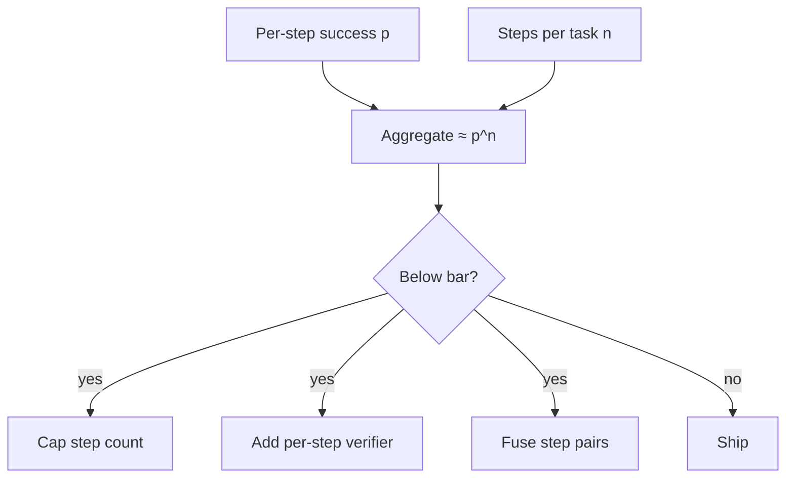

# Compound Error Degradation

**Also known as:** Per-Step Accuracy Collapse, Multiplicative Error, Long-Horizon Error Compounding

**Category:** Anti-Patterns  
**Status in practice:** emerging

## Intent

Anti-pattern: deploy a long-horizon agent without modelling that per-step accuracy multiplies across the trajectory.

## Context

A team has measured that the underlying model resolves single isolated tool calls or sub-tasks at a respectable per-step success rate — say 95%. They scale the agent up to a 20-step or 100-step pipeline (research loops, code-agent sessions, autonomous browser flows), assuming aggregate quality will track per-step quality.

## Problem

Per-step success multiplies across an agent's trajectory. A 95%-per-step pipeline ends 10 steps later at roughly 60% and 100 steps later at well under 1%. The end-to-end task success the user actually experiences therefore falls off a cliff that the per-step benchmark hid. Teams ship long-horizon agents whose per-step traces look healthy in evaluation but whose realised end-to-end task success on production traffic is unworkable, and the cause is never observable from any single step. The fix is not a better single step — it is fewer steps, better step-level recovery, or a much stronger per-step model.

## Forces

- Per-step benchmarks make the model look good while end-to-end task success collapses.
- Longer horizons amplify any per-step error; doubling steps roughly squares the failure rate.
- Adding recovery (verifier, retry, checkpoint) raises the effective per-step success above the raw model's rate.
- Cutting the step count by fusing or pre-computing actions has more impact than improving the model.

## Applicability

**Use when**

- Naming this anti-pattern when reviewing a long-horizon agent proposal.
- Per-step benchmarks look healthy but end-to-end success on production traffic does not.
- A long pipeline is being proposed with no step budget and no per-step verifier.

**Do not use when**

- The agent loops fewer than ~5 steps on a typical task; multiplicative error is negligible.
- A strong per-step verifier already lifts effective per-step success above ~99%.
- End-to-end success is measured directly on representative traffic, not extrapolated from step benchmarks.

## Therefore

Therefore: when designing a long-horizon agent, treat aggregate task success as the product of per-step successes and budget the step count accordingly, so the realised pipeline rate clears the user-visible bar.

## Solution

Model end-to-end task success as the product of per-step successes (after any per-step recovery). Either cap the step count so the product clears the user-visible success bar, or raise effective per-step success with verifiers, retries, and intermediate checkpoints. Treat raw per-step accuracy on a benchmark as a ceiling, not a forecast.

## Example scenario

A team benchmarks their planner-executor at 92% per-step accuracy on a curated tool-call dataset and ships it on a workflow that averages 30 steps. Realised end-to-end task completion comes back at ~8%. The team assumed step quality would carry the pipeline; the multiplicative product (0.92^30 ≈ 0.082) was the actual ceiling. They cut step count by fusing common tool pairs and add a verifier that lifts effective per-step success to ~98%; aggregate rises to ~55%.

## Diagram

## Consequences

**Benefits**

- Naming the failure mode forces explicit step budgets and per-step recovery.
- Surfaces when a problem needs a stronger model versus a shorter pipeline.

**Liabilities**

- Estimating per-step success on production-shaped tasks is hard; benchmarks rarely transfer.
- Step-level verifiers add their own error term that must be modelled too.

## What this pattern constrains

Per-step accuracy on a benchmark must not be used as a forecast of end-to-end agent success; the product over the trajectory bounds what the agent can deliver.

## Known uses

- **Long-horizon coding agents (Devin, SWE-agent) on long trajectories** — *Available*
- **Multi-step research agents (deep-research style loops)** — *Available*

## Related patterns

- *complements* → [step-budget](step-budget.md)
- *alternative-to* → [tool-transition-fusion](tool-transition-fusion.md) — Fusing tools is one way to shrink step count and dodge multiplicative error.
- *complements* → [evaluator-optimizer](evaluator-optimizer.md)

## References

- (blog) *Agents — Chip Huyen*, Chip Huyen, 2025, <https://huyenchip.com/2025/01/07/agents.html>
- (book) *AI Engineering*, Chip Huyen, 2024, <https://www.oreilly.com/library/view/ai-engineering/9781098166298/>

**Tags:** anti-pattern, long-horizon, evaluation
