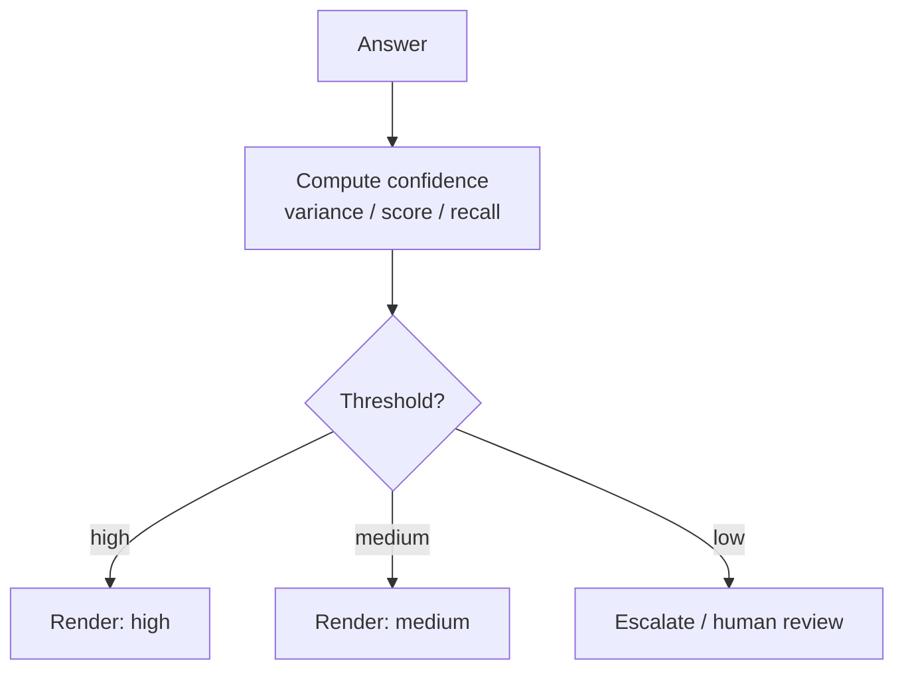

# Confidence Reporting

**Also known as:** Uncertainty Surfacing, Calibrated Output

**Category:** Verification & Reflection  
**Status in practice:** emerging

## Intent

Surface the agent's uncertainty about its answer alongside the answer itself.

## Context

A team ships an assistant whose answers feed into a downstream decision: a user choosing whether to trust a recommendation, a coder choosing whether to route a record to a senior reviewer, a workflow engine choosing whether to auto-approve a change. The cost of acting on a wrong answer is meaningfully higher than the cost of pausing to verify. The agent already produces answers; the question is how to attach a usable signal of how sure it is.

## Problem

Large language models produce answers in the same confident tone whether they actually know the answer or are guessing, so downstream code and human readers cannot tell the two cases apart. Users either trust everything (and get burned on the cases the model fabricated) or distrust everything (and lose the value of the cases the model got right). A routing layer that should escalate uncertain cases to human review has no signal to route on, so it either escalates everything or nothing. Self-reports of confidence from the model are themselves miscalibrated, so simply asking the model whether it is sure does not solve the problem on its own.

## Forces

- Confidence signals are themselves miscalibrated by the model.
- Surfacing uncertainty erodes user trust if overdone.
- Sample-based confidence (self-consistency) costs N calls.

## Therefore

Therefore: attach a calibrated uncertainty label to every answer and route low-confidence cases to a fallback path, so that downstream consumers can act on confidence instead of treating each output as equally trustworthy.

## Solution

Produce a confidence label (high/medium/low or numeric) alongside each answer. Derive from sample variance (self-consistency), evaluator score, retrieval recall, or rubric score. Render in UI; route low-confidence to fallback or human review.

## Example scenario

A medical-coding assistant proposes ICD-10 codes for clinician review. Coders trust every suggestion equally because the tone is uniform, and miss the cases where the model was actually guessing. The team adds Confidence Reporting: each suggested code carries an explicit calibrated probability and a 'low / medium / high' band, surfaced beside the code. Coders now spend their attention on the low-confidence rows and rubber-stamp the high-confidence ones, and the workflow tool can auto-defer low-confidence cases to a senior coder.

## Diagram

## Consequences

**Benefits**

- Downstream code can branch on confidence.
- Users learn when to verify.

**Liabilities**

- Calibration is empirical and drifts.
- False confidence remains the failure mode.

## What this pattern constrains

Outputs without a confidence label are not consumable by confidence-aware downstream code.

## Applicability

**Use when**

- Downstream code or UI needs to distinguish 'I know' from 'I am guessing' on each answer.
- A confidence signal can be derived from sample variance, evaluator score, or retrieval recall.
- Low-confidence answers can be routed to fallback or human review usefully.

**Do not use when**

- Confidence labels would be ignored by both the UI and the routing layer.
- No reliable signal exists to derive confidence from and the label would be cosmetic.
- Calibration cannot be maintained, so reported confidence misleads more than it helps.

## Known uses

- **OpenAI logprobs-derived confidence** — *Available*

## Related patterns

- *uses* → [self-consistency](self-consistency.md)
- *complements* → [disambiguation](disambiguation.md)
- *complements* → [fallback-chain](fallback-chain.md)
- *complements* → [attention-manipulation-explainability](attention-manipulation-explainability.md)

## References

- (paper) Kadavath et al., *Language Models (Mostly) Know What They Know*, 2022, <https://arxiv.org/abs/2207.05221>

**Tags:** uncertainty, calibration
