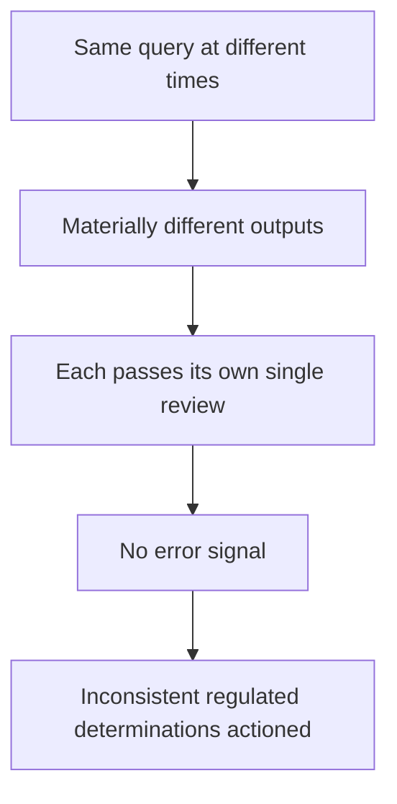

# Confident Inconsistency

**Also known as:** Cross-Time Output Drift, Unmeasured Non-Determinism

**Category:** Anti-Patterns  
**Status in practice:** emerging

## Intent

Anti-pattern: in a regulated workflow the same query produces materially different outputs at different times, each looking correct and passing review, so the variance stays invisible unless outputs are deliberately re-run and compared across time.

## Context

An agent produces outputs that feed regulated or high-stakes decisions — a legal analysis, a compliance determination, a risk assessment — where consistency is part of correctness. The model is non-deterministic: even under settings expected to be deterministic, the same input can yield different outputs across runs. Each output is reviewed once, on its own, and if it looks correct it is accepted and actioned.

## Problem

Because each individual output looks correct and passes its single review, the fact that the same query would have produced a materially different answer at another time is never seen. The inconsistency generates no error signal — nothing is malformed, nothing throws — so it is invisible unless the organisation deliberately re-runs the query and compares outputs across time. In a regulated setting this means materially different determinations are made for equivalent inputs, each defensible in isolation, with the variance surfacing only under a deliberate consistency audit that single-run review never performs.

## Forces

- LLM outputs vary across runs even under deterministic settings, so the same query is not guaranteed the same answer at another time.
- Each output is reviewed in isolation and looks correct, so single-run review cannot detect that another run would differ.
- The inconsistency produces no error signal, so nothing alerts on it the way a malformed or failing output would.
- Detecting it requires deliberately re-running and comparing outputs across time, which standard review does not do.

## Therefore

Therefore: do not rely on single-run review to catch this; measure cross-time consistency by re-running identical inputs, require a reproducibility tier appropriate to the stakes, and treat materially different answers to the same query as a defect even when each one passes review.

## Solution

Make consistency a measured property, not an assumption. Re-run identical inputs and compare the outputs across time to quantify how much the same query varies, and classify the agent into a reproducibility tier from that measurement, requiring the strict tier for regulated decisions. Where determinism matters, pin it — fixed decoding, cached or replayed outputs for equivalent inputs — so the same input yields the same determination. Treat a material difference between two answers to the same query as a defect to investigate, even when each answer passes its own review, and audit consistency on a schedule rather than trusting that one good output implies a stable one. The control is cross-time comparison and a reproducibility requirement, not single-run inspection.

## Structure

```
Same query at different times -> materially different outputs, each passes single review -> no error signal -> inconsistent determinations actioned (BROKEN) ; Corrected: re-run identical inputs + cross-time comparison + reproducibility-tier requirement
```

## Diagram



*The same query gives different answers over time; each passes single review and raises no error, so the variance is actioned unseen.*

## Example scenario

A compliance team runs the same contract clause through their agent on Monday and gets a compliant determination; an identical run three weeks later returns non-compliant, each reviewed and signed off on its own day. Nobody compared the two, because nothing errored and both looked sound. Only a later audit that re-ran a batch of past queries revealed the same inputs were getting different regulated answers over time.

## Consequences

**Liabilities**

- Equivalent inputs receive materially different regulated determinations, each defensible alone but inconsistent together.
- The variance is actioned before anyone detects it, because single-run review raises no flag.
- Audits and disputes are hard to defend when the same query can be shown to yield different answers.
- Trust in the workflow erodes once it is found that consistency was never measured.

## Failure modes

- Cross-time drift — the same query returns a materially different answer on a later run.
- Single-review blindness — each output passes its own review, so the inconsistency is never compared.
- No error signal — the variance throws nothing, so nothing alerts on it.
- Unmeasured reproducibility — consistency is assumed rather than quantified by re-running inputs.

## What this pattern constrains

Single-run review must not be treated as sufficient for a regulated output; consistency is measured by re-running identical inputs and comparing across time, a reproducibility tier appropriate to the stakes is required, and materially different answers to the same query are treated as a defect rather than accepted because each passed review.

## Applicability

**Use when**

- Recognising this failure when the same query yields materially different regulated outputs at different times, each passing review.
- Reviewing a high-stakes workflow that accepts single-run outputs without measuring cross-time consistency.
- Diagnosing inconsistent determinations for equivalent inputs that no error signal flagged.

**Do not use when**

- Consistency is measured by re-running identical inputs and a reproducibility tier appropriate to the stakes is enforced.
- Outputs are deterministic or replayed for equivalent inputs, so the same query yields the same answer.
- The task tolerates variation and consistency is not part of correctness.

## Components

- Non-deterministic agent — the model whose output for one query varies across runs
- Single-run review — the per-output check that cannot see cross-time variance
- Missing consistency measurement — the absent re-run-and-compare audit across time
- Missing reproducibility tier — the absent requirement matching determinism to the stakes
- Regulated determination — the high-stakes output where inconsistency is itself a defect

## Tools

- Replay or re-run harness — the corrective that re-issues identical inputs to compare outputs
- Consistency audit — the corrective scheduled cross-time comparison of outputs
- Reproducibility-tier classifier — the corrective that measures and requires a determinism tier

## Evaluation metrics

- Cross-time agreement rate — how often identical inputs produce the same answer on re-run
- Material-divergence incidents — count of equivalent inputs given different regulated determinations
- Detection-by-audit lag — time between an inconsistent output being actioned and an audit catching it
- Reproducibility-tier coverage — share of regulated decisions meeting the required determinism tier

## Known uses

- **[QuisLex legal-AI failure taxonomy (Confident Inconsistency)](https://quislex.com/news/quislex-defines-five-ways-legal-ai-fails-and-controls-required-detect-them)** _available_ — Names 'confident inconsistency' — the same query producing materially different outputs at different times, invisible without systematic comparison — and notes four of its five failure modes generate no visible error signal.
- **[Non-determinism of deterministic LLM settings (Atil et al.)](https://arxiv.org/abs/2408.04667)** _available_ — Empirically shows the same input yields varying outputs under settings expected to be deterministic, with accuracy varying up to 15% across runs and the variance undetectable without re-running and comparing.

## Related patterns

- _alternative-to_ **Self-Consistency** — Self-consistency samples one query at one time and aggregates; confident inconsistency is the failure across time, where re-running the same query later gives a materially different answer single-run sampling never surfaces.
- _alternative-to_ **Determinism-Tiered Replay Gate** — The replay gate is the corrective — classify the reproducibility tier by re-running identical inputs and require the strict tier for regulated decisions; confident inconsistency is the unmeasured temporal non-determinism it guards against.
- _complements_ **False Confidence Syndrome** — False confidence is miscalibrated certainty on a single answer; confident inconsistency is that each of several mutually-inconsistent answers is delivered with full confidence and passes review.
- _complements_ **Confidence Reporting** — Confidence-reporting surfaces per-answer uncertainty; confident inconsistency is invisible to it because each individual output looks confident and correct — only cross-time comparison reveals the variance.

## References

- [QuisLex Defines the Five Ways Legal AI Fails and the Controls Required to Detect Them](https://quislex.com/news/quislex-defines-five-ways-legal-ai-fails-and-controls-required-detect-them) — 2026
- [Non-Determinism of Deterministic LLM Settings](https://arxiv.org/abs/2408.04667) — Berk Atil and co-authors, 2025
