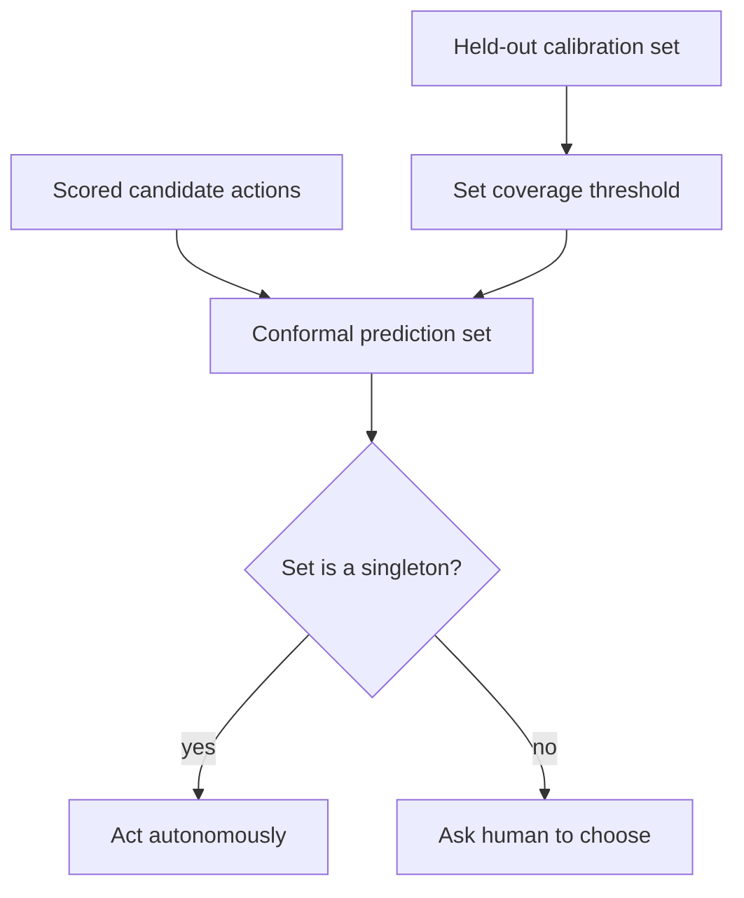

# Calibrated Help-Gate via Conformal Prediction

**Also known as:** Conformal Help-Gate, KnowNo

**Category:** Safety & Control  
**Status in practice:** experimental

## Intent

Use conformal prediction to form a calibrated set of candidate actions and have the agent ask a human for help only when that set is not a singleton, giving a statistical task-completion guarantee.

## Context

An agent, often an embodied or tool-using one, must decide each step whether it is sure enough to act or should stop and ask a human. Self-reported confidence is poorly calibrated — the model says ninety percent and is wrong a third of the time — so a fixed confidence threshold either asks for help too often, killing autonomy, or too rarely, acting on tasks it cannot complete.

## Problem

Deciding when an agent should defer to a human is usually done with an uncalibrated confidence number, which gives no guarantee about how often the agent will be wrong when it proceeds. Set the bar too high and the human is flooded with needless questions; too low and the agent confidently acts on instructions it has misunderstood. The agent needs a principled, tunable rule for when to ask that comes with a real guarantee on task success.

## Forces

- Asking for help too rarely lets the agent act on tasks it cannot complete; asking too often destroys autonomy and overloads the human.
- Raw model confidence scores are not calibrated, so a fixed threshold gives no guarantee on the error rate.
- A statistical guarantee requires a held-out calibration set and a target coverage level chosen in advance.

## Therefore

Therefore: have the planner score candidate next actions, use conformal prediction calibrated on held-out data to form a prediction set at a chosen coverage, and ask for help only when the set is not a singleton, so a target success level is guaranteed with the fewest interventions.

## Solution

Collect a calibration set of scored decisions and pick a target success level. At run time the planner emits candidate next actions with scores; conformal prediction turns those scores into a prediction set sized so that, at the chosen coverage, the correct action is inside it. If the set contains exactly one action the agent acts autonomously; if it contains more than one, or none, the agent is uncertain and asks the human to choose. The coverage level tunes the trade-off, and the calibration guarantees the task-completion rate rather than relying on the model's self-assessment.

## Structure

```
calibration set -> target coverage; runtime: scored options -> conformal prediction set -> singleton? act : ask human
```

## Diagram



*Conformal prediction turns scored options into a set; a singleton means act, anything else means ask.*

## Example scenario

A kitchen robot is told to 'put it in the bowl' with two bowls on the counter. Its planner scores the candidate placements, and conformal prediction returns a set with both bowls in it — not a singleton — so instead of guessing, the robot asks 'which bowl?'. When the planner is sure and only one candidate clears the set, it places the item without bothering the human, and across many tasks the calibrated rate of correct completions matches the target it was set.

## Consequences

**Benefits**

- Gives a statistical guarantee on task success, not an uncalibrated confidence number.
- Minimises human interventions for a chosen success level by asking only when genuinely ambiguous.
- The coverage level makes the autonomy-versus-safety trade-off explicit and tunable.

**Liabilities**

- Needs a representative held-out calibration set, which can be costly to collect.
- The guarantee holds only while run-time data matches the calibration distribution; drift breaks it.
- Producing well-formed candidate sets with scores requires planner support.

## Failure modes

- Distribution shift — run-time inputs drift from the calibration set and the coverage guarantee no longer holds.
- Miscalibrated scores — a biased scorer yields prediction sets that are systematically too small or too large.
- Empty-set handling — the set comes back empty and the agent must treat it as ask-for-help, not act.

## What this pattern constrains

The agent acts autonomously only when its calibrated prediction set is a singleton; whenever the set holds more than one candidate it must stop and request human help rather than guess.

## Applicability

**Use when**

- The agent must decide step-by-step whether to act or defer, and acting wrongly is costly.
- A held-out calibration set and a target success level are available.
- The planner can emit candidate actions with scores that conformal prediction can turn into a set.

**Do not use when**

- No representative calibration data exists, so the coverage guarantee cannot be established.
- Run-time inputs differ sharply from any calibration distribution.
- A simple clarifying-question heuristic is enough and the statistical guarantee is not needed.

## Components

- Planner — emits candidate next actions with scores
- Calibration set — held-out scored decisions used to set the conformal threshold
- Conformal predictor — turns scores into a prediction set at the target coverage
- Set-size gate — acts on a singleton and asks for help otherwise
- Human responder — resolves the choice when the set is ambiguous

## Tools

- Conformal prediction library — computes the prediction set from scores and a calibration quantile
- LLM or vision-language-action planner — generates the scored candidate actions
- Human-in-the-loop channel — carries the help request and the human's choice back to the agent

## Evaluation metrics

- Empirical task-success rate vs the target coverage — whether the guarantee holds in practice
- Help-request rate — interventions per task, the autonomy cost of the chosen coverage
- Average prediction-set size — how decisive the calibrated scorer is
- Calibration-versus-runtime distribution gap — early warning that the guarantee may be breaking

## Known uses

- **[KnowNo (Robots That Ask For Help)](https://robot-help.github.io/)** _pure-future_ — Uses conformal prediction over LLM-planner options and triggers human help when the prediction set is not a singleton.
- **[INSIGHT](https://arxiv.org/abs/2510.01389)** _pure-future_ — Token-level uncertainty introspection for vision-language-action models to decide when to request help.

## Related patterns

- _specialises_ **Disambiguation** — Disambiguation asks a clarifying question on ambiguity; this is a calibrated form whose trigger and success rate carry a statistical guarantee.
- _alternative-to_ **Confidence Reporting** — Confidence reporting surfaces an uncalibrated self-assessment; the help-gate replaces it with a calibrated prediction-set size.
- _alternative-to_ **Confidence-Checking Workflow** — Both decide when a human should step in, but the help-gate uses calibrated set size rather than self-reported per-part confidence.
- _uses_ **Human-in-the-Loop** — When the prediction set is not a singleton the gate invokes a human to choose the action.

## References

- [Robots That Ask For Help: Uncertainty Alignment for Large Language Model Planners (KnowNo)](https://robot-help.github.io/) — 2023
- [INSIGHT: INference-time Sequence Introspection for Generating Help Triggers in Vision-Language-Action Models](https://arxiv.org/abs/2510.01389) — 2025
