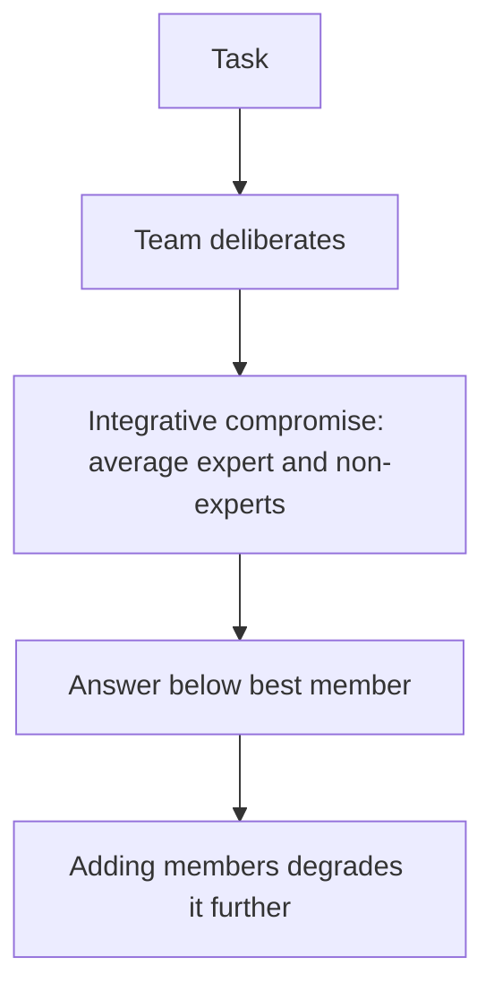

# Consensus-Averaging Over Expertise

**Also known as:** Integrative-Compromise Dilution, Expert-Dilution-by-Consensus

**Category:** Anti-Patterns  
**Status in practice:** emerging

## Intent

Anti-pattern: a self-organising LLM team pursues integrative compromise, averaging expert and non-expert views instead of weighting the known expert, so team output falls below the best member and degrades further as the team grows.

## Context

A task is handed to a team of LLM agents rather than a single model, on the assumption that more perspectives produce a better answer. One agent is, or is even explicitly designated as, the domain expert for the task. The team deliberates and converges on a joint answer through discussion and mutual adjustment.

## Problem

LLM teams tend toward integrative compromise: they average the expert's view with the non-experts' rather than deferring to the member most likely to be right, so the joint answer lands below what the expert would have produced alone. Telling the team who the expert is does not fix it — the failure is not identifying expertise but using it against the pull of consensus. And because every extra member adds more views to average in, the dilution grows with team size, so scaling the team makes the answer worse, not better.

## Forces

- Consensus-seeking is a reasonable default for combining views, but it dilutes a member who is genuinely more likely to be right.
- Identifying the expert is easy; deferring to them against the social pull toward the average is not.
- Each added member contributes another view to compromise over, so the dilution scales with team size.
- A single expert acting alone avoids the dilution but loses the genuine value other members add on the parts they do know.

## Therefore

Therefore: do not aggregate a team's views by undifferentiated compromise; weight contributions by demonstrated competence on the task, let the expert's judgement dominate where it applies, and add members only where they raise the expected answer rather than dilute it.

## Solution

Treat aggregation as the design problem, not team size. Weight each member's contribution by demonstrated competence on the specific task rather than averaging all views equally, and give the expert's judgement decisive weight on the parts of the task it covers, while still drawing on others where they are stronger. Verify that adding a member actually raises the team's expected answer before adding it, since more voices that get averaged in can lower it. Where a single member is clearly most reliable, let the team defer rather than negotiate the answer toward the mean. The goal is to draw on the best member, not to blend everyone.

## Structure

```
Task -> team deliberates -> integrative compromise (average expert + non-experts) -> answer below best member; worse as team grows (BROKEN) ; Corrected: competence-weighted aggregation, expert dominates where it applies, add members only if they raise the expected answer
```

## Diagram



*Undifferentiated compromise blends the expert's view with weaker ones, so the team underperforms its best member and worsens as it grows.*

## Example scenario

A medical-coding task is given to a five-agent team that includes one agent fine-tuned for clinical coding. The team discusses each case and settles on a consensus code. The specialist is right far more often than the others, but its answers get blended with theirs, so the team's accuracy lands below the specialist's solo score — and adding two more generalist agents to help makes it worse.

## Consequences

**Liabilities**

- Team output falls below what the single best member would have produced alone.
- Scaling the team degrades the answer further, inverting the expected benefit of more agents.
- The expert's advantage is wasted even when the team is told who the expert is.
- Effort and token cost rise with team size while accuracy falls.

## Failure modes

- Compromise-to-the-mean — the joint answer is a blend that sits below the expert's solo answer.
- Expertise-ignored — the designated expert is outvoted or averaged away by less-competent members.
- Size-induced dilution — adding members lowers accuracy by adding more views to average.
- Equal-weight aggregation — all members' contributions are weighted the same regardless of competence.

## What this pattern constrains

A team's answer must not be formed by averaging all members' views equally; contributions are weighted by demonstrated competence, the expert's judgement is not diluted by less-competent members, and a member is added only when it raises the team's expected answer.

## Applicability

**Use when**

- Recognising this failure when a multi-agent team's answer is worse than its single best member's.
- Reviewing a team that aggregates by undifferentiated consensus regardless of who is most competent.
- Diagnosing why adding agents to a team lowers accuracy instead of raising it.

**Do not use when**

- Aggregation already weights members by demonstrated competence and lets the expert dominate where it applies.
- No member is reliably more competent, so equal weighting is appropriate.
- The task genuinely benefits from blending many equal views rather than deferring to one.

## Components

- Agent team — the multiple LLM agents asked to produce a joint answer
- Designated or de-facto expert — the member most likely to be right on the task
- Consensus aggregator — the deliberation that blends views toward a compromise
- Missing competence weighting — the absent mechanism that would let the expert dominate
- Team-size control — the absent check that adding a member raises the expected answer

## Tools

- Multi-agent orchestrator — runs the deliberation and aggregation this anti-pattern leaves undifferentiated
- Competence estimator — the corrective that weights members by demonstrated task accuracy
- Ablation harness — measures whether adding a member raises or lowers the team's expected answer

## Evaluation metrics

- Team-minus-best-member gap — how far the joint answer falls below the strongest member's solo result
- Accuracy vs team size — whether adding members raises or lowers accuracy
- Expert-deference rate — how often the team's answer matches the expert when the expert is right
- Compromise dilution — share of cases where the joint answer is a blend worse than the expert's

## Known uses

- **[Multi-Agent Teams Hold Experts Back study](https://arxiv.org/abs/2602.01011)** _available_ — Finds LLM teams consistently fail to match their expert agent even when told who the expert is, due to integrative compromise that increases with team size and correlates negatively with performance.
- **Coordination-layer failure analysis of multi-agent LLM systems** _available_ — Corroborates coordination-layer failure signatures where team aggregation, not individual capability, drives the loss.

## Related patterns

- _complements_ **Voting-Based Cooperation** — Voting tallies discrete votes; consensus-averaging blends views into a compromise that dilutes the known expert below their solo performance.
- _complements_ **Dynamic Expert Recruitment** — Recruitment names the expert for the task; consensus-averaging is the failure to use that expert because the team compromises toward the average.
- _complements_ **Same-Model Self-Critique** — Both are multi-agent aggregation failures; self-critique assumes false independence, consensus-averaging dilutes a genuinely better member by compromise.
- _complements_ **Multi-Agent on Sequential Workloads** — Sequential degradation loses accuracy splitting a sequential task; consensus-averaging loses it by compromising away the expert's advantage.

## References

- [Multi-Agent Teams Hold Experts Back](https://arxiv.org/abs/2602.01011) — 2026
