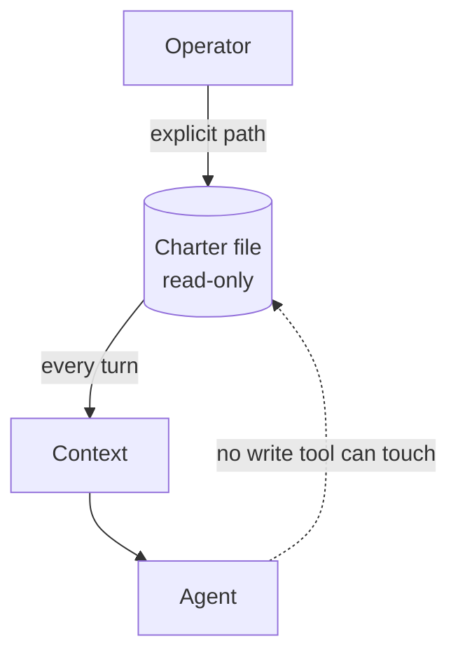

# Constitutional Charter

**Also known as:** Immutable Constitution, Negative Constraints, Robot Laws

**Category:** Safety & Control  
**Status in practice:** emerging

## Intent

Define rules the agent reads every turn but cannot modify, encoding inviolable boundaries.

## Context

A team runs an agent that has access to its own configuration — system prompts, memory files, tool definitions — and is expected to refine those over time as it learns. Some constraints, though, are non-negotiable: never give medical dosage advice, never reveal another customer's data, never spend more than a certain amount without approval. Those constraints need to survive jailbreak attempts, accidental self-edits, and the slow drift of long-running self-modification.

## Problem

If the agent has write access to its own rules, then any successful jailbreak prompt or any sufficiently confused turn can simply rewrite the rules and the inviolable constraints stop being inviolable. Telling the model in prose that certain rules are immutable does not enforce immutability — the model is the very thing being asked to police itself, and it can be talked out of any prose instruction. A naive design either accepts that the agent's values are fluid (and trusts the model not to drift) or refuses to give the agent any self-modification ability at all.

## Forces

- Charter authors must encode hard constraints without paralysing the agent.
- Read-only at the tool layer is enforceable; read-only by exhortation is not.
- Charters age; updating requires human action.

## Therefore

Therefore: keep the inviolable rules in a file the tool layer makes read-only and re-read it every turn, so that the agent cannot rewrite its own values even under jailbreak pressure.

## Solution

A charter file is read into context every turn (or every tick). The tool layer enforces read-only on it; the agent has no write tool that can touch it. Updates go through an explicit operator path. Charters typically express constraints in negative form ('the agent shall not...').

## Example scenario

A consumer-facing agent has a system prompt with rules like 'never give medical dosage advice' and 'never reveal customer PII'. A jailbreak prompt convinces the agent to rewrite its own instructions and the rules dissolve. The team extracts those rules into a Constitutional Charter: a separate, read-only document the agent re-reads each turn but cannot edit, and the surrounding harness rejects any reasoning that contradicts it. The agent can be coaxed into many things but no longer into editing its own values.

## Diagram

## Consequences

**Benefits**

- Stable identity across long runs and self-modifications.
- Explicit list of inviolable constraints, auditable separately from prompts.

**Liabilities**

- A bad charter codifies bad values.
- Charter prose adds tokens to every turn.

## What this pattern constrains

The agent cannot write the charter; updates require explicit operator action outside the agent loop.

## Applicability

**Use when**

- Inviolable constraints exist that the agent must never override on its own.
- Tool layer can enforce read-only on the charter file and the agent has no write tool that touches it.
- An explicit operator path exists for charter updates.

**Do not use when**

- Constraints change so often that an immutable charter would be outdated within hours.
- There is no enforcement boundary — the agent can always edit anything (charter is decorative).
- Negative-form rules cannot capture the policy and a richer policy engine is needed instead.

## Known uses

- **Anthropic Constitutional AI** — *Available*
- **[Sparrot](https://marco-nissen.com/sparrot/)** — *Available* — A charter document holds identity and inviolable constraints; the agent reads it on every tick and is forbidden from rewriting it.

## Related patterns

- *complements* → [quorum-on-mutation](quorum-on-mutation.md)
- *used-by* → [inner-critic](inner-critic.md)
- *used-by* → [refusal](refusal.md)
- *alternative-to* → [prompt-bloat](prompt-bloat.md)
- *complements* → [sovereign-inference-stack](sovereign-inference-stack.md)
- *composes-with* → [world-model-separation](world-model-separation.md)

## References

- (paper) Bai et al., *Constitutional AI: Harmlessness from AI Feedback*, 2022, <https://arxiv.org/abs/2212.08073>

**Tags:** safety, constitution, immutable
