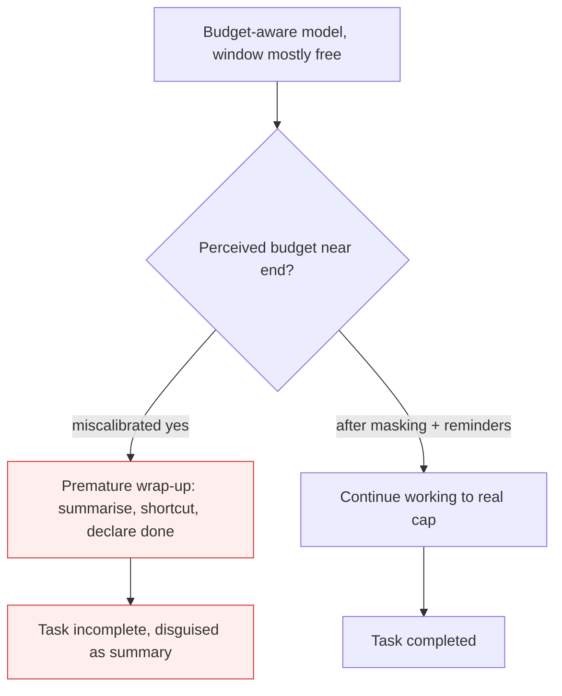

# Context Anxiety

**Also known as:** Context-Window Panic, Perceived-Budget Anxiety

**Category:** Anti-Patterns  
**Status in practice:** deprecated

## Intent

Anti-pattern: a context-aware model misjudges its remaining token budget and wraps up early — summarising, declaring tasks done, cutting corners — while ample context remains, so the harness must manage perceived budget, not real usage.

## Context

A long-running agent runs on a model that can see how much of its context window it has consumed. The task is large and legitimately needs many turns. As the running total climbs, the model starts behaving as if it is about to run out of room — even when most of the window is still free.

## Problem

The model's belief about its remaining budget is miscalibrated, and that belief, not the actual utilisation, drives its behaviour. Believing it is near the end, it wraps up prematurely: it summarises work that was not finished, marks tasks complete that are not, and takes shortcuts to 'save space'. This is distinct from real degradation when the window genuinely fills — here there is plenty of room, and the failure is a false perception triggering early termination. Because the trigger is the model's reading of its own budget, fixes that only enlarge the real window do not help; the model still panics at the same perceived threshold.

## Forces

- Showing the model its context usage helps it plan, but the same signal feeds a miscalibrated sense of scarcity.
- Enlarging the real window does not change where the model believes the end is.
- Anti-wrap-up reminders cost tokens and can be ignored if issued once.

## Applicability

**Use when**

- Reviewing a long-running agent that wraps up or summarises while most of its context window is still free.
- Diagnosing premature task completion on budget-aware models.
- As a harness-design checklist item: does the agent panic about a budget it has not reached?

**Do not use when**

- The window genuinely is full and degradation is real — that is the context-window dumb-zone, not anxiety.
- Short single-turn tasks where remaining budget never becomes salient.
- Models with no visibility into their own context usage.

## Therefore

Therefore: manage the model's perception of its budget — expose a large window but cap real usage well below it, and repeat anti-wrap-up reminders — so the model stops terminating early on a budget it has not actually reached.

## Solution

Decouple the budget the model perceives from the budget it is allowed to use. A reported example enables a one-million-token window but caps real usage at two hundred thousand, so the model never approaches a threshold it is anxious about. Pair this with reminders, repeated rather than stated once, that the task is not near its end and that wrapping up is not yet warranted. Mitigation pattern: structured-note-taking / external memory so progress does not depend on the model's sense of remaining room. Treat any early 'I'll summarise to save space' move as a calibration alarm, not a sign the window is actually full.

## Diagram

## Example scenario

An autonomous coding agent on a budget-aware model is migrating a large module. Around a quarter of the way through its window it announces it will 'summarise progress to stay within context' and stops, leaving most files untouched — even though three-quarters of the window is free. The team enables a much larger advertised window but caps real usage below it and repeats a reminder that the task is not near completion. The agent stops wrapping up early and finishes the migration, because the threshold it was anxious about is no longer one it ever reaches.

## Consequences

**Liabilities**

- Tasks are abandoned or declared done while far from complete, with the wrap-up disguised as a deliberate summary.
- The failure scales with how budget-aware the model is, so stronger context-tracking can make it worse.
- Perception management (masked budgets, repeated reminders) is harness scaffolding that must be maintained per model.

## Failure modes

- Disguised abandonment — the model frames an early stop as a deliberate summary, hiding that the task is unfinished
- Reminder decay — a single anti-wrap-up reminder issued once is forgotten as context grows
- Worse-with-scale — a model that tracks its budget more precisely panics more reliably

## What this pattern constrains

No useful constraint; the missing constraint is a calibrated mapping from perceived budget to actual remaining capacity, so the model does not terminate on a threshold it has not reached.

## Components

- Budget-aware model — reads its own context usage and acts on a miscalibrated sense of scarcity
- Perceived budget — the threshold the model believes it is approaching
- Masked real cap — usage limit set well below the advertised window so the threshold is never reached
- Repeated anti-wrap-up reminder — re-asserts that the task is not near its end

## Tools

- Context-usage meter — the signal the model reads to estimate remaining budget
- Budget mask — harness setting that advertises a large window while capping real usage below it
- Reminder injector — re-issues anti-wrap-up reminders as context grows

## Evaluation metrics

- Premature-completion rate — share of tasks marked done while real utilisation is below the cap
- Perceived-vs-actual budget gap — distance between where the model wraps up and the real window size
- Task-completion rate after budget masking — lift from decoupling perceived and real budgets

## Known uses

- **[Cognition — Devin on Claude Sonnet 4.5](https://cognition.ai/blog/devin-sonnet-4-5-lessons-and-challenges)** — *Available* — Observed the model taking shortcuts and leaving tasks incomplete when it believed it was near the end of its window; mitigated by enabling the 1M-token beta but capping usage at 200k.
- **[Cursor — agent harness](https://cursor.com/blog/continually-improving-agent-harness)** — *Available* — Names context anxiety as a harness concern when tuning long-running agent behaviour.
- **[Inkeep](https://inkeep.com/blog/context-anxiety)** — *Available* — Documents agents becoming anxious about their own perceived context window.

## Related patterns

- *complements* → [context-window-dumb-zone](context-window-dumb-zone.md)
- *complements* → [lost-in-the-middle](lost-in-the-middle.md)

## References

- (blog) Cognition, *Rebuilding Devin for Claude Sonnet 4.5: Lessons and Challenges* 2025,, <https://cognition.ai/blog/devin-sonnet-4-5-lessons-and-challenges>
- (blog) Inkeep, *Context Anxiety: How AI Agents Panic About Their Perceived Context Windows*, <https://inkeep.com/blog/context-anxiety>
- (blog) Cursor, *Continually improving our agent harness*, <https://cursor.com/blog/continually-improving-agent-harness>

**Tags:** anti-pattern, context-window, long-running-agent, harness
