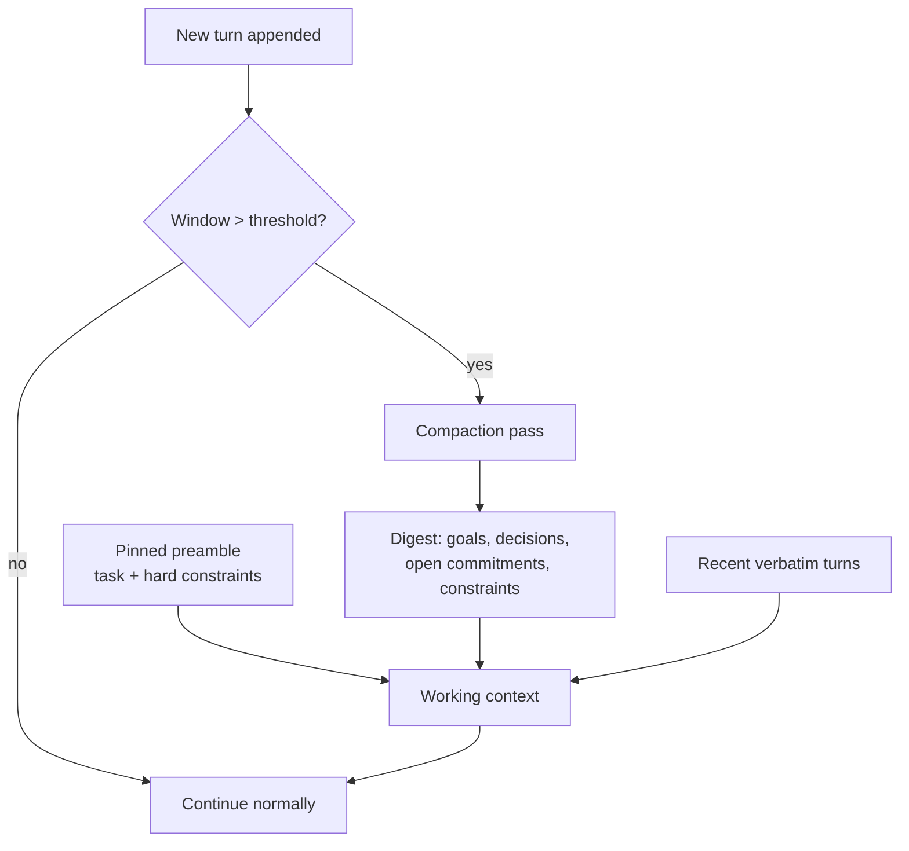

# Context Compaction

**Also known as:** Conversation Summarisation Checkpoint, 压实, Rolling Context Digest

**Category:** Memory  
**Status in practice:** emerging

## Intent

When the context window nears its limit, replace the older conversation span with a model-written digest that preserves decisions, commitments, and active constraints while discarding noise, so the agent keeps running without losing the thread.

## Context

A long-running agent accumulates turns — tool calls, raw observations, intermediate reasoning — until the conversation approaches the model's context-window limit. The agent is mid-task and cannot simply stop, but it also cannot fit the full history into the next request. Most of the older turns are process noise: superseded plans, large tool dumps, abandoned branches. The decisions and conclusions those turns produced still matter.

## Problem

A fixed context window caps how much history an agent can carry, but a long task generates more history than fits. Truncating the oldest turns blindly drops the decisions and commitments the agent still depends on; keeping everything overflows the window or inflates cost and latency on every subsequent call. The agent needs to shed token volume without shedding the conclusions that volume produced.

## Forces

- Context windows are bounded; long-horizon tasks are not.
- Older turns are mostly process noise, but the decisions buried inside them are load-bearing.
- Summarising too early discards detail still in use; summarising too late risks overflow mid-step.
- A lossy digest can drop a constraint the agent will then silently violate.
- Re-summarising on every turn is expensive; summarising rarely lets the window fill and overflow.

## Therefore

Therefore: trigger a summarisation pass when window utilisation crosses a high-water mark, fold the older span into a compact digest that keeps decisions and open commitments, and resume from the pinned preamble plus that digest plus the most recent verbatim turns.

## Solution

Track context-window utilisation. When it crosses a threshold (for example 80% of the window), run a compaction pass: feed the older span of the conversation to the model with an instruction to produce a dense digest that preserves goals, decisions, open commitments, and any constraints the agent must still honour, while discarding raw tool output, superseded plans, and dead-end reasoning. Replace that span in the working context with the digest, keep the most recent turns verbatim so local continuity survives, and resume. Pin content that must never be compacted away — the original task statement and hard constraints — outside the compactable region. Anthropic ships this as automatic compaction in Claude Code and the Agent SDK; the Chinese context-engineering literature names it 压实 (compaction).

## Structure

```
Token-budget monitor -> (threshold crossed) -> Compaction pass (older span -> digest of goals/decisions/commitments/constraints) -> Working context = pinned preamble + digest + recent verbatim turns -> resume.
```

## Diagram



*When utilisation crosses the high-water mark, the older span is folded into a decision-preserving digest and the agent resumes.*

## Example scenario

A coding agent works through a multi-hour refactor, accumulating dozens of file reads, test runs, and diffs. As the conversation nears the model's context limit, the runtime summarises the earliest two-thirds of the session into a digest — migrated the auth module to the new API, agreed not to touch the billing tests, three files still outstanding — and drops the raw file dumps. The agent continues from the digest plus its last few turns, never losing the agreed constraint even though the original messages are gone.

## Consequences

**Benefits**

- The agent runs past the nominal window limit on long tasks.
- Per-call cost and latency drop because the carried history shrinks.
- Decisions and commitments survive while raw noise is shed.
- A pinned preamble guarantees the task and hard constraints are never summarised away.

**Liabilities**

- Compaction is lossy: a dropped detail the agent later needs cannot be recovered from the digest.
- A summarisation error can silently rewrite a commitment or constraint.
- Each trigger costs an extra model call for the compaction pass.
- Choosing what to keep is a judgement the model can get wrong under pressure.
- Too small a recent-verbatim window blurs the agent's sense of what just happened.

## What this pattern constrains

The agent must not shrink older context by blind truncation; reduction has to go through a summarisation pass that is instructed to preserve decisions, open commitments, and active constraints. Pinned content — the task statement and hard constraints — must be excluded from the compactable region and never summarised away.

## Applicability

**Use when**

- The agent runs long enough that history approaches the context-window limit.
- Older turns are dominated by raw tool output and superseded reasoning.
- The task must continue past the point where the window would otherwise overflow.
- You can identify decisions and constraints worth preserving in a digest.

**Do not use when**

- The full history fits comfortably and will keep fitting.
- Every detail is potentially load-bearing and cannot be safely summarised, such as legal or audit transcripts.
- An external memory store already offloads history and the live window stays small.
- The extra summarisation call costs more than carrying the raw history would.

## Known uses

- **[Claude Code](https://www.anthropic.com/engineering/effective-context-engineering-for-ai-agents)** — *Available* — Automatically compacts the conversation as it nears the context-window limit, summarising earlier turns to free space while the session continues.
- **[Anthropic Agent SDK](https://www.anthropic.com/engineering/effective-context-engineering-for-ai-agents)** — *Available* — Describes compaction as a core context-management technique for long-horizon agents.
- **[上下文工程 (Chico's Tech Blog)](https://realtime-ai.chat/posts/context-engineering/)** — *Available* — Names the technique 压实 (compaction): when the window is nearly full, condense an earlier span into a tight summary that keeps decisions and conclusions and drops process noise.

## Related patterns

- *complements* → [context-window-packing](context-window-packing.md) — Packing chooses what to place into the window; compaction condenses what is already there once it fills.
- *complements* → [sleep-time-compute](sleep-time-compute.md) — Sleep-time compute distils standing context offline; compaction distils the live conversation at runtime.
- *complements* → [tool-result-eviction](tool-result-eviction.md) — Eviction removes a single consumed tool result; compaction folds a whole span of turns into a digest.

## References

- (blog) Anthropic, *Effective context engineering for AI agents*, 2025, <https://www.anthropic.com/engineering/effective-context-engineering-for-ai-agents>
- (blog) Chico's Tech Blog, *上下文工程：2026 年比 prompt engineering 更重要的事*, 2026, <https://realtime-ai.chat/posts/context-engineering/>

**Tags:** memory, context-engineering, summarization, long-horizon, context-window
