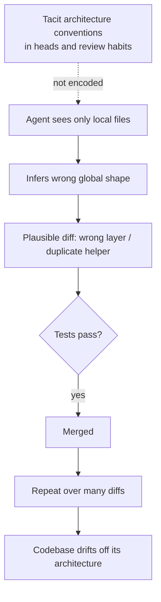

# Context-Driven Architecture Drift

**Also known as:** Tacit-Convention Violation, Brownfield Architecture Drift

**Category:** Anti-Patterns  
**Status in practice:** emerging

## Intent

Anti-pattern: let a coding agent change a brownfield codebase guided only by the files it can see, so it silently violates the architecture conventions that live in nobody's machine-readable form.

## Context

A coding agent is set loose on an existing codebase that already has a shape: layers it is supposed to respect, places where certain logic belongs, naming and dependency rules that the team enforces by habit and code review. Most of those rules were never written down for a machine. They live in senior engineers' heads, in the implicit pattern of how the existing files are arranged, and in the unstated reasons a previous author put a thing where it is. The agent reads the few files it is shown and infers a local shape from them.

## Problem

The agent builds what it is shown, not what the team means. From a handful of visible files it infers a plausible but wrong picture of where logic belongs, then puts a database call in a controller, duplicates a helper that already exists one layer up, or wires a dependency that the architecture forbids. Each change looks reasonable on its own and passes the tests, so it merges. Over many such changes the codebase drifts away from its intended architecture, and because every individual diff was defensible, nobody catches the slide until the layering is already tangled and a feature that should have been local now touches everything.

## Forces

- The architecture's real rules are tacit — in heads, review habits, and the arrangement of existing files — so the agent cannot read what it must obey.
- What the agent can see is a small, possibly unrepresentative slice of the codebase, and it generalises a global convention from a local sample.
- A change that respects the visible files but violates the unseen convention still compiles and passes the existing tests, so the usual gates do not catch it.
- Each violating diff is small and locally defensible, so reviewers approve them one at a time and the drift only becomes visible in aggregate.

## Therefore

Therefore: do not rely on the agent inferring architecture from whatever files it happens to see; the conventions must be made machine-readable and checked, or the drift is the default outcome.

## Solution

Treat the absence of a machine-readable architecture spec as the defect. Encode the tacit conventions the team enforces by habit — allowed layer dependencies, where each kind of logic belongs, naming and module boundaries — as artifacts the agent reads and that a check can enforce: an agent guidance file, architecture decision records, dependency and structural lint rules, reference examples of the right shape. Give the agent enough of the codebase as context to see the real conventions rather than a local sample, and run a drift check in the loop so a layer violation is rejected while the agent is editing, not discovered after a dozen such diffs have merged. The remedy is the positive pattern agentic-golden-path; this entry names the failure that results when that spec and harness are missing.

## Structure

```
Tacit architecture (in heads, review habits) --not encoded--> Agent sees only local files --infers wrong shape--> Plausible diff that violates a convention --tests pass--> merged --repeat--> codebase drifts off its intended architecture
```

## Diagram



*Un-encoded conventions plus a local-only view yield plausible diffs that merge and accumulate into architecture drift.*

## Example scenario

A team asks a coding agent to add a discount rule to an order service. The agent reads the order controller and the request handler it is shown, sees other small bits of logic there, and writes the discount calculation straight into the controller. It also adds its own currency-rounding helper, not knowing the team already has one in the shared money module. Tests pass and the diff merges. Over a quarter, dozens of such diffs put business logic in controllers and scatter duplicate helpers, until a change that should touch one file touches twenty.

## Consequences

**Benefits**

- Naming the anti-pattern tells a team that fast, plausible-looking agent diffs on a brownfield codebase are not evidence the architecture is being respected.
- It points directly at the missing artifact — a machine-readable architecture spec and an in-loop drift check — rather than at the agent.

**Liabilities**

- Left unaddressed, the codebase accumulates layer violations and duplicated logic that each looked correct in isolation and are expensive to untangle later.
- Reviewers who trust passing tests and clean-looking diffs stop noticing the slide until the architecture has already eroded.
- Encoding the tacit conventions is real work, and a team may keep paying the drift cost rather than write the spec down.

## Failure modes

- Wrong-layer placement — the agent puts logic (a query, a side effect, a policy decision) in a layer that the architecture reserves for something else.
- Convention reinvention — the agent writes a new helper, client, or abstraction that already exists elsewhere because it never saw the existing one.
- Forbidden dependency — the agent wires a module against another that the intended architecture keeps separate, because nothing encoded the boundary.
- Consistent nonsense — without a spec the agent produces internally consistent but architecturally wrong output at scale, so the volume of plausible diffs hides the drift.

## What this pattern constrains

No useful constraint; the missing constraint is a machine-readable architecture spec plus an in-loop drift check that rejects layer and dependency violations before the diff merges, rather than after.

## Applicability

**Use when**

- A coding agent is given write access to an existing codebase whose architecture conventions are mostly tacit and not written down for a machine.
- Plausible, test-passing agent diffs are merging quickly and nobody is checking them against the intended layering or module boundaries.
- The team notices, after the fact, that logic is landing in the wrong layers or that helpers and abstractions are being duplicated.

**Do not use when**

- The codebase is greenfield with no established conventions yet for the agent to violate.
- The architecture conventions are already encoded as machine-readable specs and enforced by an in-loop drift check (that is agentic-golden-path, not this anti-pattern).
- The agent only proposes diffs that a human architect reviews against the conventions before any merge.

## Components

- Brownfield codebase — the existing system whose architecture conventions are mostly tacit
- Coding agent — edits the codebase from the limited set of files it is shown
- Tacit conventions — layer rules, logic placement, and boundaries that live in heads and review habits, not in machine-readable form
- Local context slice — the small, possibly unrepresentative set of files the agent infers global shape from
- Test/merge gate — passes the violating diff because it compiles and the existing tests do not encode the convention

## Tools

- Coding agent / IDE assistant — generates the diffs against the brownfield codebase
- Dependency and structural lint — would reject forbidden cross-layer dependencies if the rules were encoded (the missing enforcement)
- Architecture decision records and agent guidance files — where the tacit conventions should be written for the agent to read

## Evaluation metrics

- Layer-violation rate — fraction of merged agent diffs that place logic in a disallowed layer
- Duplicate-abstraction count — helpers or clients the agent reinvents that already existed in the codebase
- Architecture-drift over time — distance between the current dependency graph and the intended one, tracked across releases
- Convention coverage — share of the team's enforced conventions that are actually encoded as machine-readable, checkable rules

## Known uses

- **[Software Architecture Summit — coding-agent architecture failures](https://software-architecture-summit.de/blog/software-architektur/coding-agent-architektur-spec-harness/)** _available_ — German practitioner write-up of brownfield coding agents producing wrong layers, ignored conventions, and misplaced logic, and the spec/harness remedy.
- **[EconLab — agent harness explained](https://econlab-ai.de/blog/agent-harness-erklaert)** _available_ — States that without spec, guardrails, and judgement, agents produce consistent nonsense — the failure shape this anti-pattern names.
- **[ArchUnit](https://www.archunit.org/)** _available_ — Library that expresses allowed layer dependencies and module boundaries as test-like assertions, the in-loop drift check that rejects wrong-layer and forbidden-dependency diffs before they merge.
- **[dependency-cruiser](https://github.com/sverweij/dependency-cruiser)** _available_ — Validates JS/TS code against forbidden-dependency and layer rules, encoding the cross-layer boundaries an agent would otherwise violate from a local view.

## Related patterns

- _alternative-to_ **Agentic Golden Path** — The golden path is the positive remedy — encode standards as machine-readable context and drift-check in the loop; this entry is the failure that occurs without it.
- _complements_ **Repo Map** — A repo map gives the agent structural context across the codebase, reducing the local-sample inference that drives wrong-layer placement; it is partial mitigation, not the full spec.
- _complements_ **Automating a Broken Process** — Both amplify a defect through an agent — that one a dysfunctional workflow, this one a brownfield codebase's un-encoded architecture conventions.
- _complements_ **Agentic Skill Atrophy** — Atrophy erodes the team's ability to spot wrong-shape diffs; this drift produces them — together the agent makes architectural mistakes and the team stops catching them.

## References

- [Warum dein Coding Agent die falsche Architektur baut](https://software-architecture-summit.de/blog/software-architektur/coding-agent-architektur-spec-harness/) — 2026
- [Agent Harness erklärt](https://econlab-ai.de/blog/agent-harness-erklaert) — 2026
- [Architecture Without Architects: How AI Coding Agents Shape Software Architecture](https://arxiv.org/abs/2604.04990) — 2026
- [ContextCov: Deriving and Enforcing Executable Constraints from Agent Instruction Files](https://arxiv.org/abs/2603.00822) — 2026
- [Constraint Decay: The Fragility of LLM Agents in Backend Code Generation](https://arxiv.org/abs/2605.06445) — 2026
