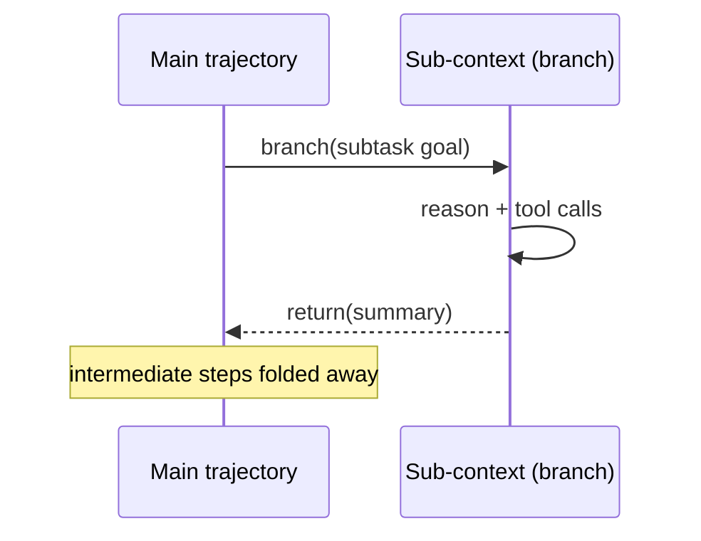

# Context Folding

**Also known as:** Sub-Trajectory Folding

**Category:** Memory  
**Status in practice:** experimental

## Intent

Let the agent branch into a temporary sub-context for a subtask and fold it back into a short summary on completion, so a long-horizon task stays within a small active window.

## Context

An agent works a task that spans hundreds of steps, such as a repository-wide refactor, a multi-document research sweep, or a long tool chain. Every step appends its tool calls and observations to the running context, and the window fills long before the task is finished. Reactive truncation or whole-window summarisation near the limit either drops detail the agent still needs or pays to re-read it.

## Problem

A single linear context cannot hold a hundred-step trajectory, yet most of the intermediate detail produced while exploring one subtask stops mattering once that subtask returns its result. Keeping every step wastes the window and slows the model, while discarding steps blindly loses the thread. The agent needs a way to spend a large working context on a subtask and then reclaim almost all of it, retaining only the outcome.

## Forces

- Aggressive compression buys a long horizon under a fixed token budget, but folding away detail risks discarding something a later subtask needs.
- A subtask's exploration is high-value while it runs and near-worthless once it returns a result.
- Reliable folding is a learned skill: prompting an agent to self-summarise is brittle, while training the fold end-to-end (for example with FoldGRPO) is costly.

## Therefore

Therefore: give the agent explicit branch and return actions so it can open a fresh sub-context for a subtask and collapse it into a concise summary on completion, keeping the main trajectory small.

## Solution

Expose two control actions to the agent. The branch action opens a new sub-context seeded with just the subtask goal; the return action closes it and writes back only a short outcome summary to the parent trajectory. The agent reasons and calls tools freely inside the branch, and when it returns, the intermediate steps are folded away so the parent sees one compact result. The decision of when to branch and what to keep is learned during training (FoldGRPO assigns credit through the fold) rather than hard-coded by the harness, so the agent folds where it pays off.

## Structure

```
Main trajectory --branch(goal)--> Sub-context (explores, calls tools) --return(summary)--> Main trajectory (intermediate steps discarded)
```

## Diagram



*Branch opens a fresh sub-context; return folds it to a one-line summary in the main trajectory.*

## Example scenario

A coding agent is asked to migrate a 40-file module to a new API. For each file it opens a branch, reads the file, runs the tests, and fixes the call sites — dozens of steps per file. When a file is done it returns a one-line summary such as 'migrated payments.py, 3 call sites updated, tests pass' and folds away the rest, so by the fortieth file the main context still fits comfortably instead of overflowing.

## Consequences

**Benefits**

- A roughly 100K-token task can run inside an active main trajectory of a few thousand tokens, extending the feasible horizon under a fixed window.
- Intermediate tool noise from one subtask never pollutes reasoning about the next.

**Liabilities**

- A summary that drops a detail a later step needed forces costly re-derivation or fails the task.
- The folding policy must be trained; an untrained agent folds at the wrong boundaries.
- Debugging is harder because the folded steps are gone from the visible trace.

## Failure modes

- Over-folding — the agent collapses a subtask whose detail a later step still needs, and cannot recover it.
- Premature return — a branch folds before the subtask is actually finished, summarising an incomplete result.
- Summary drift — the retained summary subtly misstates what happened inside the branch.

## What this pattern constrains

Folded sub-trajectories are no longer visible to the parent context; once a branch returns, the agent cannot read its intermediate steps, only the retained summary.

## Applicability

**Use when**

- Tasks routinely exceed the context window because they decompose into many self-contained subtasks.
- The detail generated inside a subtask is not needed once the subtask returns a result.
- The folding policy can be trained or fine-tuned rather than relying on prompt-only self-summarisation.

**Do not use when**

- Tasks are short enough to finish inside one context window.
- Later steps frequently need the fine-grained detail of earlier steps, so folding would discard load-bearing context.
- The folding policy cannot be trained and deterministic, harness-controlled compaction is required instead.

## Components

- Main trajectory — the persistent context that holds the task goal and the folded summaries
- Branch controller — opens a fresh sub-context seeded with a subtask goal when the agent emits a branch action
- Sub-context — the temporary working window where the agent explores one subtask
- Folder — on return, discards the sub-context's steps and writes a short outcome summary back to the main trajectory
- Folding policy — the learned decision of when to branch and what to keep (for example trained via FoldGRPO)

## Tools

- Tool-calling LLM — reasons and acts inside both the main trajectory and each branch
- Token-budget accounting — tracks active-window size so the main trajectory stays small

## Evaluation metrics

- Active main-trajectory size vs total tokens consumed — how much context the fold reclaims
- Long-horizon task success rate vs a no-fold baseline at the same window size
- Over-fold rate — fraction of failures traced to a folded detail a later step needed
- Steps completed before context overflow — the horizon the pattern buys

## Known uses

- **[Context-Folding (FoldGRPO)](https://arxiv.org/abs/2510.11967)** _pure-future_ — RL-trained agent that emits branch/return to fold sub-trajectories, reported to keep an ~8K active context over ~100K total tokens on long-horizon benchmarks.
- **[FoldAct](https://arxiv.org/abs/2512.22733)** _pure-future_ — Follow-up adding stable branch/return actions for long-horizon search agents.
- **[FoldAgent (sunnweiwei/FoldAgent)](https://github.com/sunnweiwei/FoldAgent)** _available_ — Official open-source implementation of the Context-Folding paper, exposing branch(description, prompt) and return(message) actions plus the FoldGRPO RL training framework.

## Related patterns

- _alternative-to_ **Context Compaction** — Compaction digests the older span reactively when the window nears its limit; folding is a learned, agent-issued operation scoped to a self-chosen subtask.
- _complements_ **Agent-as-Tool Embedding** — Both hide a sub-computation's turns from the parent; embedding does it at a call boundary, folding does it mid-trajectory via branch/return.
- _complements_ **Subagent Isolation**
- _alternative-to_ **MemGPT-Style Paging** — Paging moves spans in and out of an external store; folding discards the span and keeps only a summary.

## References

- [Scaling Long-Horizon LLM Agent via Context-Folding](https://arxiv.org/abs/2510.11967) — 2025
- [FoldAct: Efficient and Stable Context Folding for Long-Horizon Search Agents](https://arxiv.org/abs/2512.22733) — 2025
- [Scaling LLM Multi-turn RL with End-to-end Summarization-based Context Management (SUPO)](https://arxiv.org/abs/2510.06727) — 2025
- [Learning Agent-Compatible Context Management for Long-Horizon Tasks (AdaCoM)](https://arxiv.org/abs/2605.30785) — 2026
