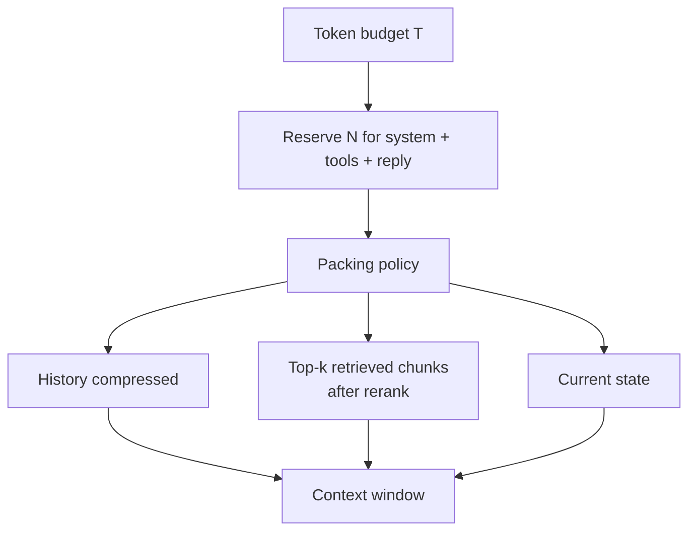

# Context Window Packing

**Also known as:** Context Compression, Token Budget Management, Fit in Context, Token Cost Reduction

**Category:** Memory  
**Status in practice:** mature

## Intent

Choose what fits in the context window each turn given a fixed token budget.

## Context

An agent's available context for the next model call — the system prompt, conversation history, retrieved chunks, tool definitions, current state, and any other information the model needs — has grown to the point where it exceeds the model's maximum context window. The team has to decide what goes in and what stays out for every single call.

## Problem

Naively concatenating everything overflows the window and the call fails. Naively truncating from the start or the end drops information that may be critical (the original task, the most recent tool result, the system prompt itself). A first-fit packing strategy leaves the model with a different subset on every call, which makes behaviour unpredictable. The team needs a deliberate policy for what is preserved, what is summarised, what is retrieved on demand, and what is dropped — and that policy has to be applied consistently across calls.

## Forces

- What to drop is task-dependent.
- Compression has its own LLM cost.
- Reserved budget for the response itself.

## Therefore

Therefore: budget the window explicitly across system, tools, history, retrieval, and response before each call, so that nothing important is silently truncated and nothing wasteful is silently included.

## Solution

Define a packing policy. Reserve N tokens for system + tools + response. Allocate the rest across history (compressed), retrieved chunks (top-k after rerank), and current state. Use eviction (drop oldest), summarisation (compress), or selection (relevance-rank) policies. Audit token counts before each call.

## Example scenario

A long-running support agent has a 200k window and a thirty-turn conversation full of tool outputs, two 80-page attached PDFs, and the system charter. Naive concatenation overflows; truncating from the back loses the original ticket; truncating from the front loses the latest turn. The team builds a Context-Window Packing step: each turn it scores items by recency, relevance, and pinned-status, then fits a budgeted subset, replacing the rest with summaries. The window stops overflowing and critical state stays visible.

## Diagram

## Consequences

**Benefits**

- Predictable behaviour at the window edge.
- Inspectable trade-offs.

**Liabilities**

- Complexity of the packing logic.
- Compression artefacts.

## What this pattern constrains

Total tokens passed to the model must not exceed the window minus the reserved response budget.

## Applicability

**Use when**

- Naive concatenation overflows the context window for realistic inputs.
- Some context (system, tools, response reservation) is fixed and the rest must be allocated dynamically.
- You can audit token counts before each call and adjust the policy.

**Do not use when**

- Inputs are small and always fit comfortably in the window.
- There is no measurable quality difference between packing policies and the work is overhead.
- An external memory or retrieval layer already controls what reaches the model.

## Known uses

- **LangChain ConversationSummaryBufferMemory** — *Available*
- **Most production agent frameworks** — *Available*
- **[Sparrot](https://marco-nissen.com/sparrot/)** — *Available* — Prompt-cache management and a context-packer fit the per-tick prompt into the model's window deliberately (stable prefix, recent ledger, current workspace, active variant) rather than relying on the provider to truncate.

## Related patterns

- *uses* → [episodic-summaries](episodic-summaries.md)
- *alternative-to* → [memgpt-paging](memgpt-paging.md)
- *complements* → [dynamic-scaffolding](dynamic-scaffolding.md)
- *used-by* → [todo-list-driven-agent](todo-list-driven-agent.md)
- *used-by* → [reasoning-trace-carry-forward](reasoning-trace-carry-forward.md)
- *alternative-to* → [salience-attention-mechanism](salience-attention-mechanism.md)

**Tags:** context, tokens, budget
