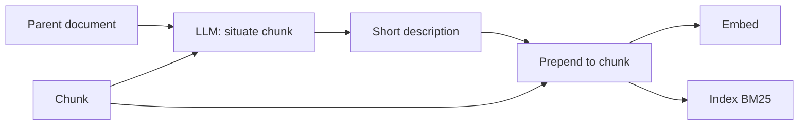

# Contextual Retrieval

**Also known as:** Chunk Contextualisation, Anthropic Contextual Embeddings

**Category:** Retrieval & RAG  
**Status in practice:** emerging

## Intent

Prepend a short LLM-generated description to each chunk before embedding so the chunk carries its situating context.

## Context

Chunks that lose context at split boundaries (pronouns, 'the company', time references) embed far from queries that name the entity explicitly.

## Problem

Naive chunking destroys context; queries that name entities by full name miss chunks that refer to them by pronoun.

## Forces

- An LLM call per chunk is expensive.
- Prompt caching of the parent document amortises the cost.
- Context generation must be deterministic enough to keep the index stable.

## Solution

For each chunk, prompt an LLM with the parent document and the chunk; receive a short description that situates the chunk. Prepend that description to the chunk. Embed the prepended chunk. Store BM25 over both prepended chunks (Contextual BM25) and dense vectors (Contextual Embeddings). Compose with reranking for further gains.

## Variants

- **LLM-generated context prefix** — An LLM produces a short situating sentence per chunk from the parent document (the canonical Anthropic recipe).
- **Metadata-as-context** — Use existing structural metadata (document title, section heading, date, author) as the prepended context instead of an LLM-generated one.
- **Contextual BM25 + Contextual Embeddings** — Index the prepended chunks twice — once for BM25 and once for dense vectors — and fuse at query time.

## Diagram

## Consequences

**Benefits**

- Reported retrieval-failure reductions: 35% (embeddings), 49% (+BM25), 67% (+reranking).
- Fully compatible with existing RAG pipelines.

**Liabilities**

- Indexing cost per chunk; only worth it for stable corpora.
- Chunk re-indexing required when context model changes.

## What this pattern constrains

Chunks enter the index only after contextualisation; raw chunks are not indexed.

## Applicability

**Use when**

- Naive chunking destroys context and queries miss chunks that refer to entities by pronoun or shorthand.
- An LLM pass over each chunk to produce a situating description is affordable at index time.
- BM25 over prepended chunks and dense embeddings can both be wired into the retrieval stack.

**Do not use when**

- Documents are short or self-contained enough that chunks already carry their context.
- Index-time LLM cost is unaffordable for the corpus size.
- Retrieval quality is already adequate without the chunk-rewriting step.

## Known uses

- **[Anthropic Contextual Retrieval blog post](https://www.anthropic.com/news/contextual-retrieval)** — *Available*

## Related patterns

- *specialises* → [naive-rag](naive-rag.md)
- *composes-with* → [hybrid-search](hybrid-search.md)
- *composes-with* → [cross-encoder-reranking](cross-encoder-reranking.md)
- *uses* → [prompt-caching](prompt-caching.md)
- *alternative-to* → [raft](raft.md)

## References

- (blog) Anthropic, *Introducing Contextual Retrieval*, 2024, <https://www.anthropic.com/news/contextual-retrieval>

**Tags:** rag, contextual, anthropic
