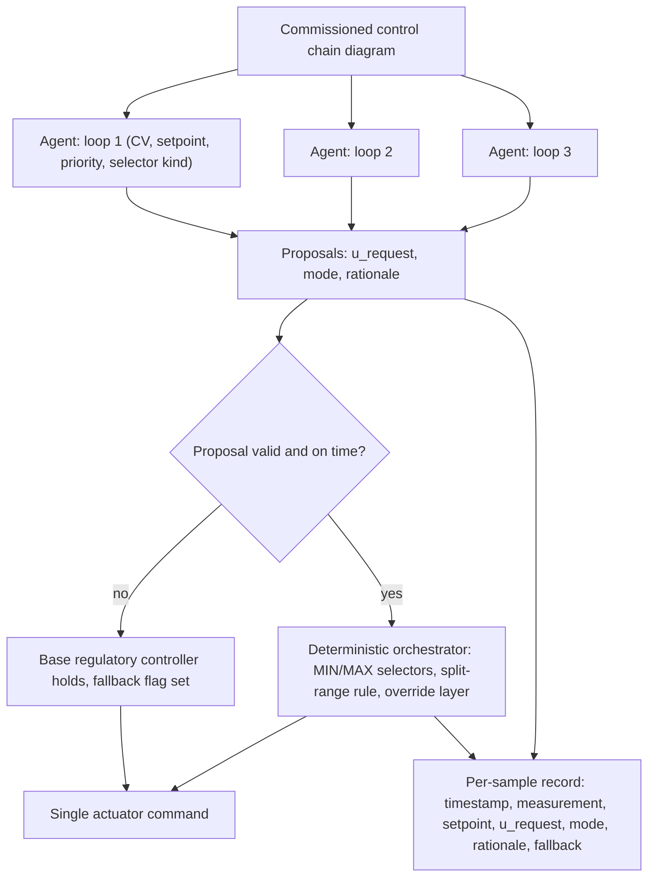

# Control-Loop-Mapped Agent Chain

**Also known as:** ARC-Mapped Operator Agents, One Agent Per Feedback Loop, Selector-Arbitrated Agent Team

**Category:** Multi-Agent  
**Status in practice:** experimental

## Intent

Give each existing feedback loop in a plant's control chain its own operator agent carrying that loop's control-theoretic context, and resolve their competing proposals with the chain's own deterministic selector logic.

## Context

A physical process — a distillation column, a barn ventilation system, a compressor train — is already run by a commissioned chain of feedback loops. Each loop defends one controlled variable against one manipulated variable, each has a setpoint and limits, and the chain records which loop wins when two of them pull the same actuator: MIN and MAX selector networks decide between competing controlled variables, split-range logic divides one manipulated variable between loops, and an override layer sits above both. That structure was derived from a hazard analysis and signed off long before anyone proposed putting a language model near the plant. Someone now wants operator agents that read the process, propose the next move, and explain the move in words an operator can check.

## Problem

The default multi-agent shape invents roles for the task and asks a coordinating model to arbitrate between them. Both halves fail here. Roles invented for the task have no relationship to the loops the plant actually runs, so nobody can review the team against an engineered artefact, and the prompt for a general-purpose agent has to carry whole-plant context that only retrieval can supply — which turns a reviewable prompt into a scored guess. Arbitration by a model is worse: contention over a shared manipulated variable already has an answer that came out of a safety analysis, and a coordinating model can at best reproduce that answer and at worst overrule it under load, at a tier too slow to run at every control sample. Measurement shows why the loops cannot simply be handed over: on Skogestad's Column A an ungated agent supervisor beat a Pareto-tuned linear controller on off-nominal target acquisition, at an error ratio of 0.361 at the upper confidence bound, and inverted by a factor of 16.03 on disturbance rejection over the same sixteen-point grid.

## Forces

- A general-purpose model does well on general tasks and badly on narrow domain ones, largely because supplying narrow context and bounding the task are both hard; a loop-scoped prompt makes the bound structural instead of retrieved.
- Contention over a shared manipulated variable already has an engineered, hazard-derived answer, and any arbitrator that reasons about it can only match that answer or degrade it.
- A model arbitrator can express nuance a fixed selector network cannot, but it runs at a slower tier and cannot be guaranteed to return a usable value at every control sample.
- One agent per loop is affordable only when each agent's task fits a small local model — the reported case ran Qwen 2.5 7B Instruct offline on a single 24 GB consumer graphics card at a five-minute cadence — and cost then scales with loop count.
- The same agent that wins on one regime loses badly on another, so per-loop competence is scenario-dependent and cannot be assumed uniform across the chain.

## Therefore

Therefore: read the team off the existing control chain — one agent per feedback loop, each carrying its own controlled variable, setpoint, chain priority and selector kind — and let the chain's MIN and MAX selectors, split-range rule and override layer arbitrate the proposals with no model call in the arbitration step.

## Solution

Take the chain diagram as the specification for the team. Every feedback loop in it becomes exactly one operator agent, and that agent's prompt carries the loop's control-theoretic context and nothing else: the controlled variable it defends, the current setpoint and limits, its priority within the chain, the kind of selector it feeds, and the measurements belonging to that loop. Because the scope comes from the diagram rather than from a search over plant documentation, the retrieval problem becomes a prompt an engineer can verify by reading it. At each control sample every agent proposes a value for its own manipulated variable together with a mode and a short rationale. An orchestrator collects the proposals and applies the chain's interaction logic in the order the chain prescribes — MIN and MAX selectors for switching between competing controlled variables, the split-range rule for dividing one manipulated variable, then the override layer — and that step contains no model call, so every constraint conflict resolves deterministically regardless of what the models produced. A proposal that is missing, late, or outside its declared limits is dropped and the base regulatory controller's own output holds the loop, with the substitution flagged. Each agent appends one record per sample carrying the timestamp, measurement, setpoint, requested output, mode, rationale and fallback flag, which gives an auditable trajectory and a logbook written in operator language. A slower advisory tier may use a model to comment on the trajectory or suggest setpoint changes for review, but it never becomes the per-sample arbitrator.

## Structure

```
Chain diagram --defines--> N loop-scoped agents (controlled variable, setpoint, priority, selector kind). Each sample: agent_i -> proposal {u_request, mode, rationale} --> deterministic orchestrator (MIN/MAX selectors -> split-range rule -> override layer) --> single actuator command. Missing or invalid proposal --> base regulatory controller holds, fallback flag set. Every proposal and verdict --> append-only per-sample record.
```

## Diagram



*The chain diagram fixes how many agents exist and what each defends; the chain's own selector and override logic combines their proposals with no model call, and a missing proposal falls back to the base controller.*

## Example scenario

A dairy barn holds its air temperature, humidity and air change rate with three feedback loops that were commissioned years ago, and when the barn turns hot and damp at once an existing selector already decides which loop gets the fans. A small language model is added to each loop, proposing the next fan setting and writing a sentence a farmer can check. The selector is left untouched, so it still decides what actually reaches the fans. When one of the models returns nothing before the next sample, the original controller holds that loop and the log records a fallback for the sample.

## Consequences

**Benefits**

- Each agent's context is bounded by construction, so the retrieval problem is replaced by a prompt a domain expert can verify by inspection.
- The team inherits the safety property of the control chain: every constraint conflict is resolved deterministically by the orchestrator, whatever the models emit.
- The topology is reviewable against an artefact that already exists and was already commissioned, rather than against roles someone invented for the task.
- Per-loop scope keeps each agent small enough for a local open-weight model, so the control cadence does not depend on a hosted frontier model.
- The per-sample records give an auditable trajectory paired with an operator-voice rationale, which is what a control campaign logbook needs.

**Liabilities**

- The pattern only applies where a control-loop topology exists and is documented; where override logic was rewired in the field and never redrawn, the mapping produces a team that defends the wrong variables.
- The priority structure is fixed at commissioning, so a conflict the chain never anticipated is still resolved by a rule that was not written for it, and no agent can escalate past that rule.
- Per-loop competence is scenario-dependent: the same agent supervisor that beat a tuned linear controller on target acquisition inverted by a factor of 16.03 on disturbance rejection, so each loop needs its own gate rather than blanket trust.
- Deterministic arbitration reads numbers only, so the rationale that makes the trajectory reviewable plays no part in the decision and can drift away from what was applied.
- Inference cost and per-sample latency both scale with loop count, which caps how many loops can be mapped at a given control cadence.
- Where the operating specification sits on a safety limit, arbitration blocks well-behaved requests as readily as harmful ones — in one 250-cell pass 534 of 590 interventions had that geometry, against 318 blocks that corrected actively harmful proposals.

## Failure modes

- The chain diagram used for the mapping is stale, so an agent defends a controlled variable the plant no longer has or feeds a selector whose priority was changed in the field.
- The model orchestrator variant is promoted from advisory commentary to the per-sample arbitration step, and the deterministic safety property is lost without anything in the logs saying so.
- Agent prompts accumulate whole-plant context over time until the scope bound disappears and the retrieval problem returns.
- The fallback flag is recorded but never alarmed, so a persistently failing agent looks healthy because the base controller quietly holds its loop every sample.
- The rationale is written to the log while a different value reaches the actuator, and the logbook becomes a plausible account of something that did not happen.
- The team is mapped onto a domain with no engineered priority structure, and the selectors end up encoding an arbitrary ordering that nobody analysed.

## What this pattern constrains

Agents may only propose a value for their own loop's manipulated variable and cannot change their own chain priority; contention over a shared manipulated variable is settled only by the chain's selectors, split-range rule and override layer, so the arbitration step must contain no model call; and a proposal that is missing, late, or outside its declared limits must fall back to the base regulatory controller rather than being applied.

## Applicability

**Use when**

- The domain already has a commissioned control-loop topology with a documented priority structure such as selectors, split-range logic or an override layer.
- Contention over a shared actuator has a safety-derived answer that predates the agent and must not be renegotiated at runtime.
- Each agent's task can be bounded to one controlled variable and the measurements belonging to its loop.
- Per-sample records and an operator-readable rationale are needed for audit or for a control campaign logbook.
- The control cadence is slow enough that one model call per loop fits inside a sample interval.

**Do not use when**

- No prior control chain exists and the roles genuinely have to be invented for the task.
- The conflicts are open-ended objective trade-offs with no engineered priority, where a human-authored resolution table or an escalation path fits better.
- The correct response to a conflict is to renegotiate the objective rather than to apply a fixed structural priority.
- Loop count times per-call latency exceeds the control cadence, so proposals would arrive after the sample they were meant for.
- The regulatory layer would have to be modified for the agents to act, rather than the agents writing into an existing setpoint interface.

## Components

- Loop-scoped operator agent — one per feedback loop, prompted with that loop's controlled variable, setpoint, limits, chain priority and selector kind, and nothing outside the loop
- Chain map — the commissioned control-chain diagram that fixes how many agents exist and what each one defends
- Deterministic orchestrator — applies the MIN and MAX selectors, the split-range rule and the override layer in the order the chain prescribes, with no model call
- Base regulatory controller — keeps each loop closed and takes over whenever a proposal is missing, late or outside its limits
- Per-sample record — timestamp, measurement, setpoint, requested output, mode, rationale and fallback flag, appended once per agent per sample
- Advisory tier — a slower commentary layer that may use a model to review trajectories or suggest setpoint changes, but never arbitrates a sample

## Tools

- Distributed control system or programmable logic controller — hosts the regulatory layer and the setpoint interface the agents write into
- Process simulator or plant twin — replays scenarios so the mapped team can be tested before any agent touches the plant
- Locally served open-weight model — supplies one loop-scoped agent per feedback loop at the control cadence, such as a 7B model on a 24 GB card at five-minute samples
- Append-only log store — holds the per-sample records that make the trajectory auditable after the fact
- Historian or process data archive — supplies each agent the measurements of its own loop and nothing more

## Evaluation metrics

- Integrated absolute error per loop against the unassisted regulatory baseline — whether the agent on that loop helps or hurts, split by regime
- Fallback rate per agent — how often the base controller had to hold the loop because a proposal was missing, late or invalid
- Selector intervention count and split — how often deterministic arbitration overrode a proposal, and how many of those overrides corrected an actively harmful request rather than a well-behaved one
- Prompt scope drift — measurements or variables referenced by an agent that lie outside the loop it was mapped to
- Rationale-to-action agreement — share of samples where the logged rationale matches the value that actually reached the actuator
- Sample-deadline compliance — share of control samples where every proposal arrived before the next sample was due

## Known uses

- **[ARC-mapped LLM operator agents for barn ventilation (Nogueira and Skogestad)](https://arxiv.org/abs/2606.30877)** _pure-future_ — Each feedback loop in the advanced regulatory control chain is mapped to one specialised operator agent carrying the loop's controlled variable, setpoint, chain priority and selector kind; the interaction logic is encapsulated as one orchestrator. Evaluated on a dairy-barn ventilation case over a four-day mixed-season scenario with Qwen 2.5 7B Instruct agents running offline on a 24 GB consumer graphics card at a five-minute cadence.
- **[Safety-gated agentic supervisory control on Skogestad's Column A (Rosenthal)](https://arxiv.org/abs/2607.27849)** _pure-future_ — Independent corroboration of the same boundary: the regulatory layer is left unchanged and the agent is confined to a setpoint interface, with a rule-based counterfactual gate of nine pinned constraints deciding admit or block before the regulatory layer moves.
- **Advanced regulatory control layers in commissioned process plants** _available_ — The MIN and MAX selector networks, split-range logic and override paths that this pattern reuses as its arbitration layer are ordinary commissioned practice in distributed control systems; the pattern adds agents above that structure rather than authoring a new priority scheme.

## Related patterns

- _alternative-to_ **Role Assignment** — There the roles are invented for the task and given persona prompts; here the roles are read off a commissioned control chain and each carries a controlled variable rather than a persona.
- _alternative-to_ **Orchestrator-Workers** — There an orchestrator decomposes the task at runtime and synthesises the results with a model call; here the decomposition is fixed by the chain before the run and the synthesis step is a selector network.
- _alternative-to_ **Supervisor** — A supervising agent routes and arbitrates using a model; this pattern keeps the coordinating position but removes the model from it, because the priority answer already exists.
- _alternative-to_ **SOP-Encoded Multi-Agent Workflow** — A standard operating procedure is a sequential hand-off of artefacts; a control chain is a set of loops acting at the same sample, arbitrated by structural priority rather than by order of work.
- _complements_ **Priority Matrix (Conflict Resolution)** — Both pre-commit the resolution instead of reasoning about it at runtime; there the table is authored for foreseeable goal-conflict classes, here the priority structure is an existing selector network derived from hazard analysis.
- _complements_ **Action-Admissibility Tiering** — That pattern gates one proposed intervention through ordered admissibility tiers; this one decides how many agents exist and how their simultaneous proposals are combined, and each loop still needs a gate of its own.
- _specialises_ **Stochastic-Deterministic Boundary (SDB)** — The proposer-verifier-commit contract instantiated for process control, with the loop agent as proposer and the chain's selector and override layer as the deterministic commit step.
- _uses_ **Decision Log** — One record per control sample — timestamp, measurement, setpoint, requested output, mode, rationale and fallback flag — is what turns the trajectory into an auditable campaign logbook.
- _complements_ **Graceful Degradation** — A missing or invalid proposal degrades the loop to its base regulatory controller instead of stalling the sample, which is what makes a per-sample model call safe to depend on.

## References

- [A Systematic Approach to Multi-Agent AI from Advanced Regulatory Control Theory: Safe and Auditable LLM Operator Agents for Process Control](https://arxiv.org/abs/2606.30877) — Idelfonso B. R. Nogueira, Sigurd Skogestad, 2026
- [Safety-Gated Agentic Supervisory Control on a Coupled Distillation Benchmark](https://arxiv.org/abs/2607.27849) — Christian Rosenthal, 2026
- [Multivariable Feedback Control: Analysis and Design (2nd Edition)](https://folk.ntnu.no/skoge/book/) — Sigurd Skogestad, Ian Postlethwaite, 2005
- [Control loop](https://en.wikipedia.org/wiki/Control_loop)
