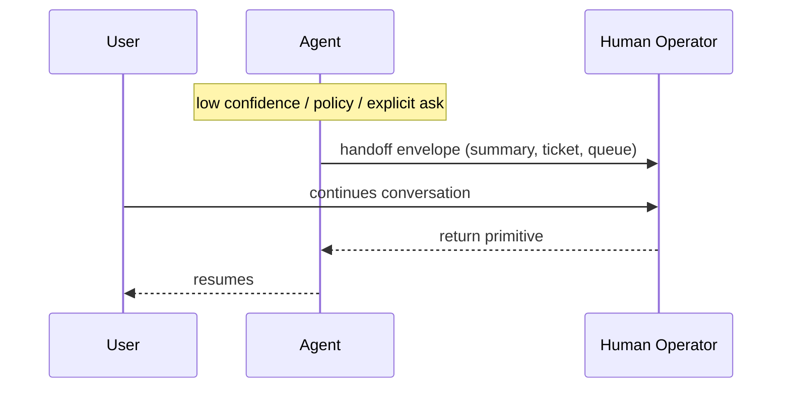

# Conversation Handoff to Human

**Also known as:** Escalation, Live-Agent Handoff, Human Takeover

**Category:** Safety & Control  
**Status in practice:** mature

## Intent

Transfer the entire conversation thread from agent to human operator, with state transfer and return primitive.

## Context

A team runs a customer-facing chat agent — support, sales, billing — that handles most conversations end to end, but some threads exceed what the agent can responsibly do alone: a refund above a policy threshold, a complaint with regulatory implications, a confused customer who explicitly asks for a person. The customer is mid-conversation, the agent has accumulated context across many turns, and the team needs a clean way to bring a human operator in without dropping the thread.

## Problem

Approving or rejecting a single tool call does not solve this case, because the whole conversation needs to change owners, not just one action. If the agent simply tells the customer to call a support line, all the accumulated context is lost and the customer has to start over with a person who knows nothing. If the agent stays in the loop and parrots whatever the human says, accountability gets muddy. Without a structured transfer of the whole thread, escalation either destroys continuity or smears responsibility between agent and operator.

## Forces

- Handoff loses context fidelity.
- Sticky routing (return to same operator on follow-up) needs auth + session plumbing.
- Return primitive (back to agent) requires re-grounding.

## Therefore

Therefore: transfer ownership of the whole thread to a human operator queue with a structured envelope and a return primitive, so that hard cases reach humans without losing the customer's continuity.

## Solution

On escalation trigger (low confidence, explicit user request, policy violation), the agent emits a structured handoff envelope with conversation summary, ticket number, and human operator queue assignment. Operator takes ownership; agent disengages. On return, agent resumes with operator's note in context.

## Example scenario

A customer-support agent has been resolving a billing issue for ten turns when it hits a refund threshold that requires a human. Approving a single tool call doesn't capture the situation — the operator needs the whole context. The team uses Conversation Handoff: the entire thread, plus a short hand-off note from the agent, transfers to a human operator's queue with a primitive to return ownership later. The customer keeps the same chat window; the operator picks up where the agent left off.

## Diagram

## Consequences

**Benefits**

- Hard cases reach humans.
- Customer experience preserved across the boundary.

**Liabilities**

- Operator queue capacity bounds scale.
- State transfer has fidelity loss.

## What this pattern constrains

Once handed off, the agent does not generate to the user; the operator owns the thread until explicit return.

## Applicability

**Use when**

- Some triggers (low confidence, policy violation, explicit user request) demand transferring ownership of the whole thread, not just one action.
- A human operator queue exists with the capacity to take over conversations.
- A return primitive is needed so the agent can resume after the operator hands back.

**Do not use when**

- Discrete-action approval is sufficient and full thread transfer is overkill (use approval-queue).
- No human operator queue exists to hand the conversation to.
- The agent must remain the sole user-facing interface for compliance reasons.

## Known uses

- **Sierra agent escalations** — *Available*
- **Intercom Fin handoffs** — *Available*
- **Zendesk AI handoffs** — *Available*

## Related patterns

- *alternative-to* → [human-in-the-loop](human-in-the-loop.md)
- *complements* → [approval-queue](approval-queue.md)
- *specialises* → [handoff](handoff.md)

## References

- (doc) *Intercom Fin: Human handoff*, <https://www.intercom.com/help/en/articles/8362236-fin-handover>
- (doc) *Sierra agent escalations*, <https://sierra.ai>

**Tags:** safety, escalation, handoff
