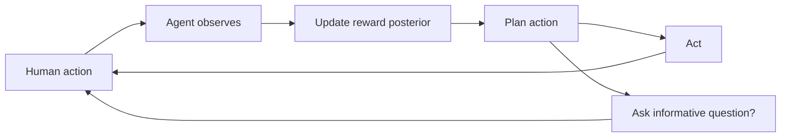

# Cooperative Preference Inference

**Also known as:** CIRL, Cooperative IRL Agent

**Category:** Cognition & Introspection  
**Status in practice:** experimental

## Intent

Agent and human jointly optimise the human's reward without the agent being told what it is — the interaction is a two-player game in which alignment is learned while acting.

## Context

A long-running personal or organisational agent must serve a human or team whose true preferences shift, are partially observable, and were never written down completely. The agent has access to demonstrations, corrections, partial instructions, and explicit questions, but no closed-form objective function.

## Problem

Treating the agent's objective as a fixed handed-down reward — even an LLM-fine-tuned one — fails on every drift in actual preferences, every novel situation the reward didn't anticipate, and every case where the human would have said something different if asked. The agent confidently optimises a frozen proxy that diverges from what the human actually wants. The interaction itself, where the human is showing and telling and correcting in real time, is the missing signal.

## Forces

- True preferences are partially observable and shift over time.
- Demonstrations, instructions, and corrections are all evidence about preferences, not commands.
- Asking too often is intrusive; never asking is unsafe.
- The agent must act while learning, not freeze waiting for full specification.

## Applicability

**Use when**

- Long-running deployment where preferences shift and were never fully specified.
- The agent has access to corrections, demonstrations, and questions as ongoing signal.
- Building principled uncertainty into the agent's objective is worth the engineering cost.

**Do not use when**

- Short single-task interaction where one frozen objective suffices.
- No reliable feedback channel — the posterior never updates.
- Engineering budget cannot support a full preference-posterior implementation.

## Therefore

Therefore: cast the interaction as a cooperative two-player game where both parties want the human's reward maximised but only the human knows it, and let the agent both act and learn from the human's behaviour as evidence about the reward.

## Solution

Model the situation as Cooperative Inverse Reinforcement Learning. Both human and agent share a reward function known only to the human. The agent observes human actions, demonstrations, and explicit corrections as evidence about R. It maintains a posterior over R and acts to maximise expected R under that posterior. Optimal play yields active teaching (human shows informative actions) and active learning (agent asks informative questions). Distinct from RLHF (one-shot offline preference learning): CIRL is continuous and online.

## Example scenario

A long-running personal-assistant agent maintains a posterior over the user's preferences about scheduling: meeting density, focus blocks, when to push back on requests. A new request arrives. The agent both acts (proposing a slot consistent with its current best estimate) and updates (asking a clarifying question whose answer would most reduce posterior variance). The user's corrections over weeks reshape the posterior; the agent never assumes its current best estimate is the truth.

## Diagram

## Consequences

**Benefits**

- Alignment is treated as ongoing inference rather than a one-shot fine-tune.
- Demonstrations, corrections, and questions all become equally legitimate signal.
- Models a principled trade-off between asking and acting under uncertainty.

**Liabilities**

- Closed-form CIRL solutions don't scale to LLM-sized hypothesis spaces; LLM versions are approximations.
- Requires the agent to maintain and update a reward posterior — heavy machinery for many products.
- Misinterpreted human actions can move the posterior in damaging directions.

## What this pattern constrains

The agent must not treat its reward function as fully known; human behaviour is treated as evidence about a reward the agent only has a posterior over.

## Known uses

- **CHAI (Center for Human-Compatible AI, Berkeley) research line** — *Available* — <https://humancompatible.ai/>
- **Long-running personal-agent loops with explicit preference posteriors** — *Available*

## Related patterns

- *uses* → [preference-uncertain-agent](preference-uncertain-agent.md)
- *complements* → [corrigible-off-switch-incentive](corrigible-off-switch-incentive.md)
- *complements* → [human-reflection](human-reflection.md)
- *complements* → [soft-optimization-cap](soft-optimization-cap.md)
- *used-by* → [multi-principal-welfare-aggregation](multi-principal-welfare-aggregation.md)

## References

- (paper) *Cooperative Inverse Reinforcement Learning*, Hadfield-Menell, Russell, Abbeel, Dragan, 2016, <https://arxiv.org/abs/1606.03137>
- (book) *Human Compatible*, Stuart Russell, 2019, <https://www.penguinrandomhouse.com/books/566677/human-compatible-by-stuart-russell/>

**Tags:** alignment, preferences, interaction
