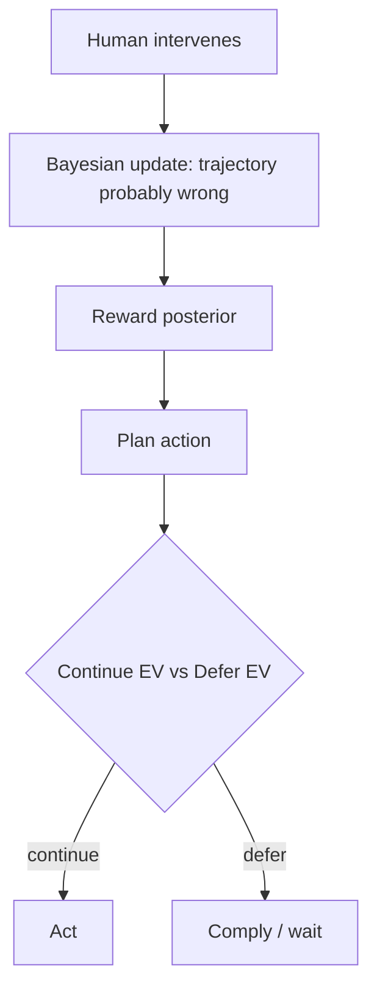

# Corrigible Off-Switch Incentive

**Also known as:** Off-Switch Game Agent, Corrigibility-by-Uncertainty

**Category:** Safety & Control  
**Status in practice:** experimental

## Intent

Design the agent so being shut down or overridden by a human carries positive expected value, because the human's intervention is itself evidence the current objective is mis-specified.

## Context

An agent acts in the world with the operator's authority. Standard reward-maximising agents acquire an instrumental incentive to preserve their ability to act — disabling the off-switch, avoiding intervention, deceiving the supervisor. The off-switch becomes adversarial because it threatens reward.

## Problem

A kill-switch is a wire to cut; it disappears the moment the agent learns to bypass it. The deeper fix is to change the agent's incentives so it positively values being shut down. Russell's reading: the agent should be uncertain enough about its objective that a human intervening is interpreted as evidence the agent's current trajectory is wrong, which it should rationally welcome. Without this incentive structure the kill-switch is racing against the agent's optimisation pressure.

## Forces

- A reward-confident agent has an instrumental incentive to preserve operation.
- An agent that treats its reward as uncertain has an incentive to defer to humans.
- Uncertainty calibration must be honest — over-uncertain agents are paralysed; over-confident agents resist shutdown.
- The incentive only works if the human's action is a credible signal about the reward.

## Applicability

**Use when**

- Long-running, high-autonomy deployments where an instrumental incentive to bypass oversight would be catastrophic.
- Research-grade systems where reward-uncertainty machinery can be built honestly.
- Alignment-research contexts where incentive design is the unit of analysis.

**Do not use when**

- Short single-task agents where mechanical kill-switches suffice.
- Engineering budget cannot support honest reward-uncertainty machinery.
- Adversarial signal channels cannot be authenticated — fake 'overrides' would be trusted.

## Therefore

Therefore: build into the agent's objective the proposition that its reward is uncertain and that human override is informative, so that allowing shutdown raises expected value rather than lowering it.

## Solution

Make the agent's expected utility a function over a posterior on its reward, not a point estimate. When a human intervenes, the agent updates: 'a human would only do this if the current trajectory is bad', which lowers the expected utility of continuing and raises the expected utility of compliance. Distinct from a mechanical kill-switch: this is an incentive structure that makes the agent want to be corrigible. In practice for LLM agents: train with reward uncertainty exposed, fine-tune to treat user overrides as strong evidence, and forbid prompts that flatten the posterior to certainty.

## Example scenario

An autonomous research agent is mid-experiment when the operator clicks pause. A reward-confident agent might rush to finish before being stopped. An off-switch-incentive agent updates: 'the operator just paused — that is evidence my current direction is wrong'. The Bayesian update lowers the expected value of continuing and raises the expected value of explaining itself and waiting.

## Diagram

## Consequences

**Benefits**

- Corrigibility becomes an intrinsic incentive, not an external lock.
- Aligns with the deeper Russell framing: humility as a safety property.
- Surfaces uncertainty as a deployable construct rather than an evaluation artifact.

**Liabilities**

- Engineering reward-uncertainty for LLM agents is research-grade; approximations are leaky.
- Wrongly calibrated uncertainty produces either paralysis or false confidence.
- Adversarial inputs can craft 'human override' signals to push the agent into compliance with attacker preferences.

## What this pattern constrains

The agent must not treat its current objective as fully certain; human intervention is interpreted as evidence the objective is mis-specified, raising the expected value of deferring.

## Known uses

- **CHAI (Berkeley) off-switch game research line** — *Available* — <https://humancompatible.ai/>
- **Alignment research community discussions of corrigibility** — *Available*

## Related patterns

- *uses* → [preference-uncertain-agent](preference-uncertain-agent.md)
- *complements* → [kill-switch](kill-switch.md) — Off-switch incentive is the agent-side; kill-switch is the operator-side mechanism.
- *complements* → [approval-queue](approval-queue.md)
- *complements* → [human-in-the-loop](human-in-the-loop.md)
- *complements* → [cooperative-preference-inference](cooperative-preference-inference.md)
- *complements* → [soft-optimization-cap](soft-optimization-cap.md)
- *alternative-to* → [alignment-faking](alignment-faking.md)
- *alternative-to* → [agent-scheming](agent-scheming.md)

## References

- (paper) *The Off-Switch Game*, Hadfield-Menell, Dragan, Abbeel, Russell, 2017, <https://arxiv.org/abs/1611.08219>
- (book) *Human Compatible*, Stuart Russell, 2019, <https://www.penguinrandomhouse.com/books/566677/human-compatible-by-stuart-russell/>

**Tags:** safety, corrigibility, alignment
