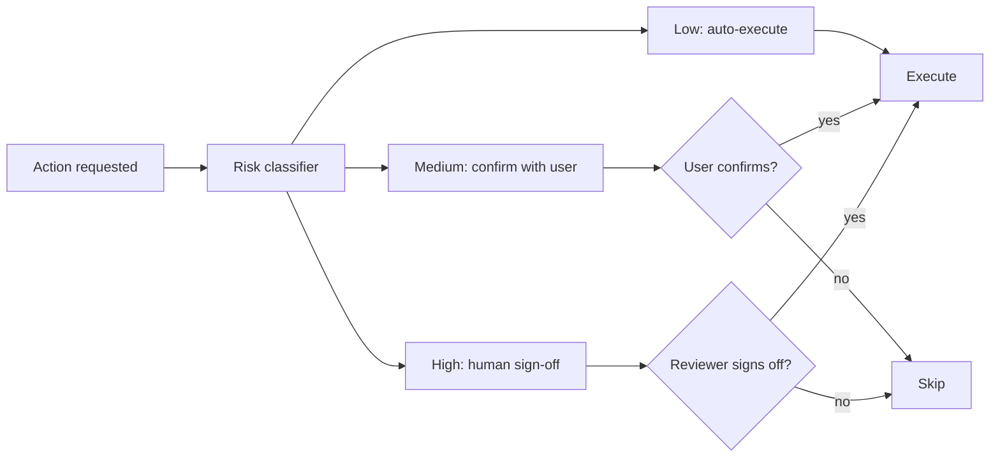

# Cost-Aware Action Delegation

**Also known as:** Risk-Tiered Action Approval, Per-Action Autonomy

**Category:** Safety & Control  
**Status in practice:** emerging

## Intent

Classify every agent action by risk/cost and route each tier to a different approval policy, bounding the autonomy surface per-action instead of by one global flag.

## Context

An agent has access to a mixed action surface: reading a file, calling a search API, sending an email, modifying a CRM record, refunding an order, terminating a cloud resource. A single 'auto-approve everything' flag treats sending an email the same as refunding $10,000. A single 'require approval for everything' flag turns the agent into a typing-assist tool.

## Problem

Without per-action risk tiering, the autonomy decision collapses to one global switch. Either the agent acts on dangerous things without checking, or it asks before every read. Approval fatigue kills the second mode within a week; trust incidents kill the first. The team has no vocabulary for 'this action is fine to do unsupervised, this one needs to confirm with the user, this one needs to escalate to a human reviewer'.

## Forces

- Risk varies by action type and sometimes by parameter value (refund $5 vs refund $5000).
- Approval fatigue dominates if every action requires confirmation.
- Trust incidents dominate if no action requires confirmation.
- Risk tiers must be a small enumeration that humans can reason about.

## Applicability

**Use when**

- The agent's action surface spans actions of materially different blast radius.
- Operators need an audit trail of what risk class each executed action was in.
- Some actions are parameter-conditional and would be misclassified by a single tier per action.

**Do not use when**

- All actions are read-only or otherwise low-risk; a single tier suffices.
- Tier inflation pressure is so strong every action ends up high; gating is then theatre.
- The team cannot maintain the classifier — risk tier becomes stale.

## Therefore

Therefore: classify each agent action by risk tier and route each tier to a fixed approval policy, so the autonomy surface is bounded per-action and per-parameter rather than by a single global flag.

## Solution

Tag every action with a risk tier (low / medium / high, or a richer scheme). Map each tier to an approval policy: low → auto-execute, medium → confirm with the user, high → require human reviewer with explicit sign-off. The tier can be conditional on parameters (refund > $1000 → high). The agent's action surface is the union of permitted (tier, policy) pairs; the runtime enforces the policy independently of the agent's reasoning. Make the classifier itself reviewable — actions and their tiers are configuration, not prompt content.

## Example scenario

A customer-ops agent has 30 actions. `search_orders` is low (auto). `update_shipping_address` is medium (confirm with the requesting customer-rep). `refund_order` is parameter-conditional: refunds under $100 are medium, refunds $100-1000 require manager sign-off, refunds over $1000 require both manager and finance approval. The agent's reasoning never gates the action; the runtime classifier does.

## Diagram

## Consequences

**Benefits**

- Autonomy decisions are per-action and per-parameter, not one switch.
- Approval fatigue collapses for low-tier actions while high-tier risk gets attention.
- Risk tier is auditable in traces; postmortems can ask why a high-tier action ran without sign-off.

**Liabilities**

- Tier assignment is a judgment call; misclassification (high marked as low) is a real attack surface.
- Parameter-conditional tiers add complexity to the classifier and to traces.
- Tier inflation — teams who get burned move actions up; over time the medium tier engulfs everything.

## What this pattern constrains

An agent must not execute an action without consulting its risk tier; the approval policy for that tier must complete before the action proceeds.

## Known uses

- **Designing Multi-Agent Systems (Dibia) — Cost-Aware Delegation UX principle** — *Available* — <https://newsletter.victordibia.com/p/4-ux-design-principles-for-multi>
- **Production agents with action-level risk classifiers (Anthropic computer-use, OpenAI Operator)** — *Available*

## Related patterns

- *uses* → [approval-queue](approval-queue.md)
- *uses* → [human-in-the-loop](human-in-the-loop.md)
- *composes-with* → [policy-as-code-gate](policy-as-code-gate.md)
- *composes-with* → [crawl-walk-run-automation-gating](crawl-walk-run-automation-gating.md)
- *complements* → [autonomy-slider](autonomy-slider.md)
- *complements* → [two-human-touchpoints](two-human-touchpoints.md)
- *alternative-to* → [agent-privilege-escalation](agent-privilege-escalation.md)
- *composes-with* → [progressive-delegation](progressive-delegation.md)

## References

- (blog) *4 UX Design Principles for Multi-Agent Systems*, Victor Dibia, 2025, <https://newsletter.victordibia.com/p/4-ux-design-principles-for-multi>
- (book) *Designing Multi-Agent Systems*, Victor Dibia, 2025, <https://www.oreilly.com/library/view/designing-multi-agent-systems/9781098150495/>

**Tags:** safety, delegation, approval
