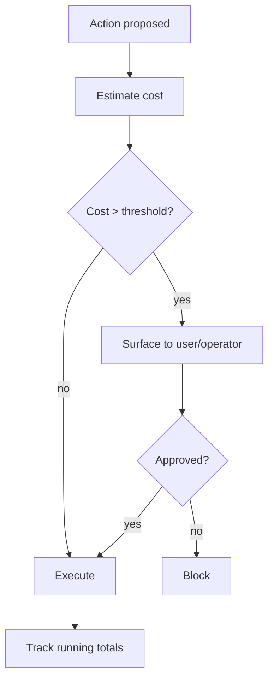

# Cost Gating

**Also known as:** Budget Cap, Cost-Aware Approval

**Category:** Safety & Control  
**Status in practice:** mature

## Intent

Block actions whose expected cost exceeds a threshold without explicit user (or operator) acknowledgement.

## Context

Some agent actions cost real money (large model calls, paid APIs); running them silently is rude or financially dangerous.

## Problem

Agents that act first and bill later create surprise costs; users learn to distrust the agent.

## Forces

- Estimating cost up front requires a model of what will happen.
- Confirmation-fatigue: too many approvals train users to ignore them.
- Budgets at multiple horizons (per call, per session, per month).

## Solution

Estimate cost before invoking the expensive action. If the estimate exceeds the threshold, surface it to the user (or operator) and require explicit approval. Track running totals against per-session and per-period budgets.

## Example scenario

An autonomous research agent is asked to 'thoroughly investigate' a niche market and quietly fans out into hundreds of web searches plus a few large-context summarisations, ringing up forty euros before producing a draft. The team adds Cost Gating: any step whose forecast cost (token volume × model rate) exceeds two euros prompts the user with the estimate, and any cumulative spend over twenty euros pauses the run for explicit acknowledgement. Surprise bills stop showing up.

## Diagram

## Consequences

**Benefits**

- Predictable bill.
- Forces the system to know its own cost shape.

**Liabilities**

- Estimation errors; actual cost can exceed estimate.
- Friction at the wrong moment can sour UX.

## What this pattern constrains

Actions exceeding the threshold cannot run without explicit acknowledgement.

## Applicability

**Use when**

- Some agent actions are expensive enough that surprise costs would erode user trust.
- Cost can be estimated before invoking the action with reasonable accuracy.
- A user or operator approval path exists for expensive actions.

**Do not use when**

- All actions are cheap and the gating overhead exceeds the cost it protects.
- Cost is unpredictable and pre-action estimates would be wildly wrong.
- Approval latency is unacceptable for the action class (e.g. real-time response loops).

## Known uses

- **Knitting-DSL Pipeline (Stash2Go)** — *Available*. scopedLlmFixer.js runs only when user accepts the cost.

## Related patterns

- *specialises* → [human-in-the-loop](human-in-the-loop.md)
- *complements* → [step-budget](step-budget.md)
- *complements* → [multi-model-routing](multi-model-routing.md)
- *complements* → [prompt-caching](prompt-caching.md)
- *complements* → [extended-thinking](extended-thinking.md)
- *complements* → [cost-observability](cost-observability.md)
- *complements* → [rate-limiting](rate-limiting.md)

**Tags:** safety, cost, budget
