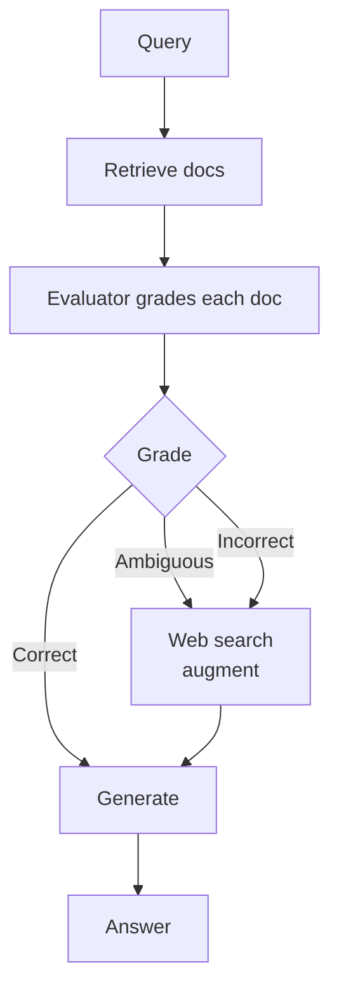

# CRAG

**Also known as:** Corrective RAG

**Category:** Retrieval & RAG  
**Status in practice:** emerging

## Intent

Add a lightweight retrieval evaluator that grades each retrieved document and triggers corrective web search on poor retrievals.

## Context

Production RAG where retrieval quality varies and the system must recover gracefully from low-quality retrievals.

## Problem

Naive RAG passes every retrieval into the generator; bad retrievals corrupt outputs without any correction step.

## Forces

- Evaluator quality bounds correction accuracy.
- Web fallback adds latency and external dependency.
- Three-way grading (correct / ambiguous / incorrect) needs calibration.

## Solution

After retrieval, a lightweight evaluator (T5-based or similar) grades each document as Correct, Ambiguous, or Incorrect. Correct documents go forward as-is. Ambiguous documents trigger a web search for additional evidence. Incorrect documents are discarded and replaced via web search. The generator receives the corrected document set.

## Variants

- **Three-grade CRAG** — Evaluator labels each retrieval Correct / Ambiguous / Incorrect; only Ambiguous and Incorrect trigger fallback (the canonical paper recipe).
- **Binary CRAG** — Simplified two-grade variant (good / bad) used when a calibrated three-way evaluator is unavailable.
- **Decompose-and-recompose CRAG** — For Correct documents, additionally strip irrelevant strips and recompose only the relevant strips before passing to the generator.

## Example scenario

A RAG-powered legal assistant retrieves three statutes for a question about export controls; one of them is from the wrong jurisdiction. Naive RAG would hand all three to the generator and the wrong statute would corrupt the answer. The team layers in CRAG: a lightweight evaluator grades each retrieved document for relevance, the wrong-jurisdiction one falls below threshold, and the system triggers a corrective web search before generation. The final answer is grounded in two strong retrievals plus one fresh source instead of one bad one.

## Diagram

## Consequences

**Benefits**

- Robustness to poor retrievals.
- Plug-and-play with existing RAG.

**Liabilities**

- Two-stage retrieval increases latency.
- Web fallback has its own correctness questions.

## What this pattern constrains

The generator sees only retrieval-graded-Correct documents, optionally augmented with corrective-search results.

## Applicability

**Use when**

- Naive RAG passes bad retrievals through to the generator and corrupts outputs.
- A lightweight evaluator (e.g. T5-class) can grade documents as Correct, Ambiguous, or Incorrect cheaply.
- Web search is available as a corrective fallback for ambiguous or incorrect retrievals.

**Do not use when**

- Retrieval quality is already high enough that the evaluator step adds no measurable lift.
- No corrective fallback (e.g. web search) is available, so the evaluator's verdict has no recovery path.
- Latency budget cannot absorb the extra evaluator and fallback hops.

## Known uses

- **CRAG paper baseline** — *Available*
- **LangGraph Corrective-RAG tutorial** — *Available*

## Related patterns

- *specialises* → [agentic-rag](agentic-rag.md)
- *uses* → [evaluator-optimizer](evaluator-optimizer.md)

## References

- (paper) Yan, Gui, Xiao, Mei, Liu, Shang, Sun, Wang, *Corrective Retrieval Augmented Generation*, 2024, <https://arxiv.org/abs/2401.15884>

**Tags:** rag, corrective, evaluator
