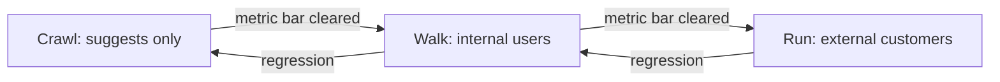

# Crawl-Walk-Run Automation Gating

**Also known as:** Three-Tier Autonomy Rollout, Automation Gates

**Category:** Governance & Observability  
**Status in practice:** emerging

## Intent

Roll an agent out in three explicit autonomy tiers with explicit gates between tiers: Crawl (suggests only, human acts), Walk (acts on internal staff), Run (acts on external customers).

## Context

A team has built an agent that could plausibly act autonomously on customer-facing actions (replying to tickets, refunding orders, sending outbound messages, modifying production resources). The blast radius of a bad action ranges from a confused colleague to a regulatory incident. Stakeholders want both fast deployment and confidence that nothing irreversible happens before the agent is trusted.

## Problem

Two failure shapes recur. Teams ship the agent fully autonomous to external customers from day one and discover behaviour they cannot retract. Or they hide the agent behind a human reviewer forever, accumulating review backlog while never building the evidence base that would justify expansion. Without a named ramp, autonomy decisions are made implicitly per release, drift toward whichever stakeholder shouts loudest, and skip the comparison data that would tell the team whether the agent is ready for the next tier.

## Forces

- Each tier needs different metrics: Crawl measures suggestion acceptance, Walk measures internal task completion, Run measures customer outcomes.
- Tier gates must be passed before promotion, not after a calendar deadline.
- Demotion back a tier must be cheap when metrics degrade.
- Some actions never leave Crawl (e.g. legally irreversible decisions).

## Applicability

**Use when**

- An agent will eventually act on external customers and the team needs an evidence-based ramp.
- Different action types have very different blast radius.
- Stakeholders need a vocabulary for promotion and demotion decisions.

**Do not use when**

- Risk surface is fine-grained enough that an [[autonomy-slider]] fits better than three tiers.
- All actions are irreversible — no Run tier is reachable, so the gating is trivial.
- The agent has no production traffic to calibrate tier metrics on.

## Therefore

Therefore: define three named tiers — Crawl, Walk, Run — each with its own success criteria, and forbid the agent from acting at a tier it has not been explicitly promoted to.

## Solution

Tag every agent action with an autonomy tier. Crawl emits only suggestions; Walk acts on internal staff with their approval contract; Run acts directly on external customers. Each tier publishes a metric bar (acceptance rate, internal completion, customer outcome) and a duration. Promotion requires clearing the bar; regression demotes. Tier is per-action-type, not per-agent — the same agent can be in Run on safe actions and Crawl on irreversible ones.

## Example scenario

A support team ships an agent that can answer billing questions. In Crawl, the agent drafts replies that a human always sends; acceptance is tracked. After three weeks above 85% acceptance the agent is promoted to Walk for internal-only ticket types — it can resolve account-update tickets for staff requests. After another period above its internal-completion bar, promotion to Run is granted for low-risk public ticket categories only; refunds stay at Walk and password resets stay at Crawl.

## Diagram

## Consequences

**Benefits**

- Forces a measurement programme before each autonomy step.
- Lets the same agent ship at heterogeneous trust per action type.
- Makes demotion legible — not a rollback, a tier change.

**Liabilities**

- Three tiers can be too coarse for some risk surfaces (consider an autonomy-slider variant).
- Promotion politics — stakeholders push past the gate when metrics are mixed.

## What this pattern constrains

An agent must not perform an action at an autonomy tier it has not been explicitly promoted to; promotion requires the documented tier metric to clear its bar.

## Known uses

- **Customer-support agents promoting suggest→draft→send through measured ramp** — *Available*
- **AI Engineering (Huyen) — three-tier deployment guidance** — *Available* — <https://www.oreilly.com/library/view/ai-engineering/9781098166298/>

## Related patterns

- *alternative-to* → [autonomy-slider](autonomy-slider.md) — Slider is continuous; this is the three-tier discrete form.
- *complements* → [progressive-delegation](progressive-delegation.md)
- *uses* → [approval-queue](approval-queue.md)
- *uses* → [human-in-the-loop](human-in-the-loop.md)
- *complements* → [shadow-canary](shadow-canary.md)
- *composes-with* → [cost-aware-action-delegation](cost-aware-action-delegation.md)

## References

- (book) *AI Engineering*, Chip Huyen, 2024, <https://www.oreilly.com/library/view/ai-engineering/9781098166298/>

**Tags:** autonomy, deployment, governance
